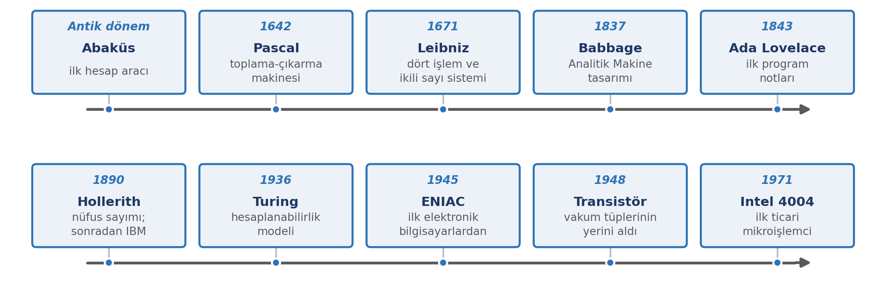
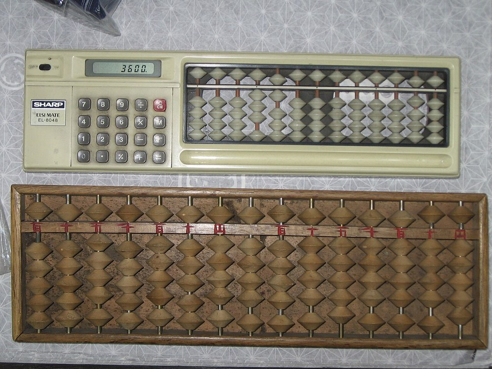
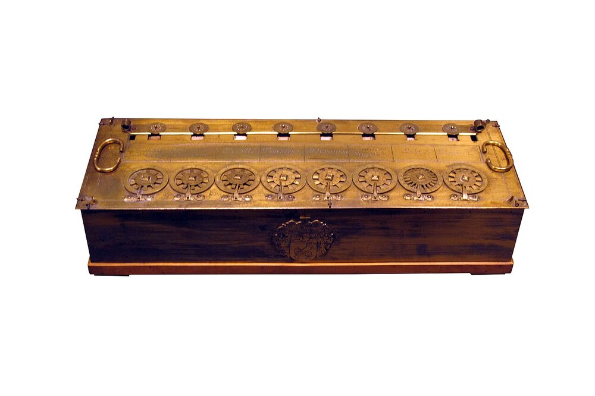
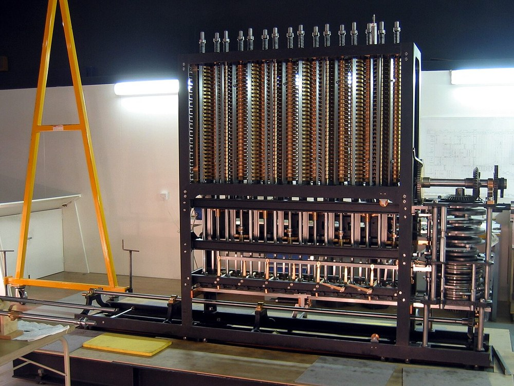
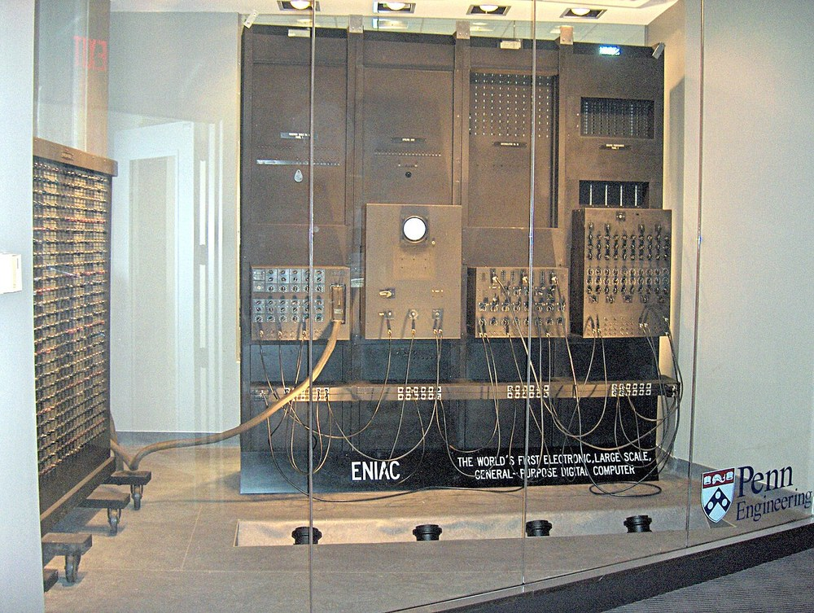
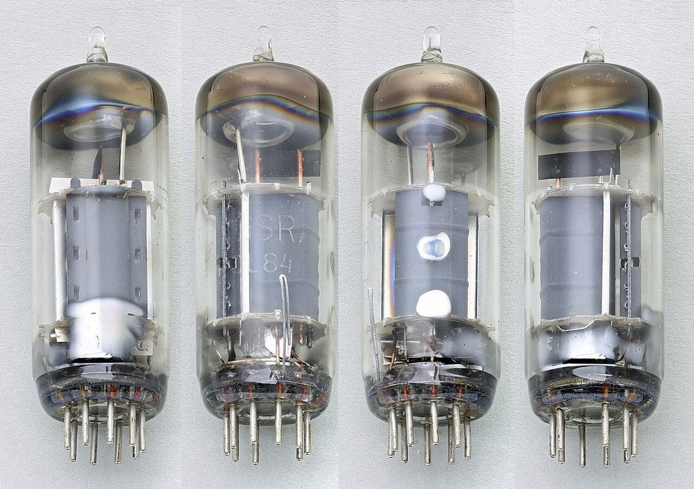
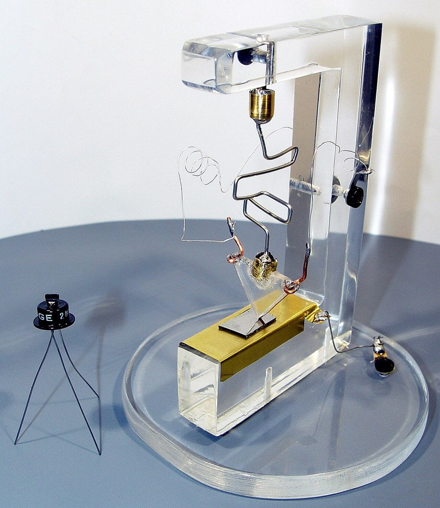
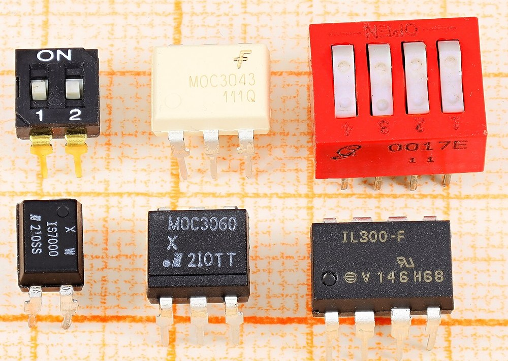
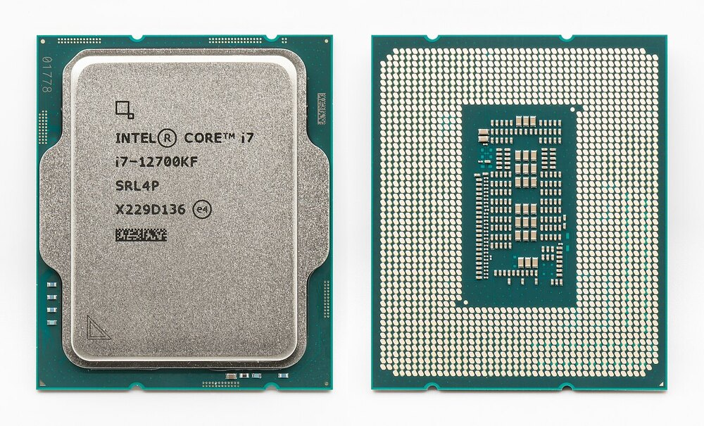
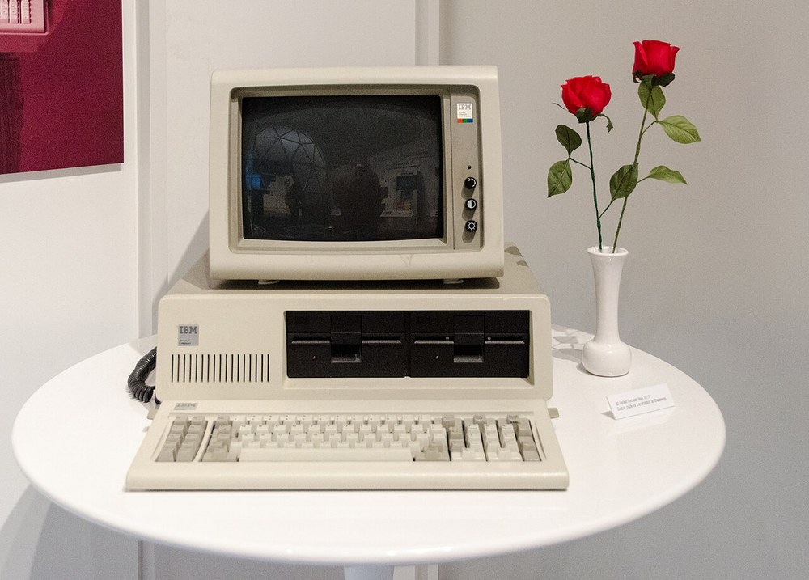

# Giriş

Bilgi teknolojileri, günümüzde yalnızca teknik bölümlerin ilgi alanı değil; hangi alanda çalışırsanız çalışın günlük yaşamın ve mesleki hayatın ayrılmaz bir parçasıdır. Ders seçimi, alışveriş, bankacılık, iletişim, öğrenme ve resmî işlemler artık büyük ölçüde dijital ortamlar üzerinden yürütülmektedir.

Bu dersin amacı, teknolojiyi yalnızca kullanabilen değil, aynı zamanda ne yaptığını bilen bir kullanıcı olmanızı sağlamaktır. Bu nedenle ilk hafta, dersin tamamına temel oluşturacak üç soruya odaklanır: Dijital ortamda karşılaştığımız şeyler aslında nedir? İçinde yaşadığımız toplum nasıl bir dönüşümden geçiyor? Bu ortamda yetkin olmak ne anlama gelir?

Bu soruların yanına bir de tarihsel boyut ekliyoruz. Bugün kullandığımız araçların nereden geldiğini bilmek, teknolojiyi bir "verili" olgu olarak değil, insanların ürettiği bir birikim olarak görmenizi sağlar.

# Bu Haftanın Öğrenme Çıktıları

- Veri, **enformasyon** ve **bilgi** kavramlarını birbirinden ayırt eder ve günlük yaşamdan örneklerle açıklar.
- Bilgi toplumunun temel özelliklerini ve dijital dönüşümün etkilerini açıklar.
- Dijital okuryazarlığın bileşenlerini ve neden önemli olduğunu ifade eder.
- Bir bilgi kaynağını güvenilirliği açısından değerlendirmek için temel ölçütleri kullanır.
- Bilgisayarın tarihsel gelişimini ve bilgisayar nesillerini ana hatlarıyla açıklar.

# Veri, Enformasyon ve Bilgi

Dijital dünyayı anlamanın ilk adımı, sıkça birbirinin yerine kullanılan üç kavramı ayırmaktır. Bu kavramlar bir bilgi piramidinin basamakları gibi düşünülebilir: alt basamakta ham veri, üstünde anlamlandırılmış enformasyon, en üstte ise yorumlanmış ve karar vermeye elverişli bilgi yer alır.

| Kavram | Tanım | Örnek |
|:---|:---|:---|
| **Veri** | İşlenmemiş, tek başına anlam taşımayan ham gerçekler, sayılar veya semboller. | 23,5 |
| **Enformasyon** | Bağlam içine yerleştirilerek anlam kazandırılmış veri. | Bu öğle saatlerinde hava sıcaklığı 23,5 °C ölçüldü. |
| **Bilgi** | Enformasyonun yorumlanması, deneyim ve muhakeme ile birleştirilerek karar vermede kullanılması. | Sıcaklık 23,5 °C ve nem yüksek olduğu için öğle saatinde açık alanda koşu yapmak uygun değil. |

Aynı veri kümesi, farklı bağlamlarda farklı enformasyona dönüşür. Bir mağazanın günlük satış rakamları tek başına veridir; bu rakamlar ürün adlarıyla eşleştirildiğinde "hangi ürün ne kadar satıldı" sorusunu yanıtlayan bir enformasyon ortaya çıkar. Aynı veri kümesi, bir ekonomist için harcama eğilimine ilişkin başka bir enformasyon üretir. Veriyi değerli kılan, ona hangi soruyu sorduğunuzdur.

::: {.callout-note}
## Neden bu ayrım önemli?

Bir tabloda gördüğünüz sayı henüz bilgi değildir; onu yorumlamadan karar vermek yanıltıcı olabilir.

İnternette karşılaştığınız bir iddia genellikle enformasyon düzeyindedir. Bilgi düzeyine çıkmak, iddiayı bağlamıyla birlikte değerlendirmeyi gerektirir.
:::

# Bilgi Toplumu ve Dijital Dönüşüm

Toplumlar tarih boyunca üretim biçimlerine göre sınıflandırılmıştır: tarım toplumu, sanayi toplumu ve son olarak bilgi toplumu. Bilgi toplumu, ekonomik değerin büyük ölçüde bilginin üretilmesi, işlenmesi ve paylaşılmasıyla oluştuğu toplumdur.

## Bilgi toplumunun belirgin özellikleri

- Bilgi ve iletişim teknolojileri günlük yaşamın her alanına yayılır.
- Hizmet ve bilgi sektörlerinin ekonomideki ağırlığı artar.
- Bilgiye erişim hızlanır; ancak bilgiyi seçme ve değerlendirme ihtiyacı da büyür.
- Çalışma biçimleri esnekleşir: uzaktan çalışma, çevrimiçi eğitim, dijital işbirliği yaygınlaşır.
- Ağ bağlantılı cihazlar sayesinde bireyler hem içerik tüketicisi hem de üreticisi hâline gelir.

Dijital dönüşüm, bu değişimin kurumlar ve süreçler düzeyindeki karşılığıdır. Kâğıt üzerinden yürüyen bir işlemin çevrimiçi ortama taşınması, verilerin merkezî olarak işlenmesi ve kararların veriye dayandırılması bu dönüşümün tipik örnekleridir. Kamu hizmetlerinin elektronik ortama taşınması, çevrimiçi bankacılık ve uzaktan eğitim, günlük hayatta en sık karşılaştığımız örneklerdir.

::: {.callout-note}
## Dijital uçurum

Dijital dönüşüm herkes için eşit koşullarda gerçekleşmez. İnternet erişimi, cihaz sahipliği ve dijital beceri düzeyi bakımından bireyler ve bölgeler arasındaki farklar **dijital uçurum** olarak adlandırılır.

Bu fark, eğitim ve iş fırsatlarına erişimi doğrudan etkilediği için günümüzün önemli toplumsal konularından biridir.
:::

# Dijital Okuryazarlık

Dijital okuryazarlık, dijital araçları ve ortamları etkin, eleştirel ve güvenli biçimde kullanabilme becerisidir. Yalnızca bir cihazı açıp bir uygulamayı çalıştırmayı değil; karşılaştığınız içeriği sorgulamayı, kişisel güvenliğinizi korumayı ve dijital ortamda sorumlu davranmayı da kapsar.

## Bileşenleri

- **Teknik beceriler:** Cihaz, işletim sistemi ve temel yazılımları amaca uygun kullanabilme.
- **Bilgi okuryazarlığı:** İhtiyaç duyulan bilgiyi bulma, doğru kaynaklara ulaşma ve bilgiyi değerlendirme.
- **Medya okuryazarlığı:** İçeriğin kim tarafından, hangi amaçla ve nasıl üretildiğini sorgulama.
- **Dijital güvenlik ve gizlilik:** Hesapları, kişisel verileri ve cihazları risklere karşı koruma.
- **Dijital iletişim ve işbirliği:** Çevrimiçi ortamda uygun üslupla iletişim kurma ve ortak çalışabilme.
- **Dijital etik:** Telif hakkına saygı, kaynak gösterme ve çevrimiçi nezaket.

## Bilginin doğruluğunu değerlendirmek: beş soru

İnternette eriştiğiniz her içerik doğru olmayabilir. Bir kaynağa güvenmeden önce şu beş soruyu sorabilirsiniz:

1. **Kim yazdı?** Yazarın kimliği ve uzmanlığı açık mı?
2. **Ne zaman yayımlandı?** Bilgi güncel mi?
3. **Kanıt var mı?** İddia veriye veya güvenilir bir kaynağa dayanıyor mu?
4. **Amaç ne?** İçerik bilgilendirmek mi, ikna etmek mi, satış yapmak mı istiyor?
5. **Başka kaynaklar ne diyor?** Aynı bilgi bağımsız kaynaklarca doğrulanıyor mu?

::: {.callout-tip}
## Aklınızda tutun

Bilgiye ulaşmak artık kolaydır; asıl beceri, ulaşılan bilginin doğruluğunu değerlendirmektir. Bu dersin ilerleyen haftalarında bu beceriyi farklı bağlamlarda tekrar ele alacağız.
:::

# Bilgisayarın Kısa Tarihi

Bugün kullandığımız bilgisayarlar bir gecede ortaya çıkmadı. Hesaplama araçlarının tarihi, insanın sayıları işleme ihtiyacı kadar eskidir. Bu bölümde, bu birikimin ana duraklarını ve bilgisayarların nesiller boyunca nasıl dönüştüğünü ele alacağız.

## Hesaplama araçlarından elektronik bilgisayara

{width=100%}

Şemadaki duraklar eşit aralıklarla yerleştirilmiştir; **zaman ekseni ölçekli değildir.** Örneğin 1671 ile 1843 arasındaki süre, 1843 ile 1890 arasındaki süreden çok daha uzundur.

Tarihin bilinen ilk hesaplama aracı **abaküs**tür; teller üzerindeki boncuklarla dört işlem yapılmasını sağlar. 17. yüzyılda hesaplama makineleri mekanik hâle geldi: **Blaise Pascal** (1642) toplama ve çıkarma yapabilen bir makine tasarladı; **Gottfried Leibniz** (1671) çarpma ve bölmeyi de ekledi ve ikili sayı sistemi üzerine çalıştı.

::: {#fig-hesap-araclari layout-ncol=2}
{width=90%}

{width=90%}

Hesaplamanın ilk araçları: abaküs ve Pascal'ın hesap makinesi
:::

**Charles Babbage**, 19. yüzyılda bugünkü bilgisayarların atası sayılan **Analitik Makine**'yi tasarladı. Bu makine, delikli kartlardan okunan komutlarla çalışacak ve sonucu saklayacaktı. **Ada Lovelace**, bu makine için yazdığı notlarda bir işlemin adım adım nasıl yapılacağını anlatarak tarihin ilk programcısı kabul edildi.

Babbage tasarımlarını kâğıt üzerinde bıraktı: ne Fark Makinesi'ni ne de Analitik Makine'yi hayatında tamamlayabildi. Fark Makinesi No. 2, 1991'de Londra Bilim Müzesi'nde Babbage'ın **özgün planlarından** yeniden inşa edildi; proje tutunca ABD'de bir müze için ikinci bir kopyası daha yapıldı. Aşağıdaki fotoğraf o ikinci kopyanın yapımını gösterir.

{width=62%}

1890'da **Herman Hollerith**, Amerika Birleşik Devletleri nüfus sayımında delikli kartla çalışan bir tablolama makinesi kullandı. Hollerith'in kurduğu şirket, sonradan bugünkü **IBM**'e dönüştü. 1936'da **Alan Turing**, "Turing makinesi" adı verilen kuramsal modelle hesaplanabilirliğin sınırlarını tanımladı; bu model, bilgisayar biliminin matematiksel temeli sayılır.

Elektronik bilgisayara geçiş İkinci Dünya Savaşı yıllarında hızlandı. 1945'te tamamlanan **ENIAC**, yaklaşık 167 metrekarelik bir alanı kaplayan, binlerce vakum tüpüyle çalışan ilk elektronik bilgisayarlardan biriydi.

{width=65%}

## Bilgisayar nesilleri

Bilgisayarlar, kullandıkları baskın teknolojiye göre nesillere ayrılır:

| Nesil | Dönem | Belirleyici teknoloji | Temsilci |
|:---|:---|:---|:---|
| Birinci nesil | 1945–1956 | Vakum tüpleri | ENIAC, UNIVAC |
| İkinci nesil | 1956–1964 | Transistörler | IBM 1401 |
| Üçüncü nesil | 1964–1970 | Entegre devreler | IBM System/360 |
| Dördüncü nesil | 1971 ve sonrası | Mikroişlemciler | Intel 4004, kişisel bilgisayarlar |

::: {#fig-nesiller layout-ncol=4}
{width=90%}

{width=90%}

{width=90%}

{width=90%}

Nesillerin belirleyici teknolojileri: vakum tüpü, transistör, entegre devre ve mikroişlemci
:::

**1948'de transistörün icadı**, vakum tüplerinin yerini aldı; makineler küçüldü, daha az ısındı ve daha güvenilir oldu. **Entegre devreler** sayesinde yüzlerce transistör tek bir yonga üzerine sığdırıldı. **1971'de Intel 4004** ile başlayan mikroişlemci dönemi, bilgisayarı kurumların deposundan çıkarıp masalarımıza getirdi.

{width=62%}

::: {.callout-tip}
## Bunu biliyor muydunuz?

ENIAC, 1945 yılında saniyede yaklaşık 5.000 toplama işlemi yapabiliyordu. Bugün cebimizdeki bir telefonun işlemcisi, bundan milyonlarca kat hızlıdır.
:::

**Günümüzde** ise tek bir çipte milyarlarca transistör bulunuyor; bilgisayarlar artık masaüstü ve dizüstü kutulara sığmıyor. Telefonlar, tabletler, akıllı saatler, sunucular ve gömülü sistemler de bilgisayardır. Son yıllarda **bulut bilişim** ve **yapay zekâ** uygulamaları, hesaplamanın nereye taşındığını yeniden tanımlıyor.

# Dersin Kapsamı ve İzlenceden Notlar

Ders 14 hafta sürer ve üç ana bloktan oluşur:

| Haftalar | Blok | İçerik |
|:---|:---|:---|
| 1–6 | Temel kavramlar ve altyapı | Bilgi kavramları ve tarihçe, donanım, yazılım ve işletim sistemleri, dosya yönetimi, ağlar, İnternet ve e-posta |
| 7–9 | Üretim araçları | Kelime işlemci, elektronik tablo, sunum uygulamaları |
| 10–14 | Değerlendirme ve sorumluluk | Sayısal okuryazarlık, bilgi güvenliği, kişisel veriler ve dijital etik, bütünleşik uygulama, genel tekrar |

Dersin başarı notu; ara sınav (vize), kısa sınav ve dönem sonu sınavı (final) notlarının ortalaması alınarak belirlenir. Her hafta paylaşılan 10 soruluk alıştırmalar ise notla değerlendirilmez; konuyu pekiştirmeniz ve kendi eksiklerinizi görmeniz için verilir.

# Uygulama: Kendi Dijital Alışkanlıklarımızı İnceleyelim

Bu haftanın uygulaması, kavramları kendi deneyiminiz üzerinden somutlaştırmayı amaçlar. Aşağıdaki adımları kendi cihazınızda (bilgisayar, tablet veya telefon), herhangi bir özel yazılıma ihtiyaç duymadan yapabilirsiniz.

## Adım 1 — Günlük dijital kullanımınızı listeleyin

Bir gün içinde kullandığınız dijital araçları ve hizmetleri alt alta yazın (örneğin mesajlaşma, e-posta, çevrimiçi ders, video izleme, bankacılık). Bunları "iletişim", "bilgi edinme", "üretim" ve "eğlence" başlıkları altında gruplayın.

## Adım 2 — Veri, enformasyon ve bilgi ayrımını uygulayın

Seçtiğiniz bir örnekte üç katmanı yazın. Örneğin hava durumu uygulamasında gördüğünüz sayı veriyi; "bugün yağmur bekleniyor" ifadesi enformasyonu; "şemsiye almalıyım" kararı ise bilgiyi temsil eder. Kendi örneğinizi bu biçimde yazın.

## Adım 3 — Bir haber kaynağını değerlendirin

Son bir hafta içinde okuduğunuz bir haber veya sosyal medya paylaşımını seçin. Dijital okuryazarlık bölümündeki beş soruyu bu içerik için tek tek yanıtlayın.

## Adım 4 — Kısa bir değerlendirme yazın

Yaklaşık bir paragraf yazarak şu soruyu yanıtlayın: *Bu hafta öğrendiğiniz kavramlardan hangisi, günlük dijital alışkanlıklarınızı değiştirmenize neden oldu? Nedenini açıklayın.*

::: {.callout-note}
## Teslim ve değerlendirme

Bu uygulama notla değerlendirilmez. Amacı, haftanın kavramlarını kendi deneyiminizle ilişkilendirmenizdir. Yazdıklarınızı ders boyunca kişisel notlarınız olarak saklamanız, ilerleyen haftalarda işinizi kolaylaştıracaktır.
:::

# Özet

- **Veri** ham gerçeklerdir; **enformasyon** bağlamla anlam kazanır; **bilgi** ise yorumlanarak karar vermede kullanılır.
- **Bilgi toplumu**, ekonomik ve toplumsal değerin bilgi üretimi ve paylaşımı etrafında şekillendiği toplumdur.
- **Dijital dönüşüm** süreçlerin dijital ortama taşınmasıdır; **dijital uçurum** bu dönüşümün eşitsiz yönüne işaret eder.
- **Dijital okuryazarlık**; teknik beceri, bilgi ve medya okuryazarlığı, güvenlik ve etik bileşenlerinden oluşur.
- Bilgisayarlar **dört nesilde** vakum tüpünden mikroişlemciye gelmiştir; bugün bulut bilişim ve yapay zekâ yeni bir dönemi tanımlıyor.

# Kendini Sınama Soruları

Aşağıdaki soruları ders notuna bakmadan yanıtlamayı deneyin; ardından notlarınızla karşılaştırın.

1. Bir marketin kasa kayıtlarındaki sayılar hangi düzeydedir; bunlar ne zaman bilgiye dönüşür?
2. Bilgi toplumunu sanayi toplumundan ayıran temel özellik nedir?
3. Dijital okuryazarlığın hangi bileşeni sizin için en zayıf halka; neden?
4. Bir internet sitesindeki sağlık bilgisine güvenip güvenmeyeceğinize karar verirken hangi ölçütleri kullanırsınız?
5. Transistörün icadı bilgisayarları nasıl değiştirdi?
6. Dijital uçurum kavramını bir örnekle açıklayın.

# Kaynaklar

Bu haftanın konularını destekleyen, kamuya açık kaynaklar:

- **Bilgi Teknolojileri ve İletişim Kurumu (BTK)** — İnternet'in bilinçli ve güvenli kullanımına ilişkin yayınlar ve rehberler. (btk.gov.tr)
- **Kişisel Verileri Koruma Kurumu (KVKK)** — kişisel verilerin korunmasına yönelik farkındalık yayınları. (kvkk.gov.tr)
- **Ulusal Siber Olaylara Müdahale Merkezi (USOM)** — güvenlik uyarıları ve farkındalık içerikleri. (usom.gov.tr)
- **TÜBİTAK BİLGEM** — bilişim güvenliği ve siber güvenlik farkındalık yayınları. (tubitak.gov.tr)

**Görsel kaynakları.** Bu haftanın notlarındaki fotoğraflar Wikimedia Commons'tan alınmıştır. Aşağıdaki sekiz fotoğraf için kaynak gösterme zorunludur:

- Fark Makinesi — *Difference engine (161978436)*, Richard King, CC BY 2.0.
- ENIAC — *ENIAC Penn1*, TexasDex, CC BY-SA 3.0.
- Kişisel bilgisayar — *IBM PC 5150 (1)*, edwardhblake, CC BY 2.0.
- Vakum tüpü — *PCL84 Tungsram*, Mister rf, CC BY-SA 4.0.
- Transistör — *A replica of the first working transistor 02*, Mister rf, CC BY-SA 4.0.
- Entegre devre — *DIP packages*, Mister rf, CC BY-SA 4.0.
- Pascal'ın hesap makinesi — *Pascaline-CnAM 823-3-IMG 1503-white*, Rama, CC BY-SA 3.0 FR.
- Mikroişlemci — *2023 Intel Core i7 12700KF (5)*, Jacek Halicki, CC BY-SA 4.0.

Abaküs fotoğrafı kamu malı/CC0 olduğu için kaynak gösterme zorunluluğu yoktur; künyesi Syced'e aittir.

Haftaya özel ek okuma önerileri ve güncel bağlantılar, dersin çevrimiçi ortamında ayrıca paylaşılır.
