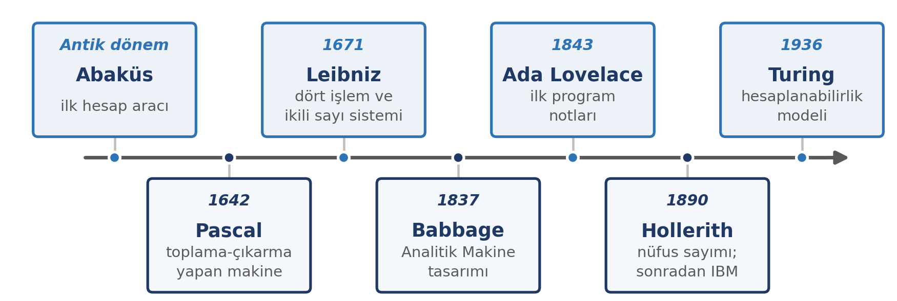
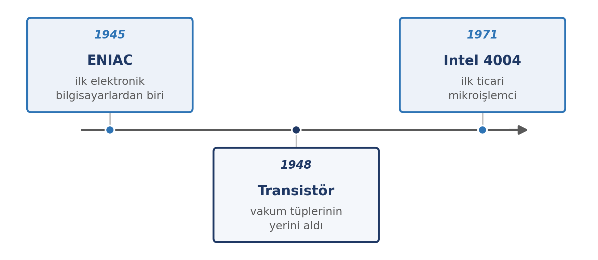

## Dersi Nasıl İşleyeceğiz?

- **Değerlendirme ölçütleri** ve ağırlıkları **ÖBS** üzerinden görülebilir.
- **Yoklama** alınır; **devamsızlık** takibi ÖBS'den izlenir.
- Her hafta **üç PDF** paylaşılır: **ders notu**, **sunum**, **alıştırma**. Sınavlar için bunların dışında kaynak gerekmez.
- **Sınava hazırlık:** Ders notlarını ücretsiz **Google NotebookLM**'e yükleyerek çalışabilirsiniz — sesli podcast, çalışma soruları, çalışma kartları.
- **Canlı dersler** sonradan **kayıttan** izlenebilir.

# Bu Haftanın Çerçevesi

## Öğrenme Çıktıları

- Veri, **enformasyon** ve **bilgi** kavramlarını ayırt eder ve örneklendirir.
- Bilgi toplumunun özelliklerini ve dijital dönüşümün etkilerini açıklar.
- Dijital okuryazarlığın bileşenlerini tanımlar.
- Bir bilgi kaynağını güvenilirliği açısından değerlendirir.
- Bilgisayarın tarihsel gelişimini ana hatlarıyla açıklar.

# Veri, Enformasyon ve Bilgi

## Üç Kavram, Üç Katman

| Kavram | Tanım | Örnek |
|:---|:---|:---|
| **Veri** | Ham gerçekler | 23,5 |
| **Enformasyon** | Bağlam kazanmış veri | Öğle saatlerinde hava 23,5 °C |
| **Bilgi** | Yorumlanmış enformasyon | Nem yüksek; öğle vakti koşu yapılmaz |

## Örnek Üzerinden

**Katman 1 — Veri**

`23,5`

**Katman 2 — Enformasyon**

Öğle saatlerinde hava sıcaklığı **23,5 °C** ölçüldü.

**Katman 3 — Bilgi**

Nem oranı da yüksek olduğu için **öğle vakti koşu yapmak uygun değil.**

## Aynı Veri, Farklı Bağlam

Bir mağazanın günlük satış rakamları tek başına **veridir**.

- Ürün adlarıyla eşleştirildiğinde: *"hangi ürün ne kadar satıldı"* → **enformasyon**
- Ekonomist için: harcama eğilimine ilişkin başka bir **enformasyon**

Veriyi anlamlı kılan, ona sorduğunuz sorudur.

# Bilgi Toplumu ve Dijital Dönüşüm

## Toplumdan Topluma

| Dönem | Temel Kaynak | Belirgin Özellik |
|:---|:---|:---|
| Tarım toplumu | Toprak | Üretim el emeğine dayanır |
| Sanayi toplumu | Sermaye ve makine | Fabrika temelli üretim |
| **Bilgi toplumu** | **Bilgi** | Değer, bilginin üretimi ve paylaşımıyla oluşur |

## Bilgi Toplumunun Özellikleri

- Bilgi ve iletişim teknolojileri yaşamın her alanına yayılır.
- Hizmet ve bilgi sektörlerinin ağırlığı artar.
- Bilgiye erişim hızlanır; **seçme ve değerlendirme** ihtiyacı da büyür.
- Çalışma esnekleşir: uzaktan çalışma, çevrimiçi eğitim, dijital işbirliği.
- Birey hem içerik **tüketicisi** hem de **üreticisi** hâline gelir.

## Dijital Dönüşüm Günlük Hayatta

Süreçlerin dijital ortama taşınması, verinin merkezî işlenmesi ve kararların veriye dayandırılması.

- Kamu hizmetlerinin elektronik ortama taşınması
- Çevrimiçi bankacılık ve ödeme sistemleri
- Uzaktan ve karma öğretim uygulamaları
- Bulut tabanlı ortak çalışma araçları

## Dijital Uçurum

İnternet erişimi, cihaz sahipliği ve dijital beceri düzeyi bakımından bireyler ile bölgeler arasındaki farklardır.

- Eğitime, işe ve kamu hizmetlerine erişimi doğrudan etkiler.
- Yalnızca altyapı sorunu değildir; **beceri** ve **kullanım** farkını da içerir.
- Dijital dönüşümün eşitsiz yüzünü gösterir.

# Dijital Okuryazarlık

## Dijital Okuryazarlık Nedir?

Dijital araçları ve ortamları **etkin, eleştirel ve güvenli** biçimde kullanabilme becerisidir.

- Yalnızca cihazı çalıştırmak değildir.
- Karşılaşılan içeriği **sorgulamayı** gerektirir.
- Kişisel güvenliği ve gizliliği korumayı kapsar.
- Çevrimiçi ortamda **sorumlu davranmayı** içerir.

## Bileşenleri

| Bileşen | Ne kazandırır? |
|:---|:---|
| Teknik beceriler | Cihaz ve yazılımları amaca uygun kullanma |
| Bilgi okuryazarlığı | Bilgiyi bulma ve değerlendirme |
| Medya okuryazarlığı | İçeriğin kaynağını ve amacını sorgulama |
| Güvenlik ve gizlilik | Hesapları ve verileri koruma |
| İletişim ve işbirliği | Uygun üslupla iletişim, ortak çalışma |
| Dijital etik | Telif hakkı, kaynak gösterme, nezaket |

## Bir Kaynağa Güvenmeli miyim? Beş Soru

1. **Kim** yazdı? Yazarın uzmanlığı açık mı?
2. **Ne zaman** yayımlandı? Bilgi güncel mi?
3. **Kanıt** var mı? İddia veriye dayanıyor mu?
4. **Amaç** ne? Bilgilendirmek mi, ikna etmek mi?
5. **Başka kaynaklar** ne diyor?

Bilgiye ulaşmak artık kolay. Asıl beceri, ulaşılan bilginin doğruluğunu değerlendirmektir.

# Bilgisayarın Kısa Tarihi

## Hesaplama Araçlarından Elektronik Bilgisayara

## İlk Elektronik Bilgisayarlar

**ENIAC (1945)** — binlerce vakum tüpüyle çalışıyordu ve yaklaşık 167 m² alan kaplıyordu.

## Bilgisayar Nesilleri

| Nesil | Dönem | Belirleyici teknoloji |
|:---|:---|:---|
| Birinci nesil | 1945–1956 | Vakum tüpleri |
| İkinci nesil | 1956–1964 | Transistörler |
| Üçüncü nesil | 1964–1970 | Entegre devreler |
| Dördüncü nesil | 1971 ve sonrası | Mikroişlemciler |

## Bugün ve Yarın

- Tek bir çipte milyarlarca transistör.
- Bilgisayar artık yalnızca masaüstü değil: telefon, tablet, saat, sunucu, gömülü sistemler.
- **Bulut bilişim**: hesaplama gücü uzak sunucularda.
- **Yapay zekâ**: hesaplamanın yeni dönemi.

# Kapanış

## Dersin Yapısı ve Değerlendirme

| Haftalar | Blok |
|:---|:---|
| 1–6 | Temel kavramlar ve altyapı |
| 7–9 | Üretim araçları (kelime işlemci, tablo, sunum) |
| 10–14 | Değerlendirme ve sorumluluk |

- **Başarı notu:** ara sınav (vize), **kısa sınav** ve **dönem sonu sınavı (final)** notlarının **ortalaması**.
- Haftalık **alıştırmalar** notla değerlendirilmez.

## Bu Haftanın Uygulaması

1. Günlük kullandığınız dijital araçları listeleyin ve gruplayın.
2. Bir örnekte **veri → enformasyon → bilgi** katmanlarını yazın.
3. Bir haber veya paylaşımı beş soruyla değerlendirin.
4. Kısa bir paragrafla: hangi kavram alışkanlığınızı değiştirdi?

Gelecek hafta: **Bilgisayar donanımı** — işlemci, bellek, depolama, çevre birimleri ve bilgisayar türleri.

## Özet

- **Veri** ham gerçektir; **enformasyon** bağlamla anlam kazanır; **bilgi** kararda kullanılır.
- **Bilgi toplumu**, değerin bilgi üretimi etrafında şekillendiği toplumdur.
- **Dijital okuryazarlık**; teknik beceri, sorgulama, güvenlik ve etikten oluşur.
- Bilgisayarlar **dört nesilde** vakum tüpünden mikroişlemciye gelmiştir.
