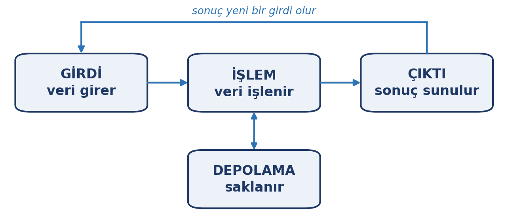
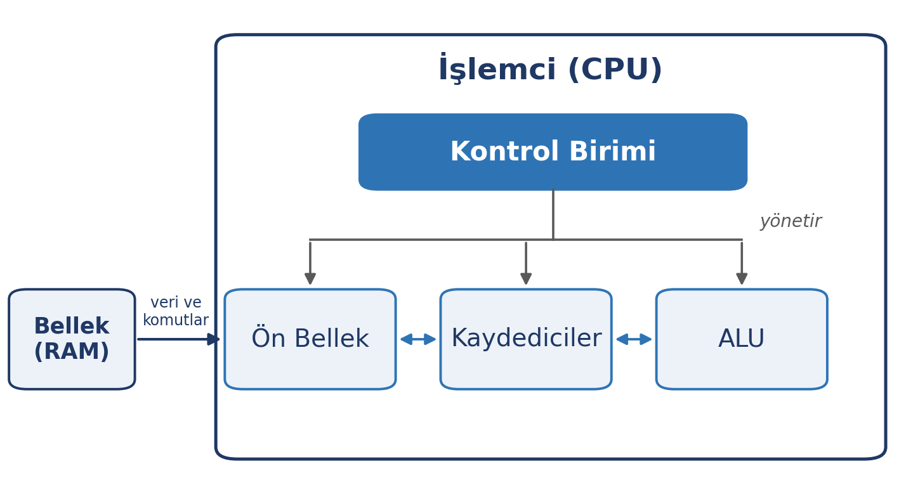
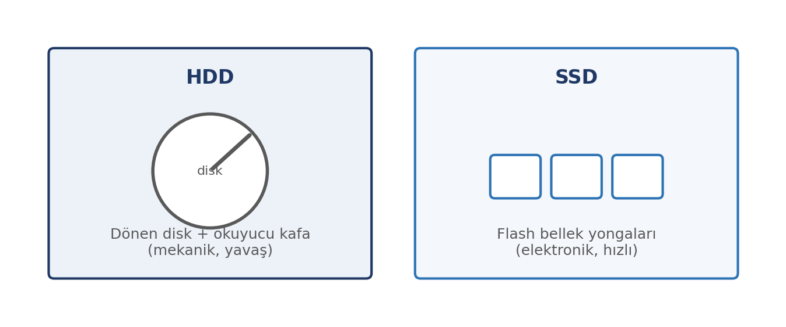

# Bu Haftanın Çerçevesi

## Öğrenme Çıktıları

- Girdi–işlem–çıktı–depolama döngüsünü açıklar.
- İşlemci, bellek, depolama ve ekran kartının görevlerini ayırt eder.
- İşlemcinin iç birimlerini (kontrol birimi, ALU, kaydediciler, ön bellek) tanır.
- Bellek ile depolama arasındaki farkı açıklar.
- HDD ile SSD arasındaki farkı ve günlük etkisini değerlendirir.
- GPU'nun işlemciden farkını ve kullanım alanlarını açıklar.
- Çevre birimlerini giriş ve çıkış işlevlerine göre ayırt eder.
- Bit, bayt ve ölçü birimlerini doğru kullanır.
- Bilgisayar türlerini ayırt eder.

# Girdi–İşlem–Çıktı–Depolama

## Dört Temel İş

Bilgisayar dört iş yapar: veriyi **alır, işler, verir ve saklar**.

{width=70%}

## Döngüyü Bir Örneğe Uygulayın

Müzik dinleme:

1. **Girdi:** Dosya ve ses girişi
2. **İşlem:** İşlemci ses verisini işler
3. **Çıktı:** Hoparlörden ses çıkar
4. **Depolama:** Müzik dosyası diskte durur

Her donanım bileşeni bu döngünün bir aşamasında görev alır.

# Ana Donanım Bileşenleri

## Anakart: Sistemin Omurgası

İşlemci, bellek, ekran kartı ve depolama; hepsi anakart üzerinde birleşir ve bu kart üzerinden birbiriyle konuşur.

- Bileşenler ortak **veri yolu** (bus) üzerinden haberleşir.

{width=70%}

## İşlemci: Bilgisayarın Beyni

- Programlardaki komutları tek tek yürütür.
- Hesapları yapar, diğer bileşenleri yönetir.

İki özellik yeter:

| Özellik | Anlamı |
|:---|:---|
| Çekirdek | Aynı anda kaç iş yapabildiği |
| Hız | Saniyede kaç işlem yapabildiği (GHz) |

## İşlemci Hakkında Yeterli Bilgi

"İşlemci ne kadar güçlü" = "aynı anda ne kadar çok ve ne kadar hızlı iş yapabildiği".

- Günlük kullanımda orta seviye bir işlemci çoğu işi görür.
- Ayrıntılı mimari karşılaştırmaları ve saat hızı yarışı bu dersin dışındadır.

## İşlemcinin İç Yapısı

{width=85%}

## İşlemcinin İçinde Ne Var?

- **Kontrol birimi:** komutları okur, çalışmayı yönetir.
- **ALU:** hesaplama ve karşılaştırma yapar.
- **Kaydediciler:** en hızlı, çok küçük saklama alanları.
- **Ön bellek:** sık kullanılan veriyi tutar.

**Mimari:** masaüstünde x86, mobilde ARM; ikisi de aynı işi farklı komut kümeleriyle yapar.

## Ekran Kartı ve GPU

- **Ekran kartı:** görüntüyü ekrana çizer.
- **GPU:** ekran kartının üzerindeki işlemci.

İşlemci az sayıda karmaşık işi, GPU **binlerce basit işi aynı anda** yapar.

## GPU'nun Kullanım Alanları

- Oyunlarda üç boyutlu görüntü
- Video düzenleme ve görüntü işleme
- Bilimsel hesaplamalar ve benzetimler
- **Yapay zekâ modeli eğitimi**

12. haftada yapay zekâyı işlerken "GPU binlerce işi aynı anda yapar" özelliğine geri döneceğiz.

## Bellek: RAM

- **Çalışma belleğidir.**
- Açık programları ve anlık veriyi tutar.
- Elektrik kesilince **silinir** (geçici).

Benzetme: **masa** — üzerinde çalıştığınız şeyler.

## Bellek: ROM ve BIOS

- **ROM:** Kalıcı, yalnızca okunur bellek.
- Açılışta çalışan temel yazılımı barındırır: **BIOS** (yeni sistemlerde **UEFI**).
- Donanımın içine gömülü bu yazılımlara **donanım yazılımı** (firmware) denir.
- BIOS önce temel donanımı sınar, ardından işletim sistemini başlatır.
- Açılışta gördüğünüz ilk ekran bu yüzden BIOS'a aittir.

## Ön Bellek (Cache)

- Çok küçük ama çok hızlı bir bellek türüdür.
- Sık kullanılan veriyi tutar; işlemcinin belleğe gitme sayısını azaltır.

"Ön bellek vardır ve hızlandırır" bilgisi yeter.

## Bellek mi, Depolama mı?

{width=70%}

## En Sık Kavram Karışıklığı

"Bilgisayarım yavaş" denilince diski suçlarız; oysa yavaşlığın en sık nedeni **RAM'in yetmemesidir**.

- Disk büyütmek bu sorunu çözmez.
- RAM'i büyütmek çözebilir.

## Depolama: HDD ve SSD

{width=70%}

- **HDD:** mekanik, yavaş, ucuz.
- **SSD:** elektronik, çok hızlı, sessiz.

## SSD'nin Günlük Farkı

SSD'li bilgisayar hızlı açılır, uygulamalar saniyeler içinde yüklenir.

- Yeni bir bilgisayarda **SSD, performans için ilk bakılacak özelliktir**.
- HDD, büyük ve ucuz yedek alan için tercih edilir.

# Çevre Birimleri

## Çevre Birimleri Üç Türde

| Tür | Görev | Örnek |
|:---|:---|:---|
| Giriş | Veriyi aktarır | Klavye, fare, touchpad, mikrofon, tarayıcı |
| Çıkış | Sonucu iletir | Monitör, projeksiyon, yazıcı, çizici |
| Hem giriş hem çıkış | İki yönde taşır | Dokunmatik ekran, çok fonksiyonlu yazıcı |

## Çevre Birimleri Tanıyalım

- **Touchpad:** Dizüstünde farenin yerini alır.
- **Tarayıcı:** Basılı belgeyi sayısal hâle çevirir.
- **Çok fonksiyonlu (tarayıcılı) yazıcı:** Yazdırır, tarar, fotokopi çeker; hem giriş hem çıkış birimidir.
- **Çizici (plotter):** Kalemle büyük ve hassas çizim basar.
- **Projeksiyon cihazı:** Görüntüyü büyüterek perdeye yansıtır.

## Bağlantı Noktaları

- **USB:** Klavye, fare, bellek, yazıcı — en yaygın.
- **USB-C:** Yeni nesil; küçük, çift yönlü; veri ve şarj.
- **HDMI:** Monitör ve televizyon bağlantısı.
- **Ethernet:** Kablolu ağ.

Noktaları tanımak, "kablom uymuyor" sorununu çözer.

# Veri ve Ölçü Birimleri

## Bit ve Bayt

- **Bit:** 0 veya 1; en küçük bilgi birimi.
- **Bayt:** 8 bit; yaklaşık bir karakter.

Bilgisayar her şeyi bit olarak temsil eder.

## Ölçü Birimleri

| Birim | Yaklaşık değer |
|:---|:---|
| Bayt (B) | 8 bit |
| Kilobyte (KB) | 1.024 bayt |
| Megabyte (MB) | ~1 milyon bayt |
| Gigabyte (GB) | ~1 milyar bayt |
| Terabyte (TB) | ~1 trilyon bayt |

## Gerçek Nesnelerle İlişkilendirin

- Fotoğraf: **2–5 MB**
- Şarkı: **3–5 MB**
- Film: **1–2 GB**
- 1 TB disk: **yüzlerce film, binlerce fotoğraf**

Birimleri ezberlemek yerine gerçek nesnelerle eşleştirin.

# Bilgisayar Türleri

## Bilgisayar Sadece Masaüstü Değil

| Tür | Tipik kullanım |
|:---|:---|
| Masaüstü | Ofis, ev, oyun |
| Dizüstü | Hareketlilik |
| Tablet | Okuma, not, medya |
| İş istasyonu | Mühendislik, video kurgu |
| Sunucu | Ağ hizmetleri |
| Süper bilgisayar | Bilimsel modelleme, yapay zekâ eğitimi |
| Gömülü sistemler | Modem, TV, araç |

Telefonunuz da bir bilgisayardır; modeminiz de.

# Günlük Hayatta Donanım

## Satın Alırken Neye Bakmalı?

- **RAM:** 8 GB çoğu işi görür; 16 GB rahatlık.
- **Depolama:** Öncelik **SSD**.
- **İşlemci:** Ağır iş yoksa orta seviye yeter.
- **Ekran kartı:** Oyun ve video düzenleme için ayrı kart.

::: {.callout-warning}
**Tek bir sayıya bakarak karar vermeyin.** Yüksek işlemci hızı her işi hızlandırmaz; günlük kullanımda yeterli RAM ve SSD daha çok hissedilir.
:::

## Bilgisayar Neden Yavaşlıyor?

- **RAM yetmiyor:** Çok program açık.
- **Disk dolu:** Depolama neredeyse tamamen dolu.
- **Arka plan uygulamaları:** Kaynak tüketiyor.
- **Donanım eskimiş:** Yeni yazılımlar zorluyor.

## Uygulama: Kendi Cihazınızı Tanıyın

1. Cihazınızın işlemci, RAM ve depolama bilgisini bulun.
2. Hangisinin RAM, hangisinin depolama olduğunu doğrulayın.
3. Üç senaryo için (öğrenci, içerik üreticisi, arşivci) önceliği belirleyin.

Notla değerlendirilmez; donanımı kendi cihazınız üzerinden içselleştirmeniz içindir.

## Özet

- Bilgisayar veriyi **alır, işler, verir, saklar**.
- **İşlemcinin içinde** kontrol birimi, ALU, kaydediciler ve ön bellek çalışır.
- **RAM** çalışma belleği (geçici), **depolama** kalıcıdır.
- **BIOS/UEFI** açılışta donanımı sınar, işletim sistemini başlatır.
- **SSD**, HDD'den çok daha hızlıdır.
- **GPU** binlerce basit işi aynı anda yapar.
- Boyutlar **KB → MB → GB → TB** büyür.

## Gelecek Hafta

**Yazılım ve işletim sistemleri** — açık/kapalı kaynak yazılım, Windows–Linux–macOS–Pardus, mobil ve gömülü işletim sistemleri.
