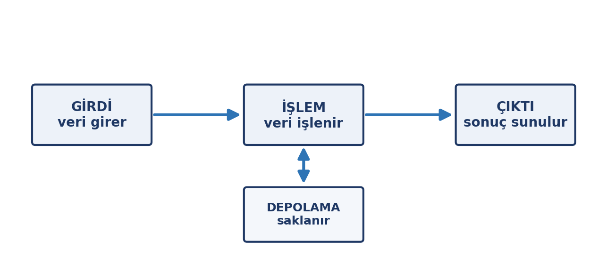
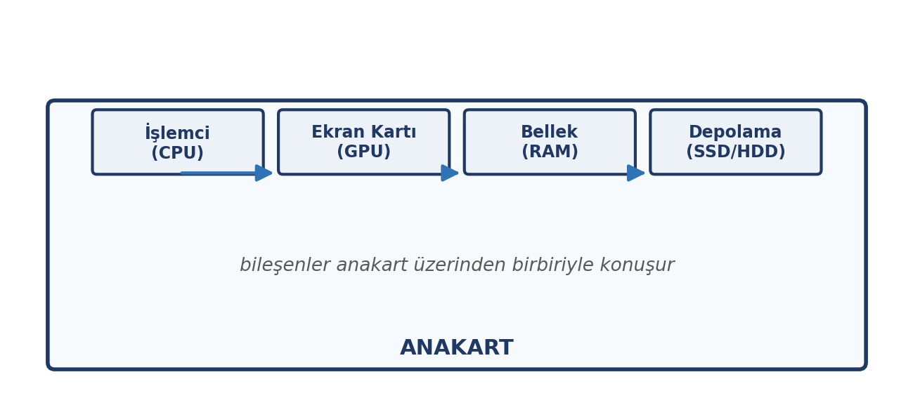
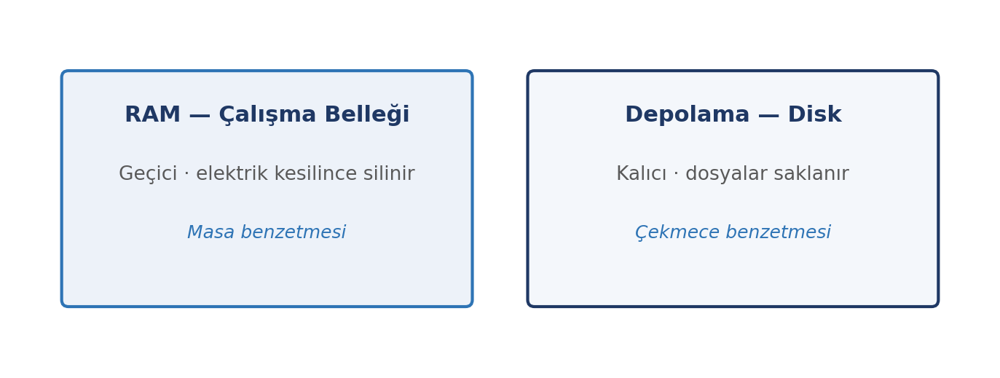

# Giriş

Ekran, klavye, kasa ve içinde neler olduğunu çoğu zaman görmediğimiz parçalar… Bir bilgisayarın işinizi görüp görmemesi, büyük ölçüde bu parçaların ne kadar uyumlu ve yeterli olduğuna bağlıdır. Bu haftanın amacı, sizi bir donanım uzmanı yapmak değil; karşınıza çıkan bir bilgisayarı **tanıyabilen, değerlendirebilen ve satın alırken ya da kullanırken doğru soruyu sorabilen** bir kullanıcı hâline getirmek.

Bu yüzden içeriği iki ilkeyle kuruyoruz: Her bileşenin **görevini** öğreniyoruz, teknik ayrıntılarına girmiyoruz; ve öğrendiğimiz her şeyi **günlük hayata** bağlıyoruz — bilgisayar alırken neye bakacağımız, neden yavaşladığı, hangi parçanın neyi hızlandırdığı gibi.

::: {.callout-note}
## Bu haftanın temel fikri

Bilgisayar, birlikte çalışan parçalar bütünüdür. Tek bir parçanın bile görevini bilmek, hem satın alırken hem de bir sorun çıktığında doğru karar vermenizi sağlar.
:::

# Bu Haftanın Öğrenme Çıktıları

- Girdi–işlem–çıktı–depolama döngüsünü açıklar ve günlük hayattan örnekler verir.
- İşlemci, bellek, depolama ve ekran kartının görevlerini birbirinden ayırt eder.
- Bellek (RAM) ile depolama (disk) arasındaki farkı açıklar.
- HDD ile SSD arasındaki farkı açıklar ve günlük kullanıma etkisini değerlendirir.
- Ekran kartının (GPU) işlemciden farkını ve kullanım alanlarını açıklar.
- Bit, byte ve ölçü birimlerini (KB, MB, GB, TB) doğru kullanır.
- Bilgisayar türlerini ve hangi amaçla kullanıldıklarını ayırt eder.

# Girdi–İşlem–Çıktı–Depolama Döngüsü

Bilgisayar ne kadar karmaşık görünürse görünsün, temelde dört iş yapar: dışarıdan veri **alır**, aldığını **işler**, sonucu **verir** ve gerektiğinde **saklar**. Bu dört adım bir döngü hâlinde sürekli tekrarlanır.

{width=70%}

| Aşama | Ne olur | Örnek (belge yazma) |
|:---|:---|:---|
| Girdi | Veri bilgisayara girer | Klavyeden yazı yazma |
| İşlem | Veri işlenir, dönüştürülür | Yazının işlemci tarafından işlenmesi |
| Çıktı | Sonuç kullanıcıya sunulur | Yazının ekranda görünmesi |
| Depolama | Sonuç saklanır | Belgenin diske kaydedilmesi |

Aynı döngüyü başka örneklere uygulayın: müzik dinlerken (dosya → işlemci → hoparlör), fotoğraf çekerken (kamera → işlemci → ekran/dosya), oyun oynarken (fare ve klavye → işlemci ve ekran kartı → ekran). Döngünün hangi aşamasında hangi donanımın çalıştığını görmek, bileşenleri anlamanın en kısa yoludur.

# Ana Donanım Bileşenleri

Bilgisayarın içindeki bileşenler **kasa** içinde, genellikle tek bir devre kartı üzerinde toplanır. Bu kart aşağıda tanıtacağımız parçaların hepsini birbirine bağlar.

## Anakart

**Anakart** (motherboard), işlemci, bellek ve ekran kartı gibi bileşenlerin üzerine takıldığı ana devre kartıdır. Sistemin omurgasıdır: parçalar arasındaki iletişimi sağlar. Anakartı, üzerinde her şeyin bağlandığı bir **iskelet** gibi düşünebilirsiniz. Bileşenlerin birbiriyle konuşabilmesi için anakartın desteklediği bağlantı türlerinin uyumlu olması gerekir.

{width=70%}

## İşlemci (CPU)

**İşlemci**, bilgisayarın beynidir: programlardaki komutları tek tek yürütür, hesapları yapar ve diğer bileşenleri yönetir. İki özelliği bilmek yeterlidir:

- **Çekirdek:** Modern işlemciler birden çok çekirdeğe sahiptir. Her çekirdek ayrı bir işi yapabildiği için çekirdek sayısı arttıkça bilgisayar aynı anda daha çok işi yürütebilir.
- **Hız:** İşlemcinin bir saniyede kaç işlem yapabildiğinin kaba bir göstergesidir (GHz ile ölçülür). Ancak tek başına hız, her şeyi anlatmaz; mimari ve çekirdek sayısı da önemlidir.

::: {.callout-note}
## İşlemci hakkında bilmeniz gereken tek şey

"İşlemci ne kadar güçlü" sorusunun günlük hayattaki karşılığı, "aynı anda ne kadar çok ve ne kadar hızlı iş yapabildiği"dir. Detaylı mimari ve saat hızı karşılaştırmaları bu dersin kapsamı dışındadır.
:::

## Ekran kartı ve grafik işlemci (GPU)

**Ekran kartı**, görüntünün ekrana çizilmesinden sorumlu bileşendir. Üzerindeki işlemciye **grafik işlemci (GPU)** denir.

GPU ile işlemci arasındaki fark, işin **türünde** yatar: İşlemci az sayıda ama karmaşık işi sırayla çok hızlı yapar; GPU ise **binlerce basit işi aynı anda** yapar. Bu yüzden GPU, milyonlarca noktanın aynı anda hesaplanması gereken işlerde öne çıkar:

- Oyunlarda üç boyutlu görüntünün kare kare çizilmesi
- Video düzenleme ve görüntü işleme
- Bilimsel hesaplamalar ve benzetimler
- **Yapay zekâ modeli eğitimi**

::: {.callout-tip}
## 12. haftaya köprü

"GPU binlerce basit işi aynı anda yapar" özelliği, günümüzde yapay zekâ modeli eğitiminin de temelidir. Bu konuyu 12. haftada yapay zekâyı işlerken yeniden hatırlayacağız.
:::

## Bellek: RAM, ROM ve ön bellek

**RAM**, bilgisayarın çalışma belleğidir. O anda açık olan programları ve işlenen veriyi tutar. Elektrik kesildiğinde ya da bilgisayar kapandığında RAM'in içindekiler **silinir**; yani RAM geçicidir.

**ROM**, üzerindeki bilgiyi kalıcı olarak saklayan, yalnızca okunabilen bellektir. Bilgisayarın açılışında çalışan temel yazılımı (donanım yazılımı) barındırır. Kullanıcı bu içeriği değiştirmez.

**Ön bellek** (cache), işlemcinin en sık kullandığı verileri tutan çok küçük ama çok hızlı bellektir. Sık kullanılan veriye hızlı erişim sağlayarak sistemi hızlandırır. "Ön bellek vardır ve hızlandırır" bilgisi bu ders için yeterlidir.

## Bellek ile depolama ayrımı

En sık yapılan kavram karışıklığı, **bellek (RAM)** ile **depolama (disk)** arasındadır. İkisi de "hafıza" gibi algılanır ama görevleri tamamen farklıdır.

| | Bellek (RAM) | Depolama (disk) |
|:---|:---|:---|
| Görevi | Çalışan programları ve anlık veriyi tutar | Dosyaları kalıcı olarak saklar |
| Kalıcılık | Elektrik kesilince silinir | Kalıcıdır |
| Hız | Çok hızlı | RAM'e göre yavaş |
| Kapasite | Genellikle GB düzeyinde, daha küçük | Genellikle daha büyük (yüzlerce GB–TB) |
| Benzetme | **Masa** — üzerinde çalıştığınız şeyler | **Çekmece** — sakladığınız şeyler |

{width=70%}

::: {.callout-warning}
## Neden önemli?

"Bilgisayarım yavaş" denildiğinde çoğu insan diski (depolamayı) suçlar. Oysa yavaşlığın en sık nedeni **RAM'in yetmemesidir**: açık program sayısı masanın üzerine sığmaz hâle gelir, sistem yavaşlar. Diski büyütmek bu sorunu çözmez; RAM'i büyütmek çözebilir.
:::

## Depolama: HDD ve SSD

Depolama birimleri iki ana türe ayrılır: mekanik **HDD** ve elektronik **SSD**.

| | HDD | SSD |
|:---|:---|:---|
| Çalışma biçimi | Dönen disk + okuyucu kafa (mekanik) | Flash bellek yongaları (elektronik) |
| Hız | Yavaş | Çok hızlı |
| Hareketli parça | Var | Yok |
| Gürültü | Çalışırken duyulabilir | Sessiz |
| GB başına maliyet | Daha ucuz | Daha pahalı |

{width=70%}

::: {.callout-tip}
## SSD'nin günlük hayattaki farkı

SSD'li bir bilgisayar çok daha hızlı açılır, uygulamalar saniyeler içinde yüklenir ve dosyalar hızla kopyalanır. Günümüzde yeni bir bilgisayarda **SSD bulunması, performans için ilk bakılacak özelliktir**; HDD ise genellikle büyük ve ucuz yedek alan ihtiyacı için tercih edilir.
:::

# Çevre Birimleri ve Bağlantı Noktaları

**Çevre birimleri**, kasanın dışında kalan ve bilgisayara bağlanan aygıtlardır. Verinin yönüne göre üçe ayrılır:

| Tür | Görevi | Örnekler |
|:---|:---|:---|
| Giriş birimleri | Veriyi bilgisayara aktarır | Klavye, fare, mikrofon, tarayıcı, kamera |
| Çıkış birimleri | Sonucu kullanıcıya iletir | Monitör, yazıcı, hoparlör |
| Hem giriş hem çıkış | İki yönde de veri taşır | Dokunmatik ekran, USB bellek, harici disk |

Çevre birimleri bilgisayara **bağlantı noktaları** (port) üzerinden takılır. En sık karşılaşacağınız noktalar: **USB** (klavye, fare, bellek, yazıcı gibi pek çok cihaz), **USB-C** (yeni nesil, küçük ve çift yönlü uç; hem veri hem şarj), **HDMI** (monitör ve televizyon bağlantısı) ve **Ethernet** (kablolu ağ). Bağlantı noktalarını tanımak, "kablom uymuyor" sorununu kendi başınıza çözmenizi sağlar.

# Bit, Byte ve Ölçü Birimleri

Bilgisayar her şeyi **bit** ile temsil eder. Bir bit, 0 veya 1 değerini alabilen en küçük bilgi birimidir. Sekiz bit bir araya gelerek **byte**'ı oluşturur; bir byte yaklaşık olarak tek bir harfi temsil eder.

Dosya boyutları büyüdükçe daha büyük birimler kullanılır. Her birim, bir öncekinin yaklaşık bin katıdır (bilgisayarlar ikilik sistemde çalıştığı için tam olarak 1024 katı):

| Birim | Kısaltma | Yaklaşık değer | Gerçek hayattan örnek |
|:---|:---|:---|:---|
| Kilobyte | KB | 1.024 byte | Kısa bir metin dosyası |
| Megabyte | MB | ~1 milyon byte | Bir fotoğraf (2–5 MB), bir şarkı (3–5 MB) |
| Gigabyte | GB | ~1 milyar byte | Bir film (1–2 GB), bir uygulama |
| Terabyte | TB | ~1 trilyon byte | Yüzlerce film, binlerce fotoğraf |

::: {.callout-note}
## Neden 1024?

Bilgisayarlar ikilik (0–1) sistemde çalıştığı için birimler 1000'in katlarıyla değil, 1024'ün katlarıyla artar. Günlük konuşmada "bir megabayt yaklaşık bir milyon byte" demek yeterlidir.
:::

# Bilgisayar Türleri

Bilgisayar denince akla masaüstü gelse de, günümüzde bilgisayarlar pek çok biçimde karşımıza çıkar:

| Tür | Özellik | Tipik kullanım |
|:---|:---|:---|
| Masaüstü | Kasa + ayrı monitör/klavye; parçaları değiştirilebilir | Ofis, ev, oyun; güç ve genişletme öncelikli |
| Dizüstü (laptop) | Taşınabilir, hepsi bir arada | Öğrenci, çalışan; hareketlilik öncelikli |
| Tablet | Dokunmatik, çok taşınabilir | Okuma, not alma, medya |
| Sunucu | Ağa hizmet veren güçlü ve sürekli açık bilgisayar | Web siteleri, kurumsal hizmetler |
| Gömülü sistemler | Tek amaca özel, cihazın içinde | Modem, akıllı TV, araç, endüstriyel cihaz |

Günlük hayatta bunların çoğuyla iç içeyiz: telefonunuz da bir bilgisayardır, evinizdeki modem de. "Bilgisayar" kavramını yalnızca masaüstü kutudan ibaret görmemek, bu dersteki diğer konuları da anlamayı kolaylaştırır.

# Günlük Hayatta Donanım

Öğrendiklerimizi iki pratik senaryoya bağlayalım.

::: {.callout-note}
## Bilgisayar alırken neye bakmalı?

- **RAM:** Günlük kullanım için 8 GB çoğu işi görür; çok program açık çalışıyorsanız 16 GB rahatlık sağlar.
- **Depolama:** Öncelik **SSD** olsun; hız farkı günlük kullanımda hemen hissedilir.
- **İşlemci:** Ağır video veya oyun kullanmayacaksanız orta seviye bir işlemci yeterlidir.
- **Ekran kartı:** Yalnızca oyun, video düzenleme veya yoğun grafik işi yapacaksanız ayrı bir ekran kartına yatırım yapın.
:::

::: {.callout-note}
## Bilgisayar neden yavaşlıyor?

- **RAM yetmiyor:** Aynı anda çok program açık; bellek dolar, sistem yavaşlar.
- **Disk dolu:** Depolama neredeyse tamamen doluysa sistem çalışmakta zorlanır.
- **Arka planda çok uygulama:** Başlangıçta kendiliğinden açılan programlar kaynak tüketir.
- **Donanım eskimiş:** Yeni yazılımlar eski donanımı zorlar.
:::

# Uygulama: Kendi Cihazınızı Tanıyın

Bu haftanın uygulaması, öğrendiklerinizi kendi cihazınız üzerinde somutlaştırır. Özel bir yazılıma gerek yoktur; cihazınızın ayarlar bölümü yeter.

## Adım 1 — Cihazınızın özelliklerini bulun

Cihazınızın sistem veya ayarlar bölümünden şu üç bilgiyi bulun: işlemci modeli, bellek (RAM) miktarı ve depolama türü ile kapasitesi. Bulduğunuz değerleri yazın.

## Adım 2 — Bellek ve depolamayı doğrulayın

Yukarıda bulduğunuz iki değeri birbirine karıştırmadığınızdan emin olun: hangisi **çalışma belleği** (RAM), hangisi **kalıcı depolama** (disk)? Her ikisinin de kaç GB olduğunu not edin.

## Adım 3 — Bir satın alma senaryosu çözün

Şu üç kişi için önceliği belirleyin: (a) yalnızca ders notu ve e-posta kullanan bir öğrenci, (b) video düzenleyen bir içerik üreticisi, (c) çok sayıda belge ve fotoğraf arşivleyen bir çalışan. Her biri için RAM, SSD ve ekran kartından hangisinin öncelikli olduğunu birer cümleyle gerekçelendirin.

## Adım 4 — Kısa değerlendirme yazın

Yaklaşık bir paragraf yazın: *Bu hafta öğrendiğiniz hangi bilgi, bilgisayara bakışınızı değiştirdi? Neden?*

::: {.callout-tip}
## Teslim ve değerlendirme

Bu uygulama notla değerlendirilmez. Amacı, donanım kavramlarını kendi cihazınız ve ihtiyaçlarınız üzerinden içselleştirmenizdir.
:::

# Özet

- Bilgisayar dört iş yapar: veriyi **alır, işler, verir ve saklar** (girdi–işlem–çıktı–depolama).
- **Anakart** bileşenleri birbirine bağlar; **işlemci** komutları yürütür; **RAM** çalışma belleğidir; **depolama** dosyaları kalıcı saklar.
- **RAM geçicidir** (elektrik kesilince silinir), **depolama kalıcıdır**; ikisi farklı görevler üstlenir.
- **SSD**, HDD'ye göre çok daha hızlıdır; günlük performansta ilk bakılacak özelliktir.
- **GPU**, binlerce basit işi aynı anda yapar; oyun, görüntü işleme, bilimsel hesap ve yapay zekâda kullanılır.
- **Bit** 0/1'dir; **byte** 8 bittir; boyutlar KB → MB → GB → TB olarak büyür.
- Bilgisayar; masaüstü, dizüstü, tablet, sunucu ve gömülü sistemler gibi pek çok biçimde bulunur.

# Kendini Sınama Soruları

1. Girdi–işlem–çıktı–depolama döngüsünü, müzik dinleme örneği üzerinden açıklayın.
2. İşlemci ile ekran kartı (GPU) arasındaki fark nedir? GPU hangi işlerde öne çıkar?
3. RAM ile depolama arasındaki temel fark nedir? Hangisi elektrik kesilince silinir?
4. SSD'nin HDD'ye göre günlük hayatta hissedilen avantajı nedir?
5. "Bilgisayarım yavaş" şikâyetinin en sık iki donanım nedenini yazın.
6. Bir byte kaç bittir? KB, MB, GB ve TB sıralamasını küçükten büyüğe yazın.
7. Dokunmatik ekran neden hem giriş hem çıkış birimidir?
8. Bir fotoğrafın, bir filmin ve bir TB'lık diskin boyutlarını kabaca ilişkilendirin.

# Kaynaklar

Bu haftanın konularını destekleyen, kamuya açık kaynaklar:

- **İşletim sisteminizin resmî yardım ve destek sayfaları** — cihaz bilgilerine ve sistem özelliklerine nasıl bakılacağı.
- **Bilgisayar üreticilerinin resmî alıcı kılavuzları ve ürün sayfaları** — RAM, depolama ve işlemci özelliklerinin karşılaştırılması.
- **Bağımsız teknoloji inceleme sitelerinin alıcı rehberleri** — bütçeye göre donanım seçiminde tarafsız karşılaştırmalar.

Haftaya özel ek okuma önerileri ve güncel bağlantılar, dersin çevrimiçi ortamında ayrıca paylaşılır.
