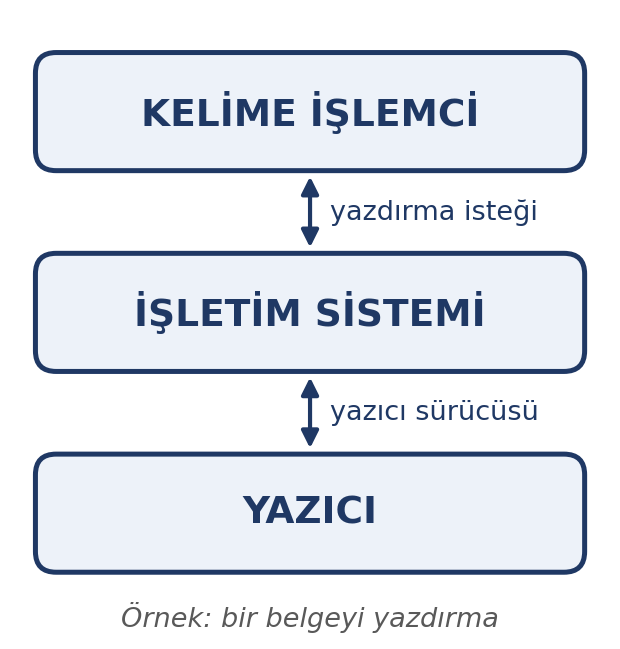
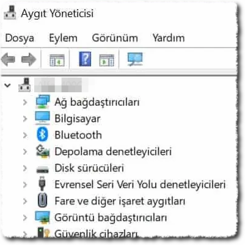
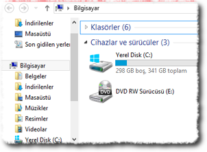
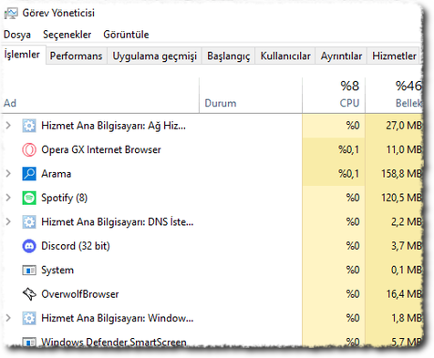
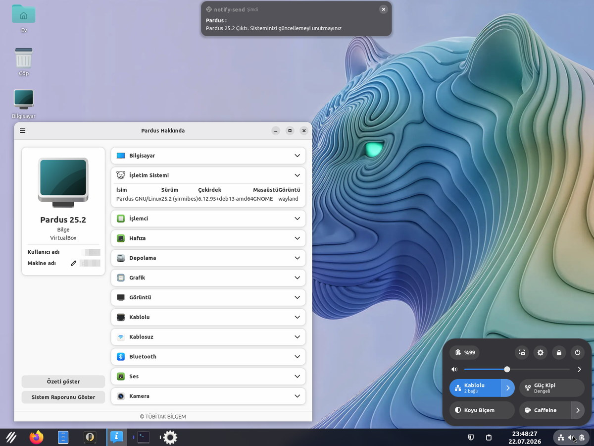
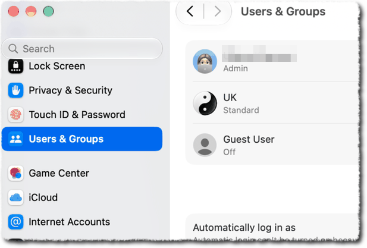
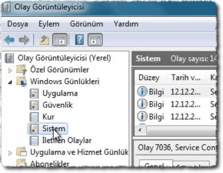
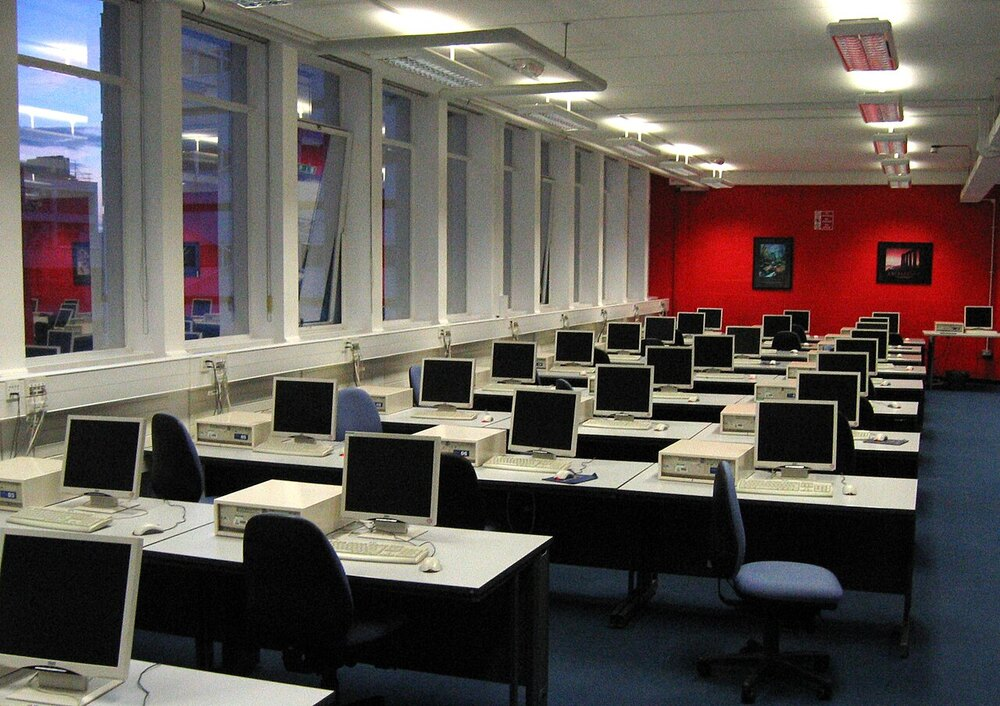
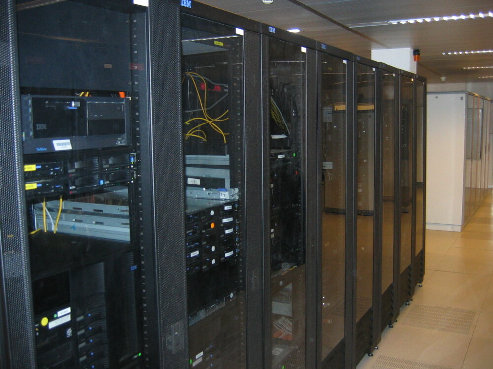
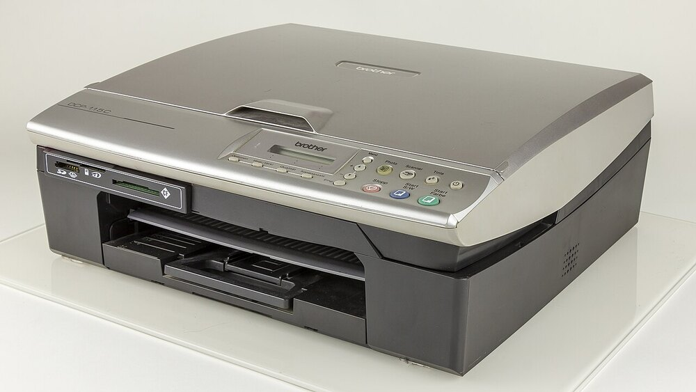

# Bu Haftanın Çerçevesi

## Öğrenme Çıktıları

- Sistem ve uygulama yazılımını ayırt eder.
- Açık kaynak ve kapalı kaynak yazılımı karşılaştırır.
- İşletim sisteminin görevlerini sıralar.
- Windows, Linux ve macOS ailelerini ayırt eder; Pardus'un yerli bir Linux dağıtımı olduğunu bilir.
- Masaüstü, mobil ve gömülü işletim sistemlerini tanır.
- Basit sorunlarda doğru adımı bilir.

# Yazılım Nedir?

## Donanım Gövde, Yazılım Akıl

Donanım tek başına hiçbir işe yaramaz; ona ne yapacağını söyleyen şey **yazılımdır**.

Elle tutulmaz, görünmez — ama donanımı anlamlı kılan odur.

## İki Tür Yazılım

| Tür | Ne yapar | Örnek |
|:---|:---|:---|
| **Sistem yazılımı** | Donanımı yönetir, zemin hazırlar | İşletim sistemi, sürücüler |
| **Uygulama yazılımı** | Kullanıcının işini yapar | Kelime işlemci, tarayıcı, oyun |

## Yazılım Katmanları

{width=58%} {width=30%}

Bir uygulama doğrudan donanıma erişemez; isteğini işletim sistemine iletir.

# Açık Kaynak ve Kapalı Kaynak

## İki Kaynak Modeli

- **Kapalı kaynak:** Kaynak kodu gizli; yalnızca üretici görüp değiştirebilir.
- **Açık kaynak:** Kaynak kodu herkese açık; incelenebilir, değiştirilebilir, paylaşılabilir.

::: {.callout-warning}
**Açık kaynak, "ücretsiz" demek değildir.** Açık kaynak kodun görülebilir ve değiştirilebilir olmasıdır; bazı açık kaynak yazılımlar ücretlidir.
:::

## Karşılaştırma

| | Açık kaynak | Kapalı kaynak |
|:---|:---|:---|
| Kaynak kodu | Herkese açık | Gizli |
| Ücret | Genellikle ücretsiz | Lisanslı |
| Güvenlik denetimi | Herkes inceleyebilir | Yalnızca üretici |
| Örnek | Linux (Pardus), Firefox | Windows, macOS |

## Hangisi Daha İyi?

Bu bir **tercih** sorusudur, üstünlük sorusu değil.

- Açık kaynak: denetlenebilirlik ve maliyet avantajı
- Kapalı kaynak: cilalı deneyim ve kurumsal destek

Kurumlar çoğu zaman ikisini bir arada kullanır.

# İşletim Sistemi

## Donanım ile Kullanıcı Arasındaki Aracı

İşletim sistemi bilgisayar açılırken yüklenen, kapanana kadar arka planda kalan temel yazılımdır.

## Görevleri

- **Donanım yönetimi:** Kaynakları programlar arasında paylaştırır
- **Dosya sistemi yönetimi:** Dosyaların yerini düzenler
- **Süreç yönetimi:** Hangi program ne zaman çalışacak
- **Kullanıcı arayüzü:** İnsan ile bilgisayar arasındaki dil
- **Kullanıcı ve güvenlik yönetimi:** Kim neye erişebilir
- **Hata yönetimi:** Bir program çökerse yalnızca o durur

## Görevler Şeması

{width=62%}

Bugün bütün masaüstü ve mobil sistemler **çok görevlidir**: birden çok program açıkken işlemci çok hızlı geçiş yapar.

## Donanım Yönetimi

::: {.columns}
::: {.column width="52%"}
İşletim sistemi takılı **donanımı tanır ve listeler**; her aygıt için gereken sürücüyü yükler.

İşlemci, bellek, depolama ve çevre birimlerini programlar arasında paylaştırır.
:::
::: {.column width="48%"}
{width=100%}

*Windows'ta Aygıt Yöneticisi*
:::
:::

## Dosya Sistemi Yönetimi

::: {.columns}
::: {.column width="50%"}
İşletim sistemi dosyaların nerede ve nasıl saklanacağını düzenler; bunları **sürücüler** üzerinde takip eder.

Dosya ve klasörlerin ağaç biçimindeki yapısını, uzantıları ve disk biçimlendirmeyi **4. haftada** ayrıntılı göreceğiz.
:::
::: {.column width="50%"}
{width=100%}

*Windows'ta Bilgisayar penceresi*
:::
:::

## Süreç Yönetimi

::: {.columns}
::: {.column width="50%"}
**Süreç**, çalışmakta olan bir programdır.

İşletim sistemi her sürece işlemci zamanı ve bellek ayırır; hangisinin ne zaman çalışacağını belirler.
:::
::: {.column width="50%"}
{width=100%}

*Windows'ta Görev Yöneticisi*
:::
:::

## Kullanıcı Arayüzü

::: {.columns}
::: {.column width="45%"}
Kullanıcının bilgisayarla konuşma biçimidir.

**Grafik arayüz** pencereler ve simgelerle, **komut satırı** ise yazılı komutlarla çalışır.
:::
::: {.column width="55%"}
{width=100%}

*Pardus'un masaüstü arayüzü*
:::
:::

## Kullanıcı ve Güvenlik Yönetimi

::: {.columns}
::: {.column width="50%"}
Kimin hangi dosyaya ve ayara erişebileceğini denetler.

Kullanıcı hesapları ve yetkiler bu görevin parçasıdır.
:::
::: {.column width="50%"}
{width=100%}

*macOS'ta Kullanıcılar ve Gruplar*
:::
:::

## Hata Yönetimi

::: {.columns}
::: {.column width="50%"}
Bir program çöktüğünde tüm sistemi değil, yalnızca o programı durdurur; bilgisayarın tamamı kapanmaz.

İşletim sistemi olayları **günlüğe kaydeder**; bir sorunun nedeni bu kayıtlardan okunur.
:::
::: {.column width="50%"}
{width=100%}

*Windows'ta Olay Görüntüleyicisi*
:::
:::

# İşletim Sistemi Aileleri

## Üç Masaüstü Ailesi

| Aile | Özelliği | Kaynak |
|:---|:---|:---|
| **Windows** | En yaygın; geniş yazılım desteği | Kapalı, ücretli |
| **Linux** | Açık kaynak; çok dağıtımı var (Ubuntu, Fedora, **Pardus**) | Açık, ücretsiz |
| **macOS** | Yalnızca Apple cihazlarda | Kapalı, ücretli |

## Pardus

- Debian tabanlı Linux dağıtımı
- TÜBİTAK bünyesinde geliştiriliyor
- Kamu ve eğitimde yaygınlaştırma çalışmaları sürüyor
- Açık kaynağın **somut ve yerli** örneği

Kamuda çalışırsanız karşılaşabileceğiniz bir sistem.

## Bu Ders Neden Platformdan Bağımsız?

Farklı sistemlerde menüler farklı yerlerde olabilir ama **kavramlar aynıdır**:

- Her sistemde dosya ve klasör vardır
- Kullanıcı hesabı vardır
- Yazılım kurulur, kaldırılır

Bir sistemi öğrenen diğerine kolayca geçer.

# İşletim Sistemi Türleri

## Masaüstü Değil, Pek Çok Tür

| Tür | Önceliği | Örnek cihaz |
|:---|:---|:---|
| Masaüstü | Güç ve çok yönlülük | Bilgisayar, dizüstü |
| Mobil | Pil, dokunmatik | Telefon, tablet |
| Sunucu | Kesintisiz, çok kullanıcı | Web sunucusu |
| Gömülü | Tek amaç, düşük kaynak | Modem, akıllı TV |

## Dört Cihaz Türü

{width=24%} {width=16%} {width=24%} {width=26%}

Sırasıyla masaüstü, mobil, sunucu ve gömülü sistem örnekleri: bilgisayarlar, akıllı telefon, sunucu dolapları ve yazıcı.

Hepsi farklı görünür — ama hepsinde bir işletim sistemi çalışır.

## Mobil İşletim Sistemleri

- **Android:** Açık kaynak temelli, çok üreticili
- **iOS:** Yalnızca Apple cihazlarda, kapalı ekosistem

Ortak özellikler: dokunmatik arayüz, pil tasarrufu, uygulama mağazası.

14\. haftada mobil cihazları **cihaz ve veri olarak** ele alacağız.

## Gömülü İşletim Sistemleri

Tek bir amaca özel cihazların içinde çalışır:

- Modem, yönlendirici
- Akıllı televizyon
- Araç bilgisayarı
- Yazıcı, endüstriyel makine

Kullanıcı bu sistemlerin varlığını çoğu zaman fark etmez.

# Basit Sorunlara İlk Bakış

## Sık Karşılaşılan Sorunlar

| Belirti | İlk adım |
|:---|:---|
| Açılmıyor | Kablo ve prize bakın |
| Çok yavaş | Gereksiz programları kapatın |
| Program yanıt vermiyor | Kapatıp yeniden açın |
| Aşırı ısınıyor | Havalandırmayı açın |
| İnternet yok | Modemi kapatıp açın |

## Üç Altın Kural

- **Panik yapmayın.** Donma çoğu zaman geçicidir.
- **Veriyi kaydedin.** Yeniden başlatmadan önce çalışmanızı kaydedin.
- **Yeniden başlatın.** Bu gerçekten işe yarar.

## Teknik Desteğe Başvurun

Cihaz hiç açılmıyorsa ya da veri kaybı riski varsa deneme yanılma yapmayın; destek isteyin.

# Kapanış

## Uygulama: Kendi Sisteminizi Tanıyın

1. İşletim sisteminizi ve sürümünü belirleyin.
2. Üç yazılım seçin; her birini **sistem/uygulama** ve **açık/kapalı** olarak sınıflandırın.

Notla değerlendirilmez.

## Özet

- **Yazılım**: sistem yazılımı ve uygulama yazılımı
- **Açık kaynak** kod herkese açık, **kapalı kaynak** kod gizli
- **İşletim sistemi** donanımı, dosyaları, süreçleri yönetir
- **Windows, Linux, macOS** masaüstü aileleri; **Pardus** yerli bir Linux dağıtımı
- **Masaüstü, mobil, sunucu, gömülü** işletim sistemi türleri
- Basit sorunda: panik yapma, kaydet, yeniden başlat

## Gelecek Hafta

**Dosya yönetimi, depolama ve bulut** — dosya işlemleri, uzantılar, sıkıştırma, çıkarılabilir depolama, disk biçimlendirme, bulut ve yedekleme.
