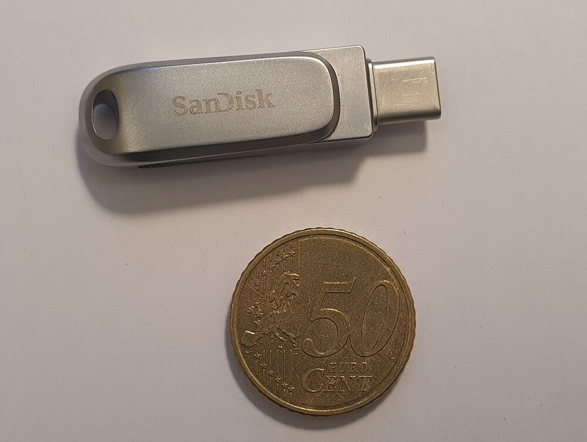
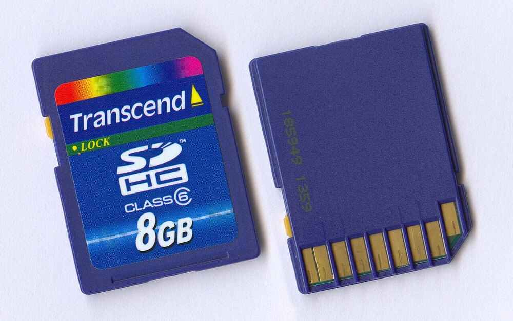
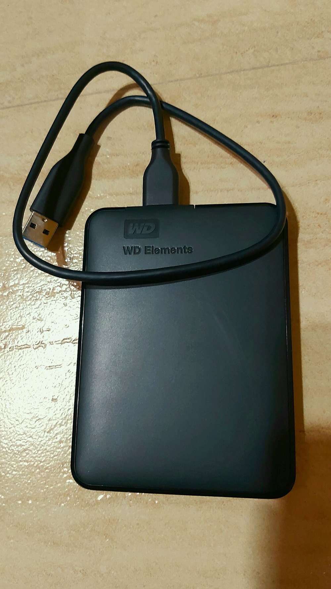
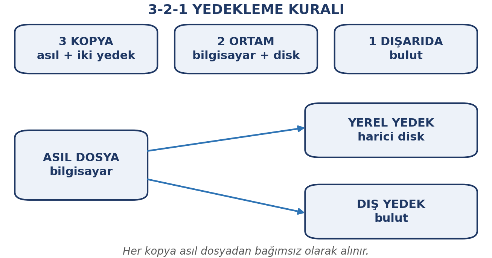

# Bu Haftanın Çerçevesi

## Öğrenme Çıktıları

- Dosya ve klasör işlemlerini güvenli biçimde yürütür.
- Dosya uzantılarını tanır ve türü uzantıdan anlar.
- Sıkıştırmanın ne işe yaradığını açıklar.
- Çıkarılabilir depolamayı güvenle kullanır.
- Disk bölümleme ve biçimlendirmenin riskini açıklar.
- Bulut depolamanın olanak ve sınırlarını değerlendirir.
- Basit bir yedekleme planı kurar.

# Dosya ve Klasör İşlemleri

## Dosya Nedir, Klasör Nedir?

- **Dosya:** Bilgisayarda saklanan bilgi birimi
- **Klasör:** Dosyaları gruplamak için kullanılan kap

Hepsi tek bir **kök** dizinden başlayan **ağaç yapısı** içinde yer alır:

```
Belgeler/
|-- Dersler/
|   |-- enf101-notlar.docx
|   `-- enf101-sunum.pptx
`-- Kişisel/
    `-- ozgecmis.pdf
```

## Temel İşlemler

| İşlem | Ne yapar |
|:---|:---|
| Kopyala / Yapıştır | Kopya oluşturur, aslı kalır |
| Kes / Yapıştır | Taşır, aslı kalkar |
| Yeniden adlandır | Adını değiştirir |
| Sil | Geri dönüşüm kutusuna gönderir |

## Dosya Adlandırma Alışkanlıkları

- **Anlamlı adlar:** `odev.docx` yerine `enf101-veri-analizi-odevi.docx`
- **Tarih başa (yıl-ay-gün):** `2026-10-15-proje-taslak.docx` → kendiliğinden sıralanır; gün-ay-yıl şeklinde olursa doğru sıralanmaz
- **Boşluk yerine tire:** başkalarıyla paylaşacağın belgelerde `-` veya `_` daha güvenlidir
- **Sürüm belirtin:** `ENF-proje-s1.0`, `ENF-proje-s1.1`

## Aynı Klasörde İki Aynı Ad Olamaz

Bir dosyayı aynı klasöre kopyalarsanız sistem adının sonuna "kopya" ekler.

Bu dosyalar çoğalınca hangisinin güncel olduğu anlaşılmaz.

**Çözüm:** kopyalamak yerine sürüm numarası kullanmak.

# Dosya Uzantıları

## Uzantı Türü Belirtir

Dosya adının sonundaki noktadan sonraki kısımdır. İşletim sistemi ona bakarak dosyayı hangi programla açacağını anlar.

| Uzantı | Tür |
|:---|:---|
| `.docx` | Metin belgesi (Word) |
| `.odt` | Metin belgesi (açık kaynak) |
| `.xlsx` | Elektronik tablo |
| `.pptx` | Sunum |
| `.pdf` | Taşınabilir belge |
| `.jpg`, `.png` | Görsel |
| `.zip` | Sıkıştırılmış arşiv |
| `.exe` | Çalıştırılabilir program |

## Uzantıyı Değiştirmeyin

`rapor.docx` dosyasını `rapor.jpg` yapmak onu **resim yapmaz** — sadece açılmaz hâle getirir.

## Çift Uzantı Tehlikesi

`fatura.pdf.exe` gibi çift uzantılı dosyaların **sonundaki uzantı** gerçek olandır.

Uzantılar gizlenmişse (Windows varsayılanı) dosyayı `.pdf` sanabilirsiniz.

Tanımadığınız kaynaklardan gelen `.exe` dosyalarını açmayın.

```{=latex}
\begin{center}
\includegraphics[width=0.65\linewidth,height=\textheight,keepaspectratio]{gorseller/ekran-cift-uzanti.png}

\emph{Windows Gezgini'nde Dosya adı uzantıları seçeneği}
\end{center}
```

# Sıkıştırma

## Ne İşe Yarar?

- **Boyut küçültme:** Özellikle metin belgelerde belirgin
- **Toplama:** Onlarca dosyayı tek arşivde birleştirme
- **Düzen:** İlgili dosyaları bir arada tutma

En yaygın biçim `.zip`; ayrıca `.rar` ve `.7z` karşınıza çıkar.

## Her Zaman Küçültmez

Video, fotoğraf ve müzik dosyaları zaten sıkıştırılmış biçimde saklanır.

Bunları `.zip`'lemek neredeyse **hiç küçültmez**. Kazanç metin tabanlı belgelerde olur.

# Depolama Aygıtları

## Çıkarılabilir Depolama

| Aygıt | Kapasite | Kullanım |
|:---|:---|:---|
| USB bellek | 8–256 GB | Dosya taşıma |
| SD kart | 16–512 GB | Fotoğraf, telefon |
| Harici disk | 500 GB–4 TB | Yedekleme, arşiv |

## Çıkarılabilir Aygıtlar

{width=30%} {width=30%} {width=17%}

USB bellek, SD kart ve harici disk: hepsi taşınabilir, hepsi kolay kaybolur.

## Güvenli Çıkarma

::: {.callout-warning}
Yazma işlemi sürerken kabloyu çekmeyin; veri bozulabilir.
:::

İşletim sisteminin **"güvenle çıkar"** seçeneğini kullanın.

**Unutmayın:** çıkarılabilir aygıtlar kolay kaybolur ve kolay bozulur.

## Disk Bölümleme

Bir diskin mantıksal olarak ayrı parçalara ayrılmasıdır.

Tek bir fiziksel disk, bilgisayarda **birden çok sürücü** gibi görünür.

**Sürücü:** tek bir depolama birimi (ör. C:).

Örnek: sistem için bir bölüm, kişisel dosyalar için bir bölüm.

## Biçimlendirme

Bölümün hangi **dosya sistemiyle** kullanılacağını belirler ve içini boşaltır. Aşağıda **Windows'un** biçimlendirme penceresi görülüyor.

| Dosya sistemi | Nerede |
|:---|:---|
| NTFS | Windows |
| ext4 | Linux |
| exFAT | Taşınabilir bellekler |
| FAT32 | Eski aygıtlar |

```{=latex}
\begin{center}
\includegraphics[width=0.52\linewidth,height=\textheight,keepaspectratio]{gorseller/ekran-bicimlendirme.png}
\end{center}
```

## Biçimlendirme Veriyi Siler

::: {.callout-warning}
Biçimlendirme, o bölümdeki **her şeyi siler**. Yanlış bölümü biçimlendirmek geri dönüşü olmayan veri kaybına yol açar.
:::

İki kural: **Önce yedek alın.** **Hangi bölümü seçtiğinizden emin olun.**

Bu ayarları kurcalamamanızı tavsiye ederiz.

# Bulut Depolama

## Dosyalar İnternette

Dosyalarınızı kendi bilgisayarınız yerine internet üzerinden erişilen **uzak sunucularda** saklamaktır.

## Olanakları

- **Her cihazdan erişim:** Telefon, tablet, okul bilgisayarı
- **Otomatik yedekleme:** Cihaz bozulsa bile dosyalar yerinde
- **Paylaşım ve ortak çalışma:** Bağlantı göndererek paylaşım
- **Sürüm geçmişi:** Eski sürümlere dönüş

## Sınırları

| Olanak | Sınır |
|:---|:---|
| Her yerden erişim | İnternet gerekir |
| Ücretsiz kullanım | Alan sınırlı |
| Şifreleme | Veri sağlayıcıda durur |
| Paylaşım kolaylığı | Yanlış paylaşım veriyi açar |

## Bulut Yedeğin Yerini Almaz

Hesabınıza erişimi kaybederseniz dosyalarınıza da erişemezsiniz.

Ücretsiz alan dolduğunda yeni dosya yüklenemez.

**Önemli dosyaların yerel bir kopyası da bulunmalıdır.**

# Çevrimiçi İşbirliği

## Aynı Belge Üzerinde Birlikte Çalışma

Örnek: **Google Docs** gibi çevrimiçi ofis araçları.

- **Aynı anda düzenleme:** Değişiklikler anında görünür
- **Sürüm geçmişi:** Kim ne zaman ne değiştirdi
- **Yorum ve öneri:** Metin üzerine not bırakma
- **Paylaşım izinleri:** Görüntüleme / yorumlama / düzenleme
- **Bağlantıyla paylaşım:** İndirmeye gerek kalmaz

## Paylaşım İzni Verirken İki Saniye Durun

"Bağlantıya sahip herkes düzenleyebilir" demek çoğu zaman istemediğiniz sonuçlar doğurur.

**Varsayılan olarak görüntüleme izni verin**; düzenlemeyi yalnızca gerekince açın.

# Yedekleme

## Haftanın En Önemli Başlığı

Diğer konular veriyi **kullanmakla**, yedekleme veriyi **korumakla** ilgilidir.

## 3-2-1 Kuralı

- **3** kopya bulundurun
- **2** farklı ortamda saklayın
- **1** kopya bilgisayarın dışında olsun

{width=62%}

## Alışkanlık Hâline Getirin

- **Otomatik yedekleme açın**
- **Önemli anlarda elle yedek alın**
- **Yedeği test edin:** Gerçekten geri yükleyebiliyor musunuz?
- **Sürüm saklayın:** Yalnızca son hâli değil

## Yedek Aynı Diskte Durmaz

Dosyayı aynı bilgisayarın başka bir klasörüne kopyalamak **yedek değildir**.

Bilgisayar bozulduğunda iki kopya da gider.

Yedek **başka bir ortamda** olmalıdır.

# Kapanış

## Uygulama: Yedekleme Planınızı Kurun

1. Dosyalarınızı gruplayın: **vazgeçilmez / önemli / önemsiz**
2. Vazgeçilmezler için 3-2-1 planını yazın
3. Kendi klasör yapınızı ve adlandırma kuralınızı tasarlayın

Notla değerlendirilmez.

## Özet

- **Dosya** ve **klasör** işlemleri; anlamlı adlandırma
- **Uzantı** türü belirtir; çift uzantıya dikkat
- **Sıkıştırma** metin belgelerde kazanç sağlar
- **Çıkarılabilir aygıt:** güvenle çıkar, tek kopya olmasın
- **Biçimlendirme veriyi siler**
- **Bulut**: erişim ve paylaşım sağlar, ama yedeğin yerini almaz
- **3-2-1 kuralı**: 3 kopya, 2 ortam, 1 dışarıda

## Gelecek Hafta

**Bilgisayar ağları ve İnternet** — ağ türleri, WiFi ve Bluetooth güvenliği, IP ve DNS, tarayıcı ve güvenli İnternet.
