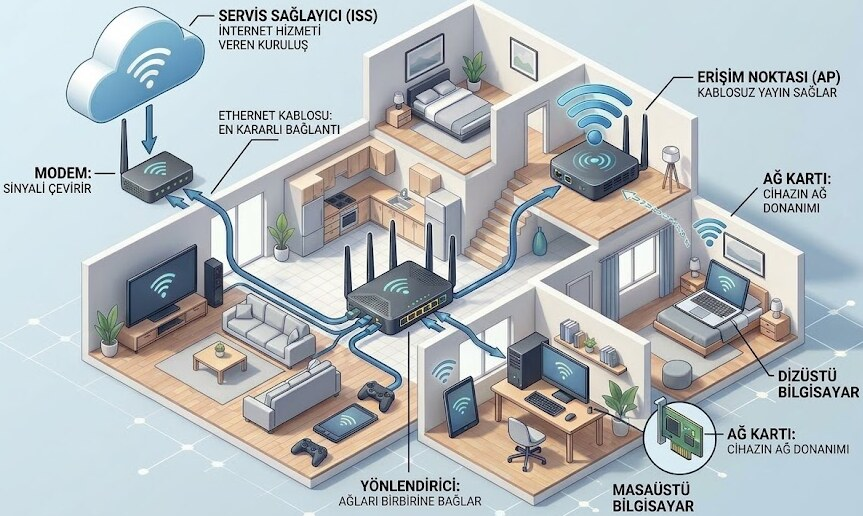
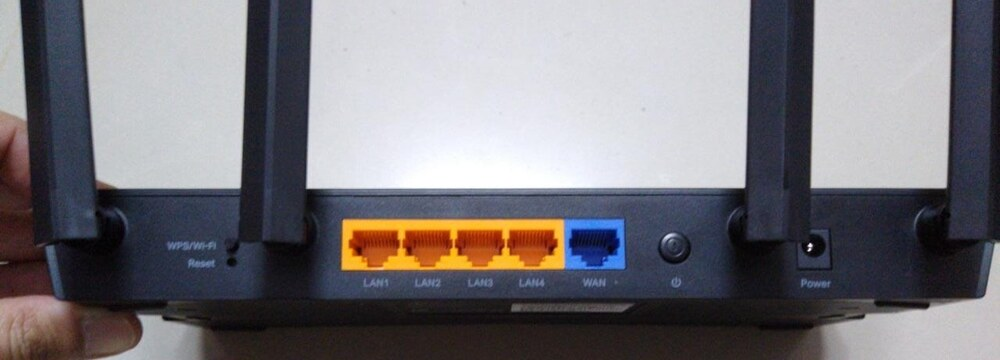
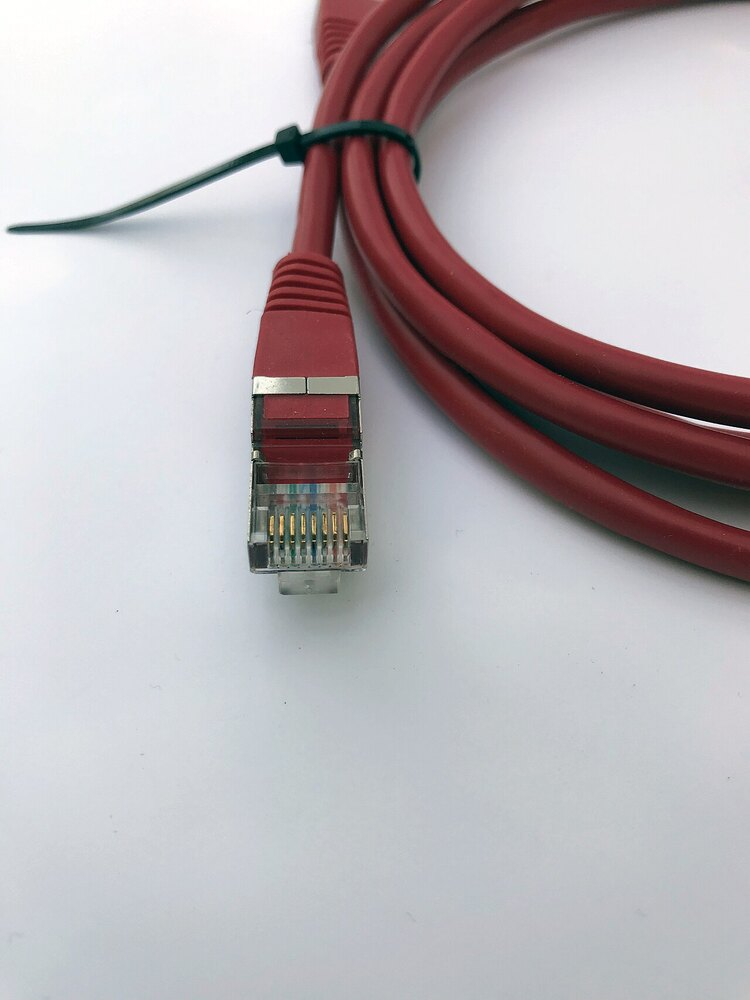
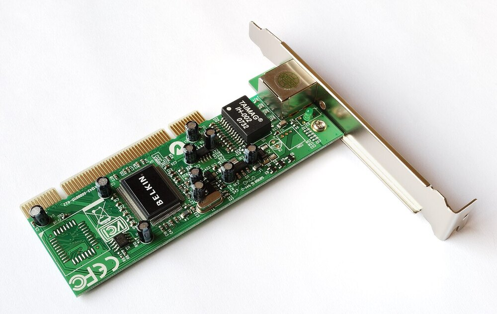
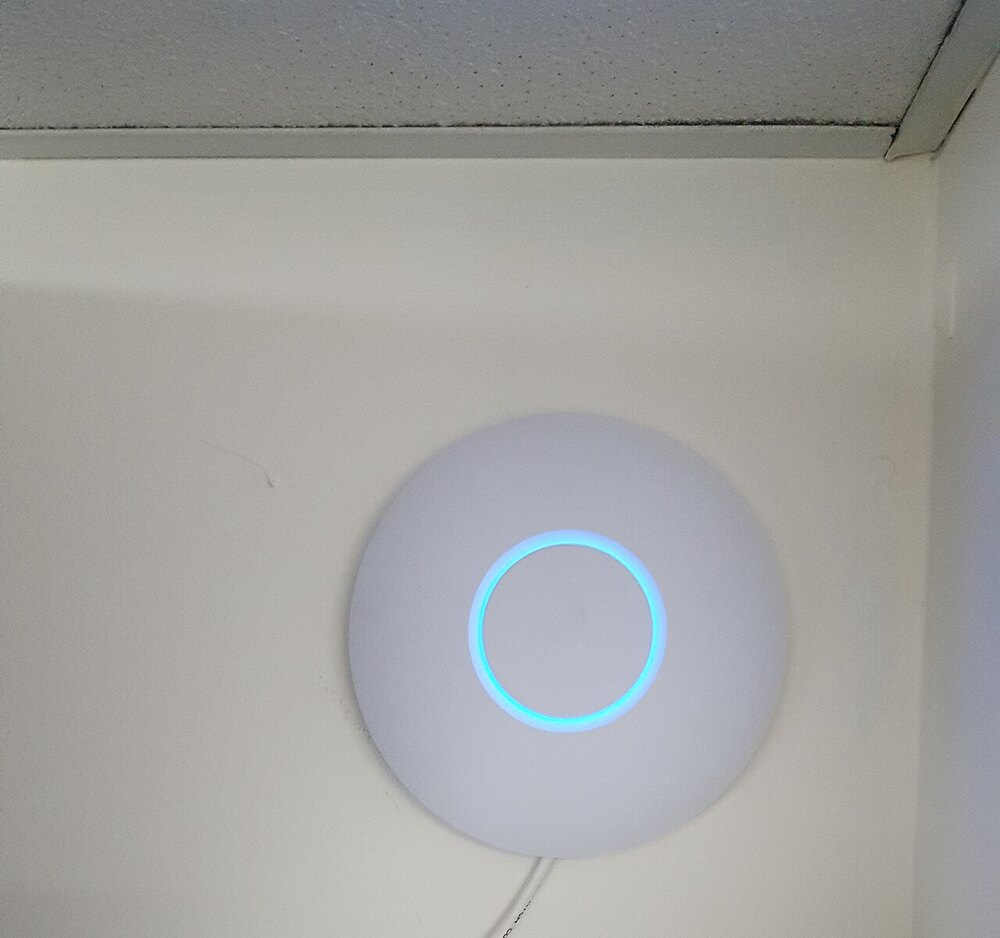
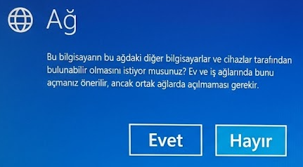
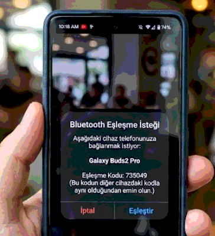
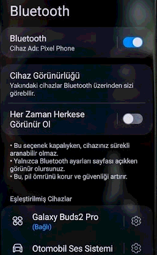
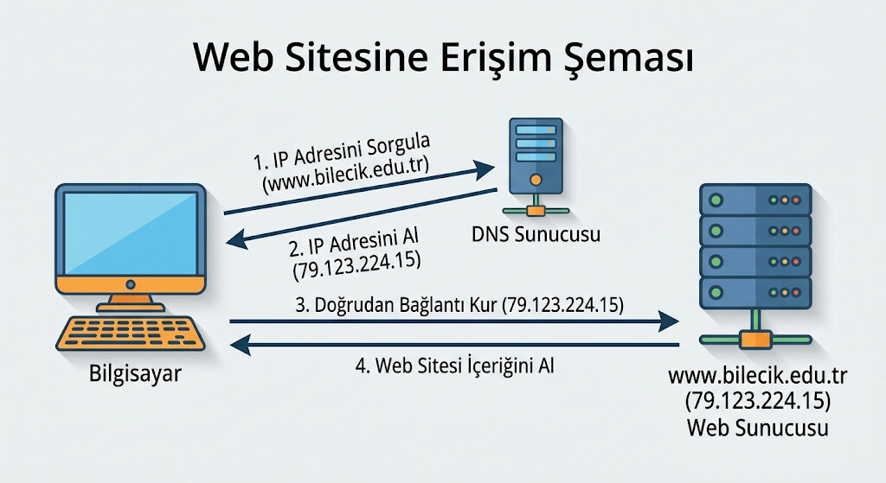
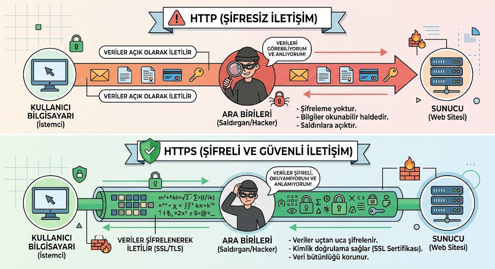

# Giriş

Telefonunuzdaki bir mesajın saniyeler içinde karşı taraftaki cihaza ulaşması, kablosuz kulaklığınızın telefona bağlanması, bir web sayfasının açılması… Bunların hepsi **ağ** sayesinde olur. Ağ, iki veya daha fazla cihazın birbiriyle veri alışverişi yapabilmesi için kurulan bağlantıdır.

Bu hafta ağların nasıl çalıştığını ve — belki daha önemlisi — **kablosuz bağlantıların hangi riskleri taşıdığını** öğreneceğiz. WiFi ve Bluetooth günlük hayatımızın parçası ama çoğu kişi bunları kullanırken hiçbir güvenlik ayarını değiştirmiyor. Bu haftanın amacı, bu boşluğu kapatmak.

::: {.callout-note}
## Bu haftanın temel fikri

Kablosuz bağlantı, kablosuz olduğu için **havada** gerçekleşir — yani sizinle cihaz arasındaki veriyi başkaları da yakalayabilir. Bu yüzden doğru bağlantıyı seçmek ve şifreleme kullanmak şarttır.
:::

# Bu Haftanın Öğrenme Çıktıları

- Ağ kavramını ve kapsama alanına göre ağ türlerini açıklar.
- Bir ağı oluşturan temel bileşenleri tanır.
- WiFi bağlantısının nasıl çalıştığını açıklar ve güvenli bağlantı seçer.
- Bluetooth'un kullanım alanlarını ve güvenlik kurallarını bilir.
- IP ve DNS kavramlarını basit düzeyde açıklar.
- Tarayıcıyı etkili ve güvenli biçimde kullanır.
- Güvenli İnternet ilkelerini günlük hayatta uygular.

# Ağ Nedir?

**Ağ (network)**, iki veya daha fazla cihazın veri paylaşmak üzere birbirine bağlanmasıyla oluşur. Ağın sağladıkları:

- **Paylaşım:** Dosya, yazıcı, internet bağlantısı ortak kullanılır.
- **İletişim:** Mesajlaşma, e-posta, görüntülü görüşme.
- **Erişim:** Uzaktaki bilgilere ve hizmetlere ulaşım.

## Kapsama alanına göre ağ türleri

Ağlar en çok **kapsama alanına** göre sınıflandırılır.

| Tür | Kapsama alanı | Teknoloji | Örnek |
|:---|:---|:---|:---|
| **PAN** (kişisel alan ağı) | Birkaç metre | Bluetooth | Kablosuz kulaklık, akıllı saat |
| **LAN** (yerel ağ) | Bir bina veya kampüs | WiFi, Ethernet | Ev, ofis, okul ağı |
| **WAN** (geniş alan ağı) | Şehir, ülke, dünya | Fiber, uydu, hücresel | İnternet |

İnternet, dünyanın en büyük WAN'ıdır — birbirine bağlı milyonlarca ağdan oluşur. Aslında "İnternet" kelimesi "inter-network", yani "ağlar arası" anlamına gelir.

## Ağ bileşenleri

Bir ev veya kampüs ağını oluşturan temel cihazlar şunlardır:

- **Modem:** Servis sağlayıcıdan gelen sinyali bilgisayarın anlayacağı hâle çevirir.
- **Yönlendirici (router):** Ağdaki cihazlar arasındaki veri trafiğini yönlendirir; cihazların birbirine ve İnternet'e ulaşmasını sağlar. Genellikle modemle aynı kutuda bulunur.
- **Erişim noktası (access point):** Kablosuz yayını sağlar; kampüslerde onlarca erişim noktası bulunur.
- **Ağ kablosu (Ethernet):** Kablolu ve en kararlı bağlantıyı sağlar.
- **Ağ kartı:** Her cihazın içinde, ağa bağlanmayı sağlayan donanım.

{width=72%}

::: {#fig-ag-bilesenleri layout-ncol=2}
{width=90%}

{width=55%}

{width=90%}

{width=60%}

Ağı oluşturan bileşenler: yönlendirici, kablolu bağlantı, ağ kartı ve erişim noktası.
:::

# WiFi: Kullanım ve Güvenlik

**WiFi**, kablosuz yerel ağ teknolojisidir. Cihazınız radyo dalgaları aracılığıyla erişim noktasıyla konuşur.

## WiFi nasıl çalışır?

- Erişim noktası, kendisini bir **ağ adıyla** (SSID) duyurur.
- Cihazınız bu adı görür; bağlanmak için **şifre** ister.
- Bağlantı kurulduğunda cihaz ile erişim noktası arasındaki veri **şifrelenir**.
- WiFi sinyali duvarlardan geçer ama mesafeyle zayıflar; ayrıca komşu ağlarla çakışabilir.

## WiFi güvenliği

::: {.callout-warning}
## Şifreleme olmadan bağlanmayın

Kablosuz ağda veri havadan gider. Şifreleme yoksa, aynı ortamdaki biri bu veriyi yakalayabilir.

**WPA2** ve **WPA3**, güncel şifreleme standartlarıdır. Eski **WEP** şifrelemesini kullanan ağlarda hassas işlem yapmayın.
:::

**Açık (şifresiz) ağlar.** Havaalanı, kafe veya otel ağları çoğu zaman şifresizdir. Bu ağlarda:

- Bankacılık, e-Devlet ve alışveriş işlemi **yapmayın**.
- Mümkünse kendi mobil verinizi kullanın.
- Zorunluysa, yalnızca şifreli siteleri (adres çubuğunda güvenlik ikonu olan `https`) tercih edin.

**Sahte erişim noktası (evil twin).** Saldırgan, gerçek bir ağın adını taşıyan sahte bir ağ kurar — örneğin kampüste **eduroam** adıyla yayın yapan bir ağ ya da "KampüsWiFi" yerine "KampüsWiFi-Ücretsiz" gibi bir ad. Sahte ağlara bağlanan kullanıcının bütün trafiği izlenebilir; siz eduroam'a bağlandığınızı sanırken aslında saldırganın ağındasınızdır. Bu yüzden **ağ adının tam olarak doğru yazıldığından** emin olun ve şüpheli ağlara bağlanmayın. eduroam gibi **kurumsal** ağlarda parola ile birlikte **kullanıcı adı** da girilmesi gerekir; yalnızca parola isteyen bir "eduroam" ağı şüphelidir.

**Ortak ağda paylaşım ayarları.** İşletim sistemleri, yeni bir ağa bağlandığınızda "bu ağda dosya paylaşımı açılsın mı?" diye sorar. Halka açık ağlarda bu soruya **hayır** deyin.

{width=52%}

## WiFi kullanımında pratik noktalar

- **Kendi ev ağı şifrenizi değiştirin:** Cihazla gelen varsayılan şifreler bilinir; mutlaka değiştirin.
- **Yönlendirici yazılımını güncelleyin:** Üretici güvenlik yamaları yayınlar.
- **Ağ adında kişisel bilgi kullanmayın:** "Ayşe'nin Evi" gibi adlar, hangi ağın size ait olduğunu belli eder.
- **Kullanmadığınızda WiFi'ı kapatın:** Özellikle dışarıdayken pil ve güvenlik açısından yararlıdır.

## eduroam: kurumlar arası kablosuz ağ

**eduroam**, üniversitelerin ortak kablosuz ağ hizmetidir. Kendi kurumunuzun hesabıyla giriş yaparsınız; başka bir üniversiteye gittiğinizde ayrı bir hesap almadan orada da bağlanırsınız.

Bağlanmak için ağ listesinden **eduroam**'ı seçin, kullanıcı adı alanına **öğrenci numaranızı** yazıp sonuna `@bilecik.edu.tr` ekleyin:

`öğrenci_numaranız@bilecik.edu.tr`

Parola alanına öğrenci hesabınızın parolasını girin. İlk bağlantıda sertifikayla ilgili bir uyarı görebilirsiniz; kesin adımlar kurumdan kuruma değiştiği için üniversitenizin bilgi işlem biriminin yönergesine bakın.

Ev ağlarında olduğu gibi herkesin bildiği **tek bir şifre** yoktur: eduroam bir **kurumsal (Enterprise)** ağdır ve herkes **kendi hesabıyla** doğrulanır (WPA2/WPA3-Enterprise). Bu sayede kurum, ağa kimin bağlandığını görebilir.

# Bluetooth: Kullanım ve Güvenlik

**Bluetooth**, kısa mesafeli (genellikle 10 metreye kadar) kablosuz bağlantı teknolojisidir. İki cihazın doğrudan konuşmasını sağlar — bir ağa bağlanmak gerekmez.

## Kullanım alanları

- Kablosuz kulaklık ve hoparlör
- Kablosuz klavye ve fare
- Akıllı saat ve bileklik
- Telefon ile araç arasında bağlantı
- Cihazlar arası dosya aktarımı

## Bluetooth güvenliği

Bluetooth bağlantısında iki cihaz **eşleştirilir**. Eşleştirme sırasında genellikle iki cihazda aynı kodu görmeniz istenir; bu, doğru cihaza bağlandığınızı doğrulamanın yoludur.

{width=32%}

::: {.callout-warning}
## Eşleştirme isteklerine dikkat

Beklemediğiniz bir anda ekranınıza "eşleştirme isteği" gelirse **reddedin**. Bu, yakınınızdaki birinin cihazınıza bağlanmaya çalıştığı anlamına gelebilir.

Kullanmadığınız zamanlarda Bluetooth'u kapatmak, hem pili korur hem de bu tür isteklere kapalı olmanızı sağlar.
:::

Diğer dikkat noktaları:

- **Görünürlüğü sınırlayın:** Cihazınız sürekli "herkese görünür" olmasın.
- **Tanımadığınız cihazlarla eşleşmeyin:** Eşleştirme, karşı tarafa cihazınıza erişim yetkisi verir.
- **Kamuya açık alanda dikkat:** Kalabalık bir ortamda eşleştirme yaparken kodun iki cihazda da göründüğünü doğrulayın.

{width=30%}

# IP ve DNS

İnternet'te her cihazın bir **adresi** vardır. Buna **IP adresi** denir. IP adresi, cihazın ağ üzerindeki konumunu belirtir — tıpkı bir ev adresi gibi.

**DNS (Alan Adı Sistemi)** ise bu adresleri insanların hatırlayabileceği **alan adlarına** çevirir. Bilgisayarlar sayılarla çalışır; insanlar ise isimlerle.

{width=82%}

Örneğin tarayıcıya bir adres yazdığınızda:

1. Bilgisayarınız **DNS sunucusuna** sorar: "bu alan adının IP adresi nedir?"
2. DNS sunucusu karşılık gelen sayısal adresi bildirir.
3. Bilgisayarınız o adrese bağlanıp sayfayı ister.

Bu yüzden DNS, İnternet'in **telefon rehberi** gibi düşünülebilir. Ayrıca alan adları; son eklerine göre tür belirtir — `.edu` bir üniversiteyi, `.gov` bir kamu kurumunu, `.com` ticari bir siteyi, `.org` bir kuruluşu gösterir.

# Tarayıcı ve Web

**Tarayıcı**, web sayfalarını görüntüleyen programdır. Günlük kullanımda işinizi kolaylaştıracak birkaç nokta:

| Özellik | Ne işe yarar |
|:---|:---|
| Sekmeler | Birden çok sayfayı aynı pencerede tutar |
| Yer imleri | Sık kullanılan adresleri kaydeder |
| Geçmiş | Daha önce ziyaret edilen sayfalara dönüş |
| Gizli mod | Geçmişe kayıt tutmaz — **anonim değildir** |
| İndirmeler | İndirilen dosyaların listesi |
| Eklentiler | Tarayıcıya işlev ekler (reklam engelleyici gibi) |

::: {.callout-note}
## Gizli mod ne yapar, ne yapmaz?

Gizli mod yalnızca **sizin cihazınızdaki** kaydı tutmaz: geçmiş, çerez ve form bilgileri saklanmaz.

Ama sizi **anonim yapmaz**: internet servis sağlayıcınız, işvereniniz veya ziyaret ettiğiniz site yine de ne yaptığınızı görebilir.
:::

**Adres çubuğundaki güvenlik ikonu** (kilit ya da kalkan gibi) ve başındaki `https`, o siteyle aranızdaki iletişimin şifreli olduğunu gösterir. Şifre, kart numarası gibi bilgileri yalnızca `https` olan sitelerde girin.

{width=88%}

**Çerezler**: Sitelerin tarayıcınıza bıraktığı küçük veri parçalarıdır. Oturum açık kalsın, tercihler hatırlansın diye kullanılır. Ancak **üçüncü taraf çerezler** (sitenin kendisi değil, sayfaya eklenen reklam ve izleme servisleri tarafından bırakılan çerezler) farklı sitelerdeki gezintinizi takip etmek ve size ilgi alanınıza göre reklam göstermek için **kullanılabilir**.

**Tedbir:** Tarayıcı ayarlarından üçüncü taraf çerezlerini engelleyebilir ya da izlemeyi sınırlandırabilirsiniz. Gizli mod bunu engellemez; yalnızca cihazınızda kayıt tutmaz.

# Güvenli İnternet

Bu haftanın konularını bir arada düşündüğümüzde, günlük hayatta uygulanacak ilkeler şöyle özetlenebilir:

1. **Bağlantınızı bilin.** Hangi ağa bağlandığınızdan emin olun; tanımadığınız ağlarda işlem yapmayın.
2. **Şifrelemesiz ağlarda hassas işlem yapmayın.** Açık ağlarda bankacılık ve e-Devlet işlemi yapmayın.
3. **Web sitesinin adresini kontrol edin.** Banka veya kurum adreslerinde tek karakter farkı olabilir — örneğin "bilecik" yerine "bi1ecik" gibi (`l` yerine `1`).
4. **Güvenlik ikonuna bakın** (kilit ya da kalkan). `https` olmayan sitelere bilgi girmeyin.
5. **İşletim sistemi ve tarayıcı güncellemelerini ertelemeyin.** Güncellemeler güvenlik açıklarını kapatır.
6. **Bluetooth ve WiFi'ı kullanmadığınızda kapatın.**

## Aile filtresi

İnternet servis sağlayıcıları, çocuklu evler için ücretsiz bir **içerik filtreleme** hizmeti sunar. Türkiye'de bu hizmet **Güvenli İnternet Hizmeti** adıyla bilinir; "Aile" ya da "Çocuk" profili seçilir ve uygun olmayan siteler **abonelik düzeyinde** engellenir.

Bunu bir güvenlik duvarı gibi düşünmemek gerekir: filtre yalnızca **erişilebilir içeriği** sınırlar, cihazdaki riskleri ortadan kaldırmaz. Kişisel önlemlerin yerini almaz, onları tamamlar.

::: {.callout-warning}
## Gerçek bir "ücretsiz WiFi" tuzağı

Havalimanlarında "Ücretsiz WiFi" adıyla yayın yapan bir ağa bağlanıp e-posta parolanızı girdiğinizi düşünün. Ağ saldırganın olsaydı, parolanız eline geçerdi. Bu saldırı türü çok yaygındır ve fark edilmesi zordur.

**Pratik kural:** Halka açık bir ağda oturum açmanız gerekiyorsa, telefonunuzun mobil verisini kullanın.
:::

# Uygulama: Bağlantılarınızı Denetleyin

## Adım 1 — Ev ağınızı inceleyin

Evdeki kablosuz ağınızın şifreleme türünü (WPA2, WPA3) ve ağ adını kontrol edin. Ağ adı kişisel bilgi içeriyor mu?

## Adım 2 — Kayıtlı ağlarınızı gözden geçirin

Telefonunuzun veya bilgisayarınızın otomatik bağlandığı ağları listeleyin. Tanımadığınız ya da artık kullanmadığınız ağları silin.

## Adım 3 — Bluetooth durumunuzu kontrol edin

Cihazınızın Bluetooth'unun açık olup olmadığına bakın; hangi cihazlarla eşleşmiş olduğunu görün. Tanımadığınız bir eşleşme varsa kaldırın.

## Adım 4 — Kısa değerlendirme yazın

Bir paragraf yazın: *Bu hafta öğrendiklerinizden sonra kablosuz bağlantı alışkanlıklarınızda neyi değiştireceksiniz?*

::: {.callout-tip}
## Teslim ve değerlendirme

Bu uygulama notla değerlendirilmez. Amacı, günlük kablosuz kullanımınızı bilinçli hâle getirmektir.
:::

# Özet

- **Ağ**, cihazların veri paylaşmak üzere bağlanmasıdır. Kapsama göre **PAN, LAN, WAN** olarak sınıflandırılır; İnternet en büyük WAN'dır.
- Ağın temel bileşenleri **modem, yönlendirici, erişim noktası, kablo ve ağ kartı**dır.
- **WiFi** kablosuz yerel ağdır; **WPA2/WPA3** şifrelemesi olmayan ağlarda hassas işlem yapılmamalıdır.
- **Sahte erişim noktası** saldırısına karşı ağ adını doğrulamak gerekir.
- **Bluetooth** kısa mesafeli bağlantıdır; beklenmeyen eşleştirme istekleri reddedilmelidir.
- **IP adresi** cihazın ağdaki adresidir; **DNS** alan adlarını IP adreslerine çevirir.
- Tarayıcıda **`https` ve güvenlik ikonu** şifreli iletişimi gösterir; **gizli mod anonim değildir**.
- Güvenli İnternet, doğru bağlantı seçimi ve şifreleme kontrolüyle başlar.

# Kendini Sınama Soruları

1. PAN, LAN ve WAN arasındaki farkı kapsama alanı bakımından açıklayın.
2. Modem ile yönlendirici arasındaki fark nedir?
3. WPA2 ve WPA3 nedir; neden önemlidir?
4. "Sahte erişim noktası" saldırısı nedir ve nasıl korunulur?
5. Bluetooth'u kullanmadığınızda kapatmak neden önerilir?
6. IP adresi ile alan adı arasındaki ilişkiyi DNS üzerinden açıklayın.
7. Gizli mod ne yapar, ne yapmaz?
8. Açık bir kablosuz ağda neyi yapmamalısınız?

# Kaynaklar

- **USOM** — güvenli İnternet ve kablosuz ağ güvenliği konularında uyarılar. (usom.gov.tr)
- **BTK** — İnternet'in bilinçli ve güvenli kullanımına ilişkin yayınlar. (btk.gov.tr)
- **İşletim sistemlerinizin resmî yardım sayfaları** — WiFi ve Bluetooth ayarları.

**Görsel kaynakları.** Bu haftanın notlarındaki fotoğraflar Wikimedia Commons'tan alınmıştır. Aşağıdaki dört fotoğrafın künyesi:

- Yönlendirici — *TP-Link AX1500 Wi-Fi 6 Router Back*, Abhi25t, CC BY-SA 4.0.
- Ethernet kablosu — *Patch cable with RJ45 connector*, heimnetzwerke.net, CC BY 4.0.
- Ağ kartı — *GB Network PCI Card*, Harke, kamu malı.
- Erişim noktası — *Unifi AC Lite Access Point*, ServerGuruBrisbane, CC BY-SA 4.0 (kare kırpılmıştır).

Yönlendirici, Ethernet kablosu ve erişim noktası fotoğrafları için kaynak gösterme zorunludur; ağ kartı karesi kamu malı olduğu için zorunlu değildir.

Sunum ve notlardaki **şemalar** (ağın sağladıkları, ağ türleri kartları, ev ağı, WiFi bağlantı adımları, güvenlik karşılaştırması, sahte erişim noktası, DNS çözümleme, HTTP–HTTPS) dersin yazarı tarafından **yapay zekâ desteğiyle** hazırlanmıştır. **Ekran görüntüleri** (Windows'ta ağ paylaşım sorusu, telefonda Bluetooth eşleştirme isteği ve görünürlük ayarı) dersin yazarı tarafından alınmıştır.

Haftaya özel ek okuma önerileri ve güncel bağlantılar, dersin çevrimiçi ortamında ayrıca paylaşılır.
