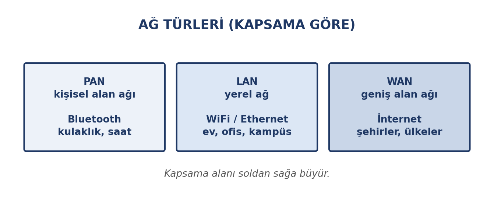
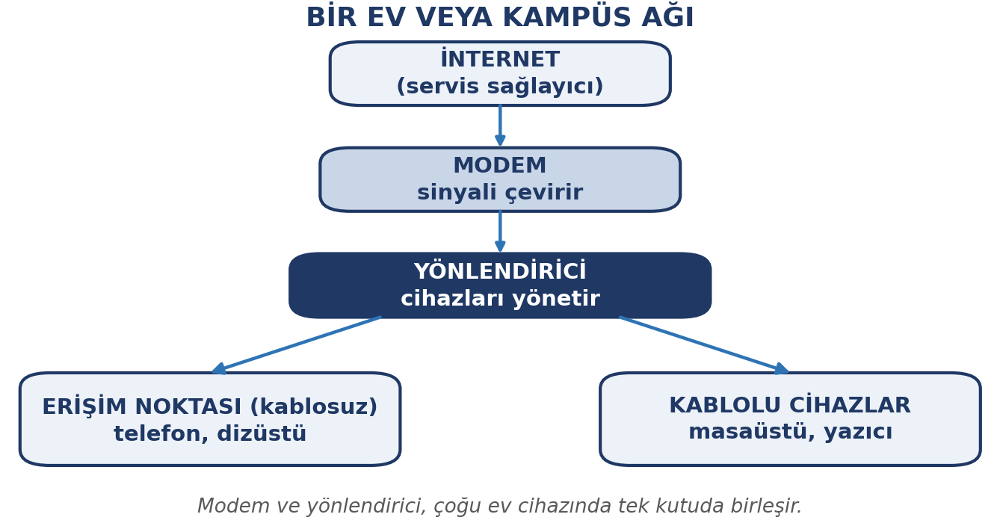
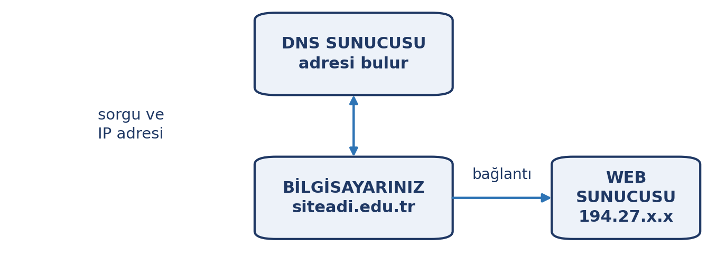

# Bu Haftanın Çerçevesi

## Öğrenme Çıktıları

- Ağ kavramını ve ağ türlerini açıklar.
- Bir ağı oluşturan bileşenleri tanır.
- WiFi'nin nasıl çalıştığını bilir ve güvenli bağlantı seçer.
- Bluetooth'un güvenlik kurallarını bilir.
- IP ve DNS kavramlarını açıklar.
- Tarayıcıyı etkili ve güvenli kullanır.
- Güvenli İnternet ilkelerini uygular.

# Ağ Nedir?

## Cihazların Birbiriyle Konuşması

İki veya daha fazla cihazın veri paylaşmak üzere bağlanmasıdır.

- **Paylaşım:** Dosya, yazıcı, internet
- **İletişim:** Mesaj, e-posta, görüntülü görüşme
- **Erişim:** Uzaktaki bilgi ve hizmetler

## Ağ Türleri

{width=72%}

## Ağ Türleri Tablosu

| Tür | Kapsama | Teknoloji | Örnek |
|:---|:---|:---|:---|
| **PAN** | Birkaç metre | Bluetooth | Kulaklık, saat |
| **LAN** | Bina, kampüs | WiFi, Ethernet | Ev, okul |
| **WAN** | Şehir, ülke | Fiber, hücresel | İnternet |

İnternet, dünyanın en büyük WAN'ıdır.

## Ağ Bileşenleri

- **Modem:** Sinyali çevirir
- **Yönlendirici:** Cihazları yönetir
- **Erişim noktası:** Kablosuz yayın sağlar
- **Ethernet kablosu:** En kararlı bağlantı
- **Ağ kartı:** Cihazın ağ donanımı

{width=62%}

# WiFi

## Kablosuz Yerel Ağ

- Erişim noktası kendini **ağ adıyla** (SSID) duyurur
- Cihaz bağlanmak için **şifre** ister
- Bağlantı kurulunca veri **şifrelenir**
- Sinyal mesafeyle zayıflar

## Şifreleme Standartları

::: {.callout-warning}
**WPA2** ve **WPA3** güncel standartlardır.

Yalnızca eski **WEP** şifrelemesini destekleyen ağlarda hassas işlem yapmayın.
:::

## Açık (Şifresiz) Ağlar

Havaalanı, kafe, otel ağları çoğu zaman şifresizdir.

Bu ağlarda:

- Bankacılık ve e-Devlet işlemi **yapmayın**
- Mümkünse **mobil verinizi** kullanın
- Yalnızca `https` siteleri tercih edin

## Sahte Erişim Noktası

Saldırgan, gerçek bir ağa çok benzeyen sahte bir ağ kurar.

- Kampüste **eduroam** adıyla yayın yapan sahte bir ağ
- Bağlanan kullanıcının trafiği izlenebilir

**Korunma:** Ağ adının tam doğru yazıldığından emin olun.

## Ortak Ağda Paylaşım

Yeni bir ağa bağlanınca sistem "dosya paylaşımı açılsın mı?" diye sorar.

Halka açık ağlarda bu soruya **hayır** deyin.

## Pratik Noktalar

- Ev ağınızın **varsayılan şifresini değiştirin**
- Yönlendirici **yazılımını güncelleyin**
- Ağ adında **kişisel bilgi kullanmayın**
- Kullanmadığınızda **WiFi'ı kapatın**

## eduroam: Kurumlar Arası Ağ

- Üniversitelerin **ortak kablosuz ağı**
- Kendi hesabınızla **başka üniversitede de** bağlanırsınız
- Kullanıcı adı: **öğrenci_numaranız** + `@bilecik.edu.tr`

Biçim: `öğrenci_numaranız@bilecik.edu.tr`

Parola: öğrenci hesabınızın parolası

# Bluetooth

## Kısa Mesafeli Bağlantı

Genellikle 10 metreye kadar. İki cihaz doğrudan konuşur; ağ gerekmez.

## Kullanım Alanları

- Kablosuz kulaklık ve hoparlör
- Kablosuz klavye ve fare
- Akıllı saat, bileklik
- Telefon–araç bağlantısı
- Dosya aktarımı

## Güvenlik: Eşleştirme

Eşleştirmede iki cihazda genellikle **aynı kod** görünür; bu, doğru cihaza bağlandığınızı doğrular.

::: {.callout-warning}
## Beklemediğiniz eşleştirme isteğini reddedin

Yakınınızdaki biri cihazınıza bağlanmaya çalışıyor olabilir.
:::

## Bluetooth İçin Üç Kural

- **Görünürlüğü sınırlayın** — sürekli herkese görünür olmasın
- **Tanımadığınız cihazla eşleşmeyin** — eşleşme erişim yetkisi verir
- **Kullanmadığınızda kapatın** — pil ve güvenlik

# IP ve DNS

## İnternet'in Adres Sistemi

Her cihazın bir **IP adresi** vardır: ağ üzerindeki konumu.

İnsanlar ise **alan adlarını** hatırlar. İkisini birleştiren sistem **DNS**'tir.

{width=74%}

## DNS: İnternet'in Telefon Rehberi

1. Tarayıcıya adres yazarsınız
2. Bilgisayar DNS sunucusuna sorar
3. DNS sayısal adresi bildirir
4. O adrese bağlanılıp sayfa istenir

## Alan Adı Son Ekleri

| Son ek | Gösterdiği |
|:---|:---|
| `.edu.tr` | Üniversite |
| `.gov.tr` | Kamu kurumu |
| `.com` | Ticari site |
| `.org` | Kuruluş |

# Tarayıcı ve Web

## Yararlı Özellikler

| Özellik | Ne işe yarar |
|:---|:---|
| Sekmeler | Birden çok sayfa |
| Yer imleri | Sık kullanılan adresler |
| Geçmiş | Önceki sayfalara dönüş |
| Gizli mod | Kayıt tutmaz |
| Eklentiler | İşlev ekler |

## Gizli Mod Ne Yapar, Ne Yapmaz?

**Yapar:** Cihazınızda geçmiş ve çerez kaydı tutmaz.

**Yapmaz:** Sizi anonim yapmaz. Servis sağlayıcınız ve ziyaret ettiğiniz site yine görebilir.

## Kilit Simgesi ve HTTPS

Adres çubuğundaki **kilit simgesi** ve `https`, iletişimin şifreli olduğunu gösterir.

Şifre ve kart bilgilerini yalnızca `https` sitelerde girin.

## Çerezler

Sitelerin tarayıcınıza bıraktığı küçük veri parçalarıdır.

- Oturumun açık kalmasını sağlar
- Tercihleri hatırlar
- Ancak **sizi izlemek için de kullanılabilir**

# Güvenli İnternet

## Altı İlke

1. **Bağlantınızı bilin** — tanımadığınız ağlarda işlem yapmayın
2. **Şifrelemesiz hassas işlem yapmayın**
3. **Adresin doğruluğunu kontrol edin**
4. **Kilit simgesine bakın**
5. **Güncellemeleri ertelemeyin**
6. **Kullanmadığınızda WiFi ve Bluetooth'u kapatın**

## Gerçek Bir Tuzak

"Havalimanında ücretsiz WiFi'a bağlanıp e-postanıza girdiniz."

Ağ saldırganın olsaydı, şifreniz eline geçerdi. Bu saldırı yaygındır ve fark edilmesi zordur.

**Pratik kural:** Halka açık ağda oturum açmanız gerekiyorsa mobil verinizi kullanın.

## Aile Filtresi

İnternet servis sağlayıcıları, çocuklu evler için ücretsiz **içerik filtresi** sunar.

- **Güvenli İnternet Hizmeti** — "Aile" ve "Çocuk" profilleri
- Uygun olmayan siteler **abonelik düzeyinde** engellenir

Filtre yalnızca içeriği sınırlar; **kişisel önlemlerin yerini almaz**.

# Kapanış

## Uygulama: Bağlantılarınızı Denetleyin

1. Ev ağınızın şifreleme türünü ve ağ adını kontrol edin
2. Otomatik bağlandığınız ağları gözden geçirin, tanımadıklarınızı silin
3. Bluetooth durumunuzu ve eşleşmiş cihazları kontrol edin

Notla değerlendirilmez.

## Özet

- **PAN, LAN, WAN** — kapsamaya göre ağ türleri
- **WiFi**: WPA2/WPA3 şifrelemesi şart; sahte ağa dikkat
- **Bluetooth**: beklenmeyen eşleştirmeyi reddet
- **IP** cihazın adresi, **DNS** adları adreslere çevirir
- **HTTPS ve kilit simgesi** şifreli iletişim demek
- **Gizli mod anonim değildir**

## Gelecek Hafta

**İnternet pratikleri, e-posta ve dijital kamu hizmetleri** — etkili arama, kaynak değerlendirme, dezenformasyon, e-posta yazım kuralları, e-Devlet ve e-imza.
