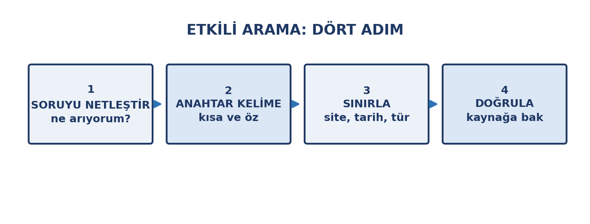
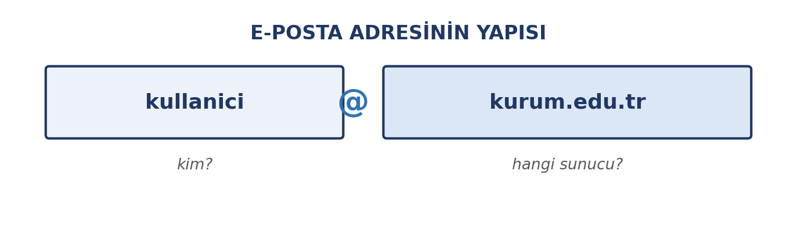
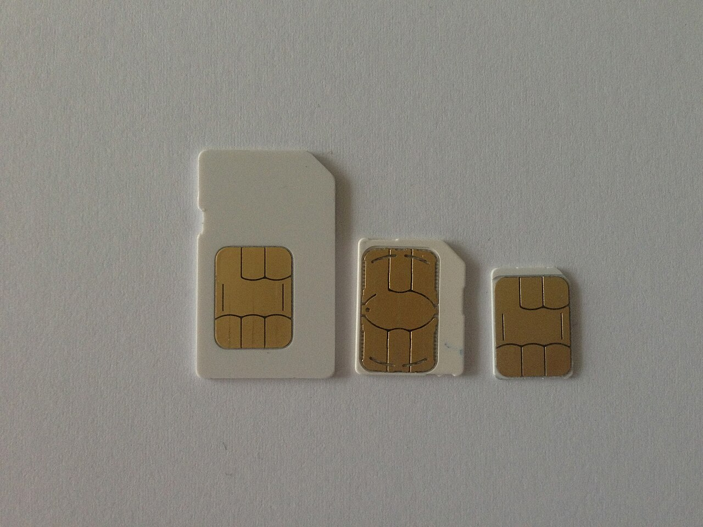
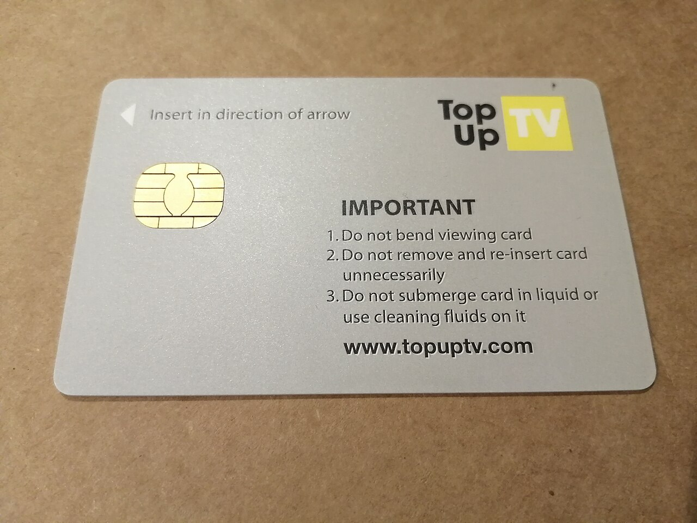
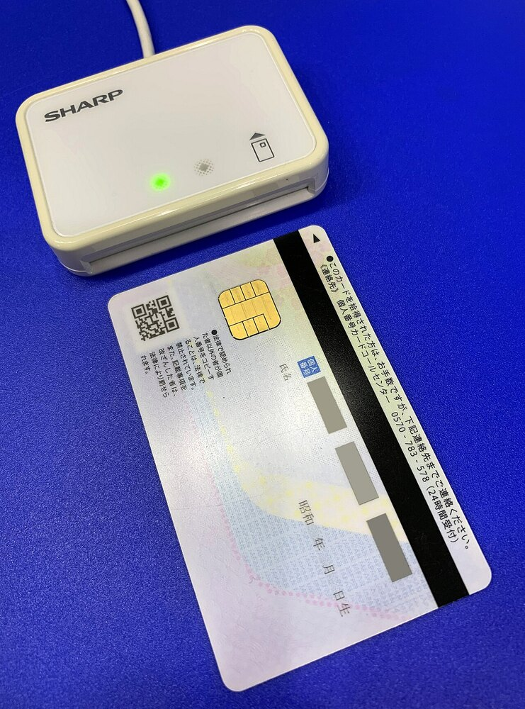

# Giriş

Geçen hafta İnternet'in **nasıl çalıştığını** öğrendik: ağlar, protokoller, adresler. Bu hafta aynı İnternet'i **nasıl kullandığımıza** bakıyoruz. Arama yapmaktan e-posta yazmaya, sahte bilgiyi fark etmekten e-Devlet üzerinden işlem yapmaya kadar…

Bu haftanın iki anahtarı var: **doğrulama** ve **yazışma görgüsü**. Aradığınız bilginin doğru olduğundan emin olmayı ve kurumsal hayatta yazdığınız bir e-postanın sizi doğru temsil etmesini öğreneceksiniz.

::: {.callout-note}
## Bu haftanın temel fikri

İnternet'te bilgiye ulaşmak kolay; **doğru bilgiye ulaşmak** ve **doğru biçimde yazışmak** beceri ister. Bu hafta ikisini de öğreniyoruz.
:::

# Bu Haftanın Öğrenme Çıktıları

- Etkili arama yöntemlerini kullanır ve arama sonuçlarını daraltır.
- Bir çevrimiçi kaynağın güvenilirliğini değerlendirir.
- Dezenformasyonu ve sahte içeriği tanır.
- Elektronik postayı doğru yapıda ve uygun üslupla yazar.
- Kurumsal yazışma kurallarını uygular.
- E-posta yoluyla gelen saldırıları fark eder.
- Dijital kamu hizmetlerini ve e-Devlet'i güvenli biçimde kullanır.
- e-imza ve ilgili kavramları birbirinden ayırt eder.

# Etkili Arama

İnternette arama yapmak herkesin yaptığı bir şey, ama **verimli** arama yapmak öğrenilen bir beceridir.

{width=78%}

## Aramayı daraltma yolları

- **Anahtar kelime seçimi:** Uzun cümleler yerine ayırt edici kelimeler kullanın. "Nasıl ödev yazarım" yerine "akademik yazım kuralları".
- **Tırnak işareti:** `"tam ifade"` yazarak kelimelerin tam bu sırayla geçmesini istersiniz. Örneğin `"yapay zekâ okuryazarlığı"`.
- **Eksi işareti:** `-kelime` o kelimeyi sonuçlardan çıkarır. Örneğin `pardus -kurulum`.
- **Site sınırlaması:** `site:gov.tr` yazarak yalnızca o alan adındaki sonuçları görürsünüz; resmî bilgi ararken çok işe yarar.
- **Tür sınırlaması:** `filetype:pdf` yalnızca PDF sonuçları getirir; ders materyali veya rapor ararken kullanışlıdır.
- **Tarih sınırlaması:** Güncel bilgi gerektiğinde arama aracının tarih filtresini kullanın.

## Kaynak değerlendirme

1\. haftada öğrendiğimiz **beş soruyu** hatırlayın — kim, ne zaman, kanıt, amaç, başka kaynaklar. İnternette karşılaştığınız her içeriği bu sorularla sınamayı alışkanlık hâline getirin.

::: {.callout-tip}
## Akademik kaynak ararken

Ödev ve araştırma için öncelik sırası şöyle olmalı:

**1.** Kütüphane veri tabanları ve akademik dergiler → **2.** Kurumsal ve resmî siteler (`.edu.tr`, `.gov.tr`) → **3.** Uzman kuruluşların yayınları → **4.** Genel web siteleri ve haber siteleri → **5.** Forumlar, sosyal medya, bloglar (tek başına kaynak olarak kullanılmaz).
:::

# Dezenformasyon ve Sahte Haber

**Dezenformasyon**, kasıtlı olarak yanıltmak amacıyla üretilen yanlış bilgidir. Yanlış bilgi (malinformasyon) ile karıştırılır, ama fark önemlidir: dezenformasyonda **kötü niyet** vardır.

{width=78%}

En sık karşılaşacağınız biçimler:

| Biçim | Ne yapar |
|:---|:---|
| **Başlık tuzağı** | İçerik başlığın söylediğini söylemez |
| **Bağlamdan koparma** | Eski bir fotoğraf güncel olaymış gibi sunulur |
| **Sahte görsel** | Fotoğraf düzenlenir ya da başka olaydan alınır |
| **Yanlış alıntı** | Bir uzmana söylemediği söz atfedilir |
| **Sahte uzman** | Konuyla ilgisiz biri yetkili gibi gösterilir |

::: {.callout-warning}
## Paylaşmadan önce iki soru

**1. Kaynağa gittim mi?** Başlığı okuyup paylaşmak, en yaygın hata.
**2. Tersine görsel arama yaptım mı?** Bir fotoğrafın daha önce başka bir bağlamda kullanılıp kullanılmadığını görmek için görsel arama kullanılabilir.

Yanıtı "hayır" ise **paylaşmayın**. Yanlış bilginin yayılmasına katkı, onu üretmek kadar zarar verir.
:::

# Elektronik Posta

**E-posta**, İnternet üzerinden mesaj ve dosya göndermenin en yaygın yoludur — özellikle kurumsal hayatta. Kurumsal bir e-posta, sizi ve kurumunuzu temsil eder.

## Adresin yapısı

{width=78%}

## Bir e-postanın bölümleri

| Bölüm | Ne yazılır |
|:---|:---|
| **Alıcı (To)** | Mesajın asıl muhatabı |
| **Bilgi (CC)** | Bilgilendirilmek istenen, yanıt beklenmeyen kişiler |
| **Gizli (BCC)** | Adresleri diğer alıcılara görünmeyen kişiler |
| **Konu** | Kısa ve açıklayıcı başlık |
| **Gövde** | Hitap, mesaj, kapanış, imza |
| **Ek (attachment)** | Gönderilen dosyalar |

::: {.callout-warning}
## Gizli alıcı (BCC) ne zaman kullanılır?

Sizi tanımayan çok sayıda kişiye e-posta gönderiyorsanız (duyuru gibi), adresleri **BCC** alanına yazın. Böylece herkes kendi adresini görür, başkalarının adreslerini görmez.

Bir kişi listesini **To** alanına yazmak, tanımadığınız kişilerin adreslerini başkalarına açıklamak anlamına gelir — bu bir gizlilik ihlalidir.
:::

## Kurumsal yazışma kuralları

- **Konu satırını boş bırakmayın.** "Toplantı hakkında" ile "Soru" arasındaki fark, e-postanın okunup okunmamasını belirler.
- **Hitap ile başlayın, kapanış ile bitirin.** "Sayın Hocam," / "Merhaba," … "Saygılarımla," / "İyi çalışmalar,".
- **Kısa ve net yazın.** Uzun paragraflar yerine madde madde.
- **Tam cümle kullanın.** Kurumsal yazışmada kısaltma ve emoji kullanılmaz.
- **Büyük harfle yazmayın.** Karşı taraf bunu bağırmak gibi algılar.
- **Yanıtla / Yanıtla-hepsine ayrımına dikkat edin.** Yalnızca gönderene mi, tüm listeye mi yanıt veriyorsunuz?
- **Ek gönderiyorsanız dosya adını düzeltin.** `belge1.docx` yerine `enf101-odev-ahmet-yilmaz.docx`.
- **Büyük dosyaları ek olarak göndermeyin.** Posta sunucularının ek boyutu sınırı vardır (genellikle 20–25 MB); büyük bir dosyayı buluta yükleyip **bağlantısını** göndermek ya da sıkıştırmak daha güvenilirdir.
- **Göndermeden okuyun.** Yazım hatası ve yanlış alıcı, en sık yapılan iki hatadır.
- **İçeriğinden emin olmadığınız mesajı iletmeyin.** Zincirleme iletiler çoğu zaman yanlış bilgi taşır; iletirken alıcı listesini ve gereksiz ekleri temizleyin.

::: {.callout-tip}
## Yanıtlamadan önce düşünün

Tartışmalı bir e-postaya sinirliyken yanıt yazmak neredeyse her zaman pişmanlıkla biter. Taslağı yazın, kaydedin, yarım saat bekleyin, sonra okuyup gönderin. Kurumsal yazışma kayıt altındadır ve geri alınamaz.
:::

# E-posta Güvenliği

E-posta, saldırganların en çok kullandığı giriş kapısıdır. Tanımanız gereken işaretler:

| Şüpheli işaret | Neden şüpheli |
|:---|:---|
| **Acelen var** vurgusu | Baskı altında düşünmeden tıklamanızı ister |
| **Beklenmedik ek** | `.exe`, `.zip` gibi dosyalar zararlı olabilir |
| **Adres uyuşmazlığı** | Görünen ad doğru, arkasındaki adres farklı olabilir |
| **Yazım hataları** | Kurumsal e-postada beklenmez |
| **Bilgi isteği** | Kurumlar e-postayla parola sormaz |
| **Bağlantı adresi** | Üzerine gelindiğinde gerçek adres görünür; yazılandan farklı olabilir |

::: {.callout-warning}
## Şüphelendiğinizde ne yapmalısınız?

Ne eki açın ne de bağlantıya tıklayın. **Göndereni başka bir kanaldan arayıp doğrulayın.** Kurumunuzdan geldiğini düşündüğünüz şüpheli bir e-postayı bilgi işlem birimine bildirin.

Unutmayın: oltalama saldırıları (phishing) genellikle sizi acele ettirir. **Acele ettiren her mesaj şüphelidir.**
:::

## E-posta gizli değildir

E-posta, yolda ve sunucularda **şifresiz** tutulabilir. Ağdaki biri ya da yanlış bir alıcı mesajınızı okuyabilir; kurumsal yazışmalar ayrıca **kayıt altındadır** ve sonradan silinse bile kurumda kalır.

Bu yüzden parola, kimlik numarası, banka bilgisi, sağlık verisi gibi bilgileri e-postayla göndermeyin; böyle bir bilgi gerekiyorsa güvenli bir kanal kullanın (5. hafta) ve kişisel veri kurallarını hatırlayın (11. hafta).

## İstenmeyen posta (spam)

Adresiniz bir kez paylaşıldığında listelere girer ve istenmeyen toplu posta gelmeye başlar. Yapılacaklar basittir:

- Mesajdaki bağlantılara **tıklamayın**, ekleri açmayın.
- Postayı **istenmeyen olarak işaretleyip silin**.
- "Listeden çık" bağlantısına **güvenmeyin**: tıklamanız adresinizin canlı olduğunu doğrular ve genellikle daha çok posta gelir.
- Kurumsal adresinizi alışveriş sitelerine ve formlara vermeyin.

# Dijital Kamu Hizmetleri ve e-Devlet

Kamu hizmetlerinin elektronik ortama taşınması, dijital dönüşümün en somut örneklerinden biridir. **e-Devlet**, farklı kurumların hizmetlerine tek bir giriş üzerinden erişmenizi sağlar: belge talebi, başvuru, sorgulama, ödeme.

## Güvenli kullanım

- **Adresin doğruluğundan emin olun.** Giriş yapmadan önce adres çubuğunu kontrol edin; resmî site `gov.tr` uzantılıdır ve `https` ile şifrelidir.
- **Parolanızı kimseyle paylaşmayın.** Hiçbir kurum e-posta veya telefonla parola istemez.
- **Ortak bilgisayarda işiniz bitince çıkış yapın.** Yalnızca sekmeyi kapatmak yetmez.
- **İşlem yaparken bağlantınıza dikkat edin.** Halka açık kablosuz ağlarda e-Devlet işlemi yapmayın; mobil veri kullanın.
- **Şüpheli bildirimlere karşı dikkatli olun.** e-Devlet üzerinden geldiği söylenen bağlantılar sahte olabilir; her zaman kendiniz giriş yaparak kontrol edin.

# e-imza ve İlgili Kavramlar

Kamu hizmetlerinde ve resmî işlemlerde karşınıza çıkacak üç farklı kavram vardır; bunları karıştırmamak önemlidir.

{width=80%}

| Kavram | Ne yapar | Hukuki sonucu |
|:---|:---|:---|
| **e-Devlet şifresi** | Kimliğinizi doğrular (giriş aracı) | İmza yerine geçmez |
| **Mobil imza** | SIM kart üzerinden imzalar | Islak imza hükmündedir |
| **e-imza (nitelikli elektronik imza)** | USB token veya akıllı kart ile imzalar | Islak imza hükmündedir |

::: {#fig-imza-araclari layout-ncol=3}
{width=90%}

{width=90%}

{width=60%}

Mobil imza SIM kartı kullanır; e-imza ise akıllı kart ve onu okuyan bir cihazla atılır.
:::

::: {.callout-note}
## En sık karışan ayrım

**e-Devlet şifresi bir imza değildir.** Sisteme giriş yapmanızı sağlayan bir kimlik doğrulama aracıdır.

**e-imza ise hukuki bir imzadır.** Elektronik İmza Kanunu (5070) uyarınca ıslak imzayla aynı hukuki sonucu doğurur. Bir belgeyi e-imzayla imzaladığınızda, belgenin size ait olduğu ve sonradan değiştirilmediği doğrulanabilir.

Kurumlar belgeleri için e-imzanın kurumsal karşılığı olan **e-mühür**'ü kullanır; bu, bireylerin konusu değildir.
:::

# Uygulama: Bir Araştırmayı Doğrulayın

## Adım 1 — Bir iddia seçin

Son bir hafta içinde sosyal medyada ya da bir haber sitesinde gördüğünüz iddialı bir bilgi seçin.

## Adım 2 — Arama tekniklerini kullanın

Aynı konuyu üç farklı aramayla araştırın: bir kez normal, bir kez `site:gov.tr` veya `site:edu.tr` sınırlamasıyla, bir kez de `filetype:pdf` ile. Sonuçları karşılaştırın.

## Adım 3 — Kaynağı değerlendirin

Bulduğunuz kaynakları beş soruyla değerlendirin. İddia doğrulanıyor mu, çürütülüyor mu, yoksa belirsiz mi kalıyor?

## Adım 4 — Bir kurumsal e-posta yazın

Öğretim elemanınıza, konusunu belirttiğiniz kısa bir e-posta yazın. Konu satırı, hitap, gövde, kapanış ve imza kurallarına uyun. **Göndermeyin**; yalnızca taslağı yazın.

::: {.callout-tip}
## Teslim ve değerlendirme

Bu uygulama notla değerlendirilmez. Amacı, doğrulama ve yazışma becerilerini günlük hayatta kullanılır hâle getirmektir.
:::

# Özet

- **Etkili arama** dört adımdır: soruyu netleştir, anahtar kelime seç, sınırla, doğrula.
- Arama operatörleri (`"tam ifade"`, `-kelime`, `site:`, `filetype:`) sonuçları belirgin biçimde daraltır.
- **Dezenformasyon**, kötü niyetle üretilmiş yanlış bilgidir; kaynağa gitmeden paylaşmamak gerekir.
- E-postada **konu, hitap, kısa gövde, kapanış ve imza** bulunur; adres listesi için **BCC** kullanılır.
- Oltalama e-postaları genellikle **acele ettirir**; şüphelenildiğinde başka kanaldan doğrulanır.
- **e-Devlet** hizmetlerine doğru adresten, güvenli bağlantıyla girilir; ortak cihazda çıkış yapılır.
- **e-Devlet şifresi imza değildir**; **e-imza ve mobil imza** ıslak imza hükmündedir.

# Kendini Sınama Soruları

1. Arama yaparken tırnak işareti ve eksi işareti ne işe yarar?
2. Yalnızca resmî kurum sitelerinde arama yapmak için hangi operatörü kullanırsınız?
3. Dezenformasyon ile yanlış bilgi arasındaki fark nedir?
4. Bir içeriği paylaşmadan önce sorulacak iki soru nedir?
5. E-postada CC ve BCC arasındaki fark nedir; hangisi gizliliği korur?
6. Oltalama e-postalarının en belirgin ortak özelliği nedir?
7. e-Devlet şifresi ile e-imza arasındaki fark nedir?
8. Halka açık bir kablosuz ağda neden e-Devlet işlemi yapılmamalıdır?

# Kaynaklar

- **e-Devlet Kapısı** — kamu hizmetlerine tek noktadan erişim. (turkiye.gov.tr)
- **USOM** — oltalama ve siber güvenlik uyarıları. (usom.gov.tr)
- **BTK** — İnternet'in bilinçli ve güvenli kullanımına ilişkin yayınlar. (btk.gov.tr)
- **Kişisel Verileri Koruma Kurumu (KVKK)** — kişisel verilerin korunması ve gizlilik. (kvkk.gov.tr)

**Görsel kaynakları.** Bu haftanın notlarındaki fotoğraflar Wikimedia Commons'tan alınmıştır. Aşağıdaki üç fotoğraf için kaynak gösterme zorunludur:

- SIM kart — *Formats de cartes SIM*, Bidouille82, CC BY-SA 3.0.
- Çipli (akıllı) kart — *TopUp TV smart card back*, Bumper12, CC BY-SA 4.0.
- Kart okuyucu — *IC Card Reader Writer RW-5100W*, Project Kei, CC BY-SA 4.0.

Haftaya özel ek okuma önerileri ve güncel bağlantılar, dersin çevrimiçi ortamında ayrıca paylaşılır.
