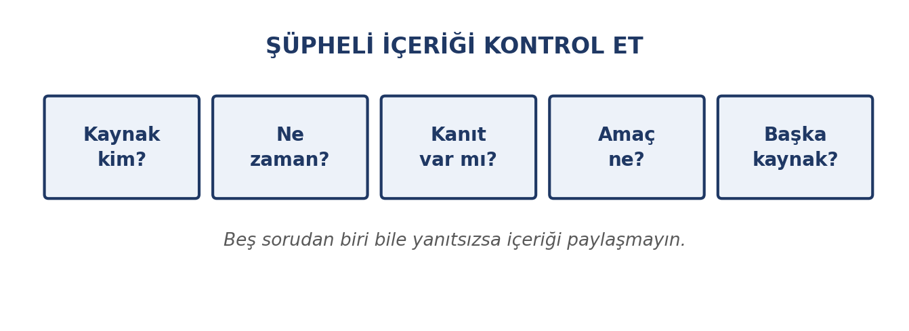
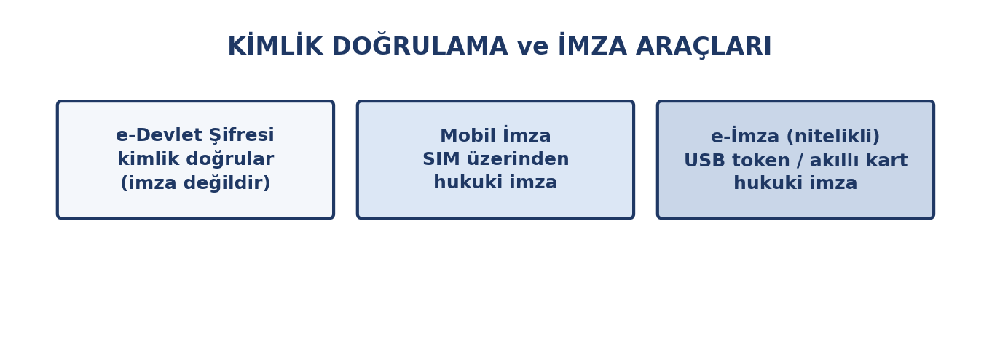

# Bu Haftanın Çerçevesi

## Öğrenme Çıktıları

- Etkili arama yöntemlerini kullanır.
- Bir çevrimiçi kaynağın güvenilirliğini değerlendirir.
- Dezenformasyonu ve sahte içeriği tanır.
- Elektronik postayı doğru yapıda yazar.
- Kurumsal yazışma kurallarını uygular.
- Oltalama saldırılarını fark eder.
- Dijital kamu hizmetlerini güvenli kullanır.
- e-imza ve ilgili kavramları ayırt eder.

# Etkili Arama

## Dört Adım

{width=78%}

## Aramayı Daraltmanın Yolları

- **Anahtar kelime:** Uzun cümle yerine ayırt edici kelimeler
- **`"tam ifade"`:** Kelimeler tam bu sırayla geçsin
- **`-kelime`:** Bu kelimeyi çıkar
- **`site:gov.tr`:** Yalnızca o alan adında ara
- **`filetype:pdf`:** Yalnızca PDF getir
- **Tarih filtresi:** Güncel bilgi gerektiğinde

## Kaynak Değerlendirme: Beş Soru

1. **Kim** yazdı?
2. **Ne zaman** yayımlandı?
3. **Kanıt** var mı?
4. **Amaç** ne?
5. **Başka kaynaklar** ne diyor?

## Akademik Kaynak Önceliği

1. Kütüphane veri tabanları ve akademik dergiler
2. Resmî siteler (`.edu.tr`, `.gov.tr`)
3. Uzman kuruluşların yayınları
4. Genel web ve haber siteleri
5. Forumlar, sosyal medya, bloglar *(tek başına kaynak olmaz)*

# Dezenformasyon

## Kasıtlı Yanlış Bilgi

**Dezenformasyon:** Yanıltmak amacıyla üretilmiş yanlış bilgi.

Yanlış bilgiden farkı: burada **kötü niyet** vardır.

{width=76%}

## Sık Karşılaşılan Biçimler

| Biçim | Ne yapar |
|:---|:---|
| Başlık tuzağı | İçerik başlığı doğrulamaz |
| Bağlamdan koparma | Eski fotoğraf güncel gibi |
| Sahte görsel | Fotoğraf düzenlenir |
| Yanlış alıntı | Söylenmemiş söz atfedilir |
| Sahte uzman | İlgisiz kişi yetkili gibi |

## Paylaşmadan Önce İki Soru

1. **Kaynağa gittim mi?**
2. **Tersine görsel arama yaptım mı?**

Yanıt "hayır" ise **paylaşmayın**.

# Elektronik Posta

## Adresin Yapısı

{width=76%}

## E-postanın Bölümleri

| Bölüm | Ne yazılır |
|:---|:---|
| **Alıcı (To)** | Asıl muhatap |
| **Bilgi (CC)** | Bilgilendirilecek kişiler |
| **Gizli (BCC)** | Adresleri görünmeyen kişiler |
| **Konu** | Kısa ve açıklayıcı başlık |
| **Gövde** | Hitap, mesaj, kapanış, imza |
| **Ek** | Gönderilen dosyalar |

## BCC Ne Zaman Kullanılır?

Tanımadığınız çok sayıda kişiye duyuru gönderiyorsanız adresleri **BCC**'ye yazın.

Böylece herkes yalnızca kendi adresini görür.

**To** alanına liste yazmak, başkalarının adreslerini açıklamak demektir — gizlilik ihlali.

## Kurumsal Yazışma Kuralları

- **Konu satırını boş bırakmayın**
- **Hitap ve kapanış kullanın**
- **Kısa ve net yazın**
- **Tam cümle kurun** — kısaltma ve emoji olmaz
- **Yanıtla / Yanıtla-hepsine** ayrımına dikkat
- **Ek dosyayı adlandırın:** `belge1.docx` değil, `enf101-odev-ad-soyad.docx`
- **Göndermeden önce okuyun**

## Sinirliyken Yanıt Yazmayın

Taslağı yazın, kaydedin, yarım saat bekleyin, sonra gönderin.

Kurumsal yazışma **kayıt altındadır** ve geri alınamaz.

# E-posta Güvenliği

## Şüpheli İşaretler

| İşaret | Neden şüpheli |
|:---|:---|
| "Acelen var" vurgusu | Düşünmeden tıklamanızı ister |
| Beklenmedik ek | `.exe`, `.zip` zararlı olabilir |
| Adres uyuşmazlığı | Görünen ad doğru, adres farklı |
| Yazım hataları | Kurumsal e-postada beklenmez |
| Bilgi isteği | Kurumlar parola sormaz |
| Bağlantı adresi | Üzerine gelince gerçek adres görünür |

## Şüphelendiğinizde

- Ne eki açın ne bağlantıya tıklayın
- **Göndereni başka kanaldan arayıp doğrulayın**
- Kurumunuzun bilgi işlem birimine bildirin

**Acele ettiren her mesaj şüphelidir.**

# Dijital Kamu Hizmetleri

## e-Devlet

Farklı kurumların hizmetlerine **tek giriş** üzerinden erişim: belge talebi, başvuru, sorgulama, ödeme.

## Güvenli Kullanım

- **Adresi kontrol edin:** `gov.tr` uzantılı ve `https`
- **Şifreyi paylaşmayın:** Hiçbir kurum istemez
- **Ortak cihazda çıkış yapın:** Sekmeyi kapatmak yetmez
- **Halka açık ağda işlem yapmayın:** Mobil veri kullanın
- **Bildirimlere şüpheyle bakın:** Her zaman kendiniz giriş yapın

# e-imza

## Karıştırılan Üç Kavram

{width=78%}

## Karşılaştırma

| Kavram | Ne yapar | Hukuki sonuç |
|:---|:---|:---|
| e-Devlet şifresi | Kimlik doğrular | İmza değildir |
| Mobil imza | SIM üzerinden imzalar | Islak imza hükmünde |
| e-imza | USB token / akıllı kart | Islak imza hükmünde |
| e-mühür | Kurumsal mühürleme | Kurum belgelerinde |

## En Sık Karışan Ayrım

**e-Devlet şifresi bir imza değildir.** Sisteme giriş aracıdır.

**e-imza hukuki bir imzadır.** 5070 sayılı Elektronik İmza Kanunu uyarınca ıslak imzayla aynı sonucu doğurur.

İmzalanan belgenin kime ait olduğu ve sonradan değiştirilmediği doğrulanabilir.

# Kapanış

## Uygulama: Bir Araştırmayı Doğrulayın

1. Son bir haftada gördüğünüz iddialı bir bilgiyi seçin
2. Üç farklı aramayla araştırın (normal, `site:gov.tr`, `filetype:pdf`)
3. Kaynakları beş soruyla değerlendirin
4. Öğretim elemanınıza bir e-posta **taslağı** yazın (göndermeyin)

Notla değerlendirilmez.

## Özet

- **Etkili arama**: netleştir, anahtar kelime, sınırla, doğrula
- **Dezenformasyon**: kaynağa gitmeden paylaşma
- **E-posta**: konu, hitap, kısa gövde, kapanış, imza
- **BCC**: adres gizliliği için
- **Oltalama**: acele ettirir; başka kanaldan doğrula
- **e-Devlet şifresi imza değildir**; e-imza hukuki imzadır

## Gelecek Hafta

**Kelime işlemci** — biçimlendirme, stiller, tablo ve görsel, sayfa düzeni, uzun belge yönetimi, akademik dürüstlük ve kaynak gösterme.
