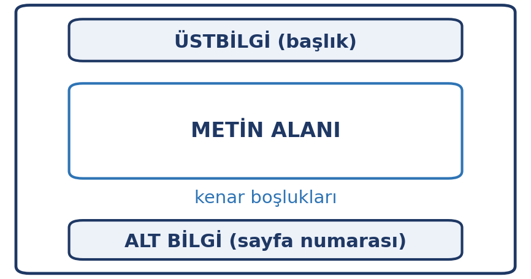

# Giriş

Üniversite hayatınızda en çok üreteceğiniz belge türü **yazılı ödev ve raporlardır**. Bu belgeler yalnızca içerikle değil, **biçimle** de değerlendirilir: başlık düzeni, sayfa numarası, kaynakça… Bir hocanın eline gelen ödev, sizin çalışmanızın görünen yüzüdür.

Bu hafta kelime işlemci yazılımını iki düzeyde ele alıyoruz: **teknik** (biçimlendirme, stiller, tablolar, sayfa düzeni) ve **akademik** (kaynak gösterme, intihalden kaçınma, erişilebilirlik). İkincisi, üniversite hayatınızın her yılında karşınıza çıkacak.

::: {.callout-note}
## Bu haftanın temel fikri

Kelime işlemciyi kullanmak, yazı yazmaktan fazlasıdır. **Stillerle** çalışmak, belgeyi elle biçimlendirmekten hem hızlı hem de güvenilirdir — üstelik içindekiler tablosu gibi şeyler ancak böyle çalışır.
:::

# Bu Haftanın Öğrenme Çıktıları

- Belge oluşturur, kaydeder ve farklı biçimlerde dışa aktarır.
- Metin ve paragraf biçimlendirmesini amaca uygun kullanır.
- Stilleri kullanarak başlık hiyerarşisi kurar.
- Tablo ve görsel ekler, sayfa düzenini ayarlar.
- Uzun belgelerde içindekiler, dipnot ve kaynakça oluşturur.
- Akademik dürüstlük ilkelerini uygular ve kaynak gösterir.
- Erişilebilir belge hazırlar.

# Temel Kavramlar

Kelime işlemci, metin ağırlıklı belgeler üretmek için kullanılan uygulama yazılımıdır. İki temel işi yapar: **içerik yazmak** ve **biçimlendirmek**.

| Kavram | Anlamı |
|:---|:---|
| Belge | Oluşturduğunuz dosya (`.docx` gibi) |
| Karakter biçimi | Yazı tipi, boyutu, kalın/italik, rengi |
| Paragraf biçimi | Hizalama, satır aralığı, girinti, boşluk |
| Stil | Adlandırılmış biçim kümesi (Başlık 1, Normal…) |
| Sayfa düzeni | Kenar boşlukları, yön, sayfa boyutu |

**Kaydetme ve biçimler.** Belgenizi genellikle **`.docx`** (Microsoft Word'ün biçimi) ya da **`.odt`** (LibreOffice gibi açık kaynak paketlerin OpenDocument biçimi) olarak kaydedersiniz; ikisi de düzenlenebilir kalır ve birbirine çevrilebilir. Paylaşırken ise sıklıkla **PDF**'e çevirmeniz gerekir. PDF, farklı bilgisayarlarda bozulmadan görüntülenir ve düzenlenmesi zordur — bu yüzden ödev tesliminde tercih edilir.

::: {.callout-tip}
## Belgeyi sık sık kaydedin

Kelime işlemcilerin çoğu otomatik kaydetme sunar; açık olduğundan emin olun. Kritik bir belgeyi yazarken ara ara `Ctrl + S` alışkanlığı, saatlerce süren çalışmayı kurtarır.
:::

## Masaüstü sürüm, çevrimiçi sürüm

Kullandığınız kelime işlemcinin büyük olasılıkla iki sürümü vardır: bilgisayara **kurulan masaüstü sürüm** ve tarayıcıda çalışan **çevrimiçi (web tabanlı) sürüm**. İkisi de aynı işi yapar; farkları kullanım koşullarındadır.

| | Masaüstü sürüm | Çevrimiçi sürüm |
|:---|:---|:---|
| Kurulum | Gerekir | Gerekmez; tarayıcı yeter |
| İnternet | Gerekmez | Gerekir |
| Erişim | Yalnızca o belgeyi açan bilgisayardan | Hesabınıza girebildiğiniz her cihazdan |
| Ortak çalışma | Sınırlı | Aynı anda birden çok kişi |
| Verinin yeri | Kendi bilgisayarınız | Hizmeti sunan şirketin sunucuları |

Çevrimiçi sürümler grup ödevlerinde ve okul ile ev arasında geçiş yaparken çok kullanışlıdır. Ancak belgeniz **kendi bilgisayarınızda durmaz**: hizmeti sunan şirketin sunucularında tutulur. Bu yüzden kişisel veya gizli bilgi içeren belgelerde dikkatli olun (11. hafta) ve çevrimiçi çalıştığınız belgelerin yerel bir kopyasını da bulundurun (4. hafta).

Ücretsiz seçenekler var: tarayıcıda çalışan **Google Docs** ya da bilgisayarınıza kurabileceğiniz **LibreOffice Writer**. İkisi de bu bölümdeki konuların hepsini destekler — stiller, içindekiler tablosu, dipnot. Menü adları farklıdır ama kavramlar aynıdır.

Aynı ayrım 8. haftadaki tablo (**Google Sheets**, **LibreOffice Calc**) ve 9. haftadaki sunum (**Google Slides**, **LibreOffice Impress**) uygulamaları için de geçerlidir.

# Metin ve Paragraf Biçimlendirme

**Karakter düzeyinde** yapılan biçimlendirme: yazı tipi, punto, kalın, italik, altı çizili, renk.

**Paragraf düzeyinde** yapılan biçimlendirme: hizalama (sol, orta, sağ, iki yana), satır aralığı, paragraf öncesi/sonrası boşluk, girinti, madde işaretleri ve numaralandırma.

::: {.callout-warning}
## Biçimlendirmede tutarlılık

Aynı belgede farklı yazı tipleri, farklı puntolar ve farklı aralıklar kullanmak belgeyi dağınık gösterir. Bir kez karar verin ve belge boyunca ona sadık kalın.

En kolay yol **stiller** kullanmaktır — bir sonraki bölümde göreceğiz.
:::

# Stiller ve Başlık Hiyerarşisi

**Stil**, bir dizi biçim ayarının adlandırılmış hâlidir. Örneğin "Başlık 1" stili, belirli bir yazı tipi, punto, kalınlık ve boşluk ayarını içerir.

## Neden stiller?

- **Hız:** Metni seçip stil uygulamak, on ayarı elle değiştirmekten hızlıdır.
- **Tutarlılık:** Aynı stildeki bütün başlıklar aynı görünür.
- **Yapı:** Kelime işlemci metnin hangi parçasının başlık, hangisinin gövde olduğunu **bilir**.
- **Otomatik içindekiler:** İçindekiler tablosu yalnızca stiller kullanıldığında çalışır.

{width=76%}

::: {.callout-warning}
## Başlığı elle kalınlaştırmayın

Bir metni seçip kalın yapmak ve puntosunu büyütmek onu **başlık yapmaz**. Yalnızca başlık gibi *görünmesini* sağlar.

Gerçek başlık, "Başlık 1" veya "Başlık 2" stili uygulanmış metindir. Aradaki fark, içindekiler tablosunu oluşturmaya kalktığınızda ortaya çıkar: elle biçimlendirilmiş başlıklar içindekilere **hiç girmez**.
:::

# Tablo ve Görsel Ekleme

## Tablolar

Tablolar, karşılaştırmalı bilgi sunmanın en etkili yoludur. Bir tabloda bulunması gerekenler:

- **Başlık satırı:** Her sütunun ne içerdiğini söyler.
- **Tutarlı hizalama:** Metin sola, sayılar sağa.
- **Ölçülü çizgiler:** Her hücreyi çerçevelemek yerine az sayıda yatay çizgi kullanmak daha okunur olur.

## Görseller

Görsel eklerken dikkat edilecekler:

- **Çözünürlük:** Ekranda iyi görünen bir görsel, basıldığında bulanık çıkabilir.
- **Boyut:** Görseli sürükleyerek büyütmek onu bozar; gerçek boyutunda ekleyip ölçeklemek gerekir.
- **Konumlandırma:** Metinle görselin ilişkisi (üstünde, altında, yanında) belirlenmelidir.
- **Altyazı:** Her görsele numara ve açıklama ekleyin (Şekil 1: …). Metinde bu numaraya atıf yapın.
- **Telif:** Başkasının görselini kullanıyorsanız kaynak göstermelisiniz.

# Sayfa Düzeni

{width=60%}

Sayfa düzeninde ayarlanacak temel öğeler:

| Öğe | Ne yapar |
|:---|:---|
| Kenar boşlukları | Metnin sayfa kenarıyla arasındaki boşluk |
| Yönlendirme | Dikey (portre) veya yatay (manzara) |
| Sayfa boyutu | A4 (Türkiye'de yaygın), Letter |
| Üstbilgi / altbilgi | Her sayfada tekrarlanan bilgi |
| Sayfa numarası | Genellikle altbilgiye eklenir |

::: {.callout-tip}
## Sayfa numarası neden gerekli?

Sayfa numarası olmayan bir ödevde hocanın "3. sayfadaki tabloya bakın" demesi mümkün değildir. Sayfa numarası, belgeyi **başvurulabilir** kılar.

Kapak sayfasında numara görünmemesi isteniyorsa, numaralandırma ikinci sayfadan başlatılabilir.
:::

# Uzun Belge Yönetimi

On sayfayı geçen belgelerde üç özellik zorunlu hâle gelir.

## İçindekiler tablosu

Başlık stillerini kullanarak yazdıysanız, **içindekiler tablosu** tek komutla oluşturulur ve belge değiştikçe güncellenebilir. Elle yazılan içindekiler, sayfa numaraları değiştiğinde yanlış hâle gelir.

## Dipnot

Sayfa altına düşülen kısa açıklama veya kaynak notudur. Metnin akışını bozmadan ek bilgi vermenin yoludur.

## Kaynakça

Yararlandığınız kaynakların belge sonunda listelendiği bölümdür. Kaynakçadaki her giriş, metin içinde mutlaka anılmalıdır — ve tersi de geçerlidir.

## Değişiklikleri izleme

Belgenin uzunluğuyla ilgili değildir ama bir belgeyi başkasıyla paylaşıp üzerinde çalıştığınızda bu özellik gerekir. **Değişiklikleri izleme** açıkken yapılan her ekleme ve silme işaretlenir; siz bunları **kabul** ya da **reddedebilirsiniz**.

İki durumda işe yarar:

- **Danışman veya hoca düzeltmeleri:** Metninizde yapılan değişiklikleri görür, katılmadıklarınızı reddedersiniz.
- **Grup ödevi:** Kimin neyi değiştirdiği kayıtlı kalır.

Teslimden önce belgede **açık kalmış bir izleme ya da yorum olmadığından** emin olun; çoğu kurum bunu son okuma adımı olarak ister.

# Akademik Dürüstlük ve Kaynak Gösterme

Bu bölüm, bu haftanın en önemli kısmıdır.

{width=76%}

## İntihal nedir?

**İntihal**, başkasının fikrini, cümlesini veya eserini **kaynak göstermeden** kendi çalışmanız gibi sunmaktır. Kasten yapılabileceği gibi dikkatsizlikten de olabilir — ama sonuçları aynıdır.

::: {.callout-warning}
## İntihal yalnızca kopyala-yapıştır değildir

Şu durumlar da intihaldir:

- Bir cümleyi birkaç kelimesini değiştirip kullanmak
- Yapay zekâ ile üretilmiş metni kendi çalışmanız gibi sunmak
- Bir fikri kaynak göstermeden kendi fikriniz gibi yazmak
- Başkasının ödevini kendi adınıza teslim etmek

**Doğru yol:** alıntı yapıyorsanız tırnak içinde gösterip kaynak belirtin; kendi cümlelerinizle anlatıyorsanız yine kaynak gösterin.
:::

## Kaynak nasıl gösterilir?

Bir kaynağı gösterirken şu bilgiler gerekir:

- **Yazar** adı
- **Eser** adı
- **Yayın yılı**
- **Sayfa numarası** (alıntı yaptıysanız)
- **Nereden erişildiği** (basılı kaynak, web adresi, veri tabanı)

Metin içinde kısa atıf yapılır, belge sonunda ayrıntılı künye verilir. Hangi biçimin kullanılacağı (APA, MLA, IEEE gibi) genellikle bölümünüz tarafından belirlenir; **önemli olan tutarlılıktır**.

## Kaynak yönetimi araçları

Kaynakları elle listelemek, sayıları arttıkça zorlaşır. **Ücretsiz kaynak yönetimi araçları** (örneğin **Zotero** ve **Mendeley**) şunları yapar:

- Web sayfasından kaynağı tek tıkla kaydeder
- Metin içi atıfları otomatik oluşturur
- Kaynakçayı istediğiniz biçimde üretir
- Yazdığınız belgeyle bütünleşir

**Zotero** açık kaynak bir araçtır; **Mendeley** ise ücretsiz ama kapalı kaynak bir araçtır. İkisi de aynı işi yapar; seçim size kalır.

Bu araçlar, kaynak göstermeyi zahmetli olmaktan çıkarır — yani intihali önlemenin en pratik yollarından biridir.

# Erişilebilir Belge Hazırlama

Hazırladığınız belgeyi yalnızca siz okumayacaksınız. Göz sağlığı sorunu yaşayan, ekran okuyucu kullanan ya da farklı bir cihazda açan kişiler için belgeyi **erişilebilir** kılmak gerekir.

- **Gerçek başlık stilleri kullanın:** Ekran okuyucular belgeyi başlıklara göre gezinir.
- **Görsellere alternatif metin ekleyin:** Görselin ne anlattığını kısa biçimde yazın.
- **Yalnızca renkle anlatmayın:** "Kırmızı satırlar hatalıdır" demek yerine metinle de belirtin.
- **Okunabilir punto kullanın:** Gövde metni için 11–12 punto uygundur.
- **Yeterli kontrast sağlayın:** Açık gri metin beyaz zeminde okunmaz.
- **Tablolarda başlık satırı tanımlayın.**

::: {.callout-note}
## Alternatif metin (alt text)

Bir resmi belgeye eklediğinizde, "bu resim ne anlatıyor?" sorusunun kısa yanıtını bir alana yazabilirsiniz. Görmeyen bir okuyucu için belge bu sayede anlamlı olur.

Örnek: "2019–2026 yılları arasında öğrenci sayısının sürekli arttığını gösteren çizgi grafik."
:::

# Uygulama: Kendi Ödevinizi Biçimlendirin

**Hangi araçla:** tarayıcıda çalışan ücretsiz bir araç (Google Docs gibi) ya da bilgisayarınıza kurulabilen ücretsiz bir paket (LibreOffice Writer gibi). Aşağıdaki adımlar ikisinde de aynıdır.

## Adım 1 — Kısa bir belge yazın

Yaklaşık bir sayfalık bir metin yazın. En az üç başlık kullanın ve bunları **stil** olarak uygulayın (elle kalınlaştırmayın).

## Adım 2 — Yapıyı tamamlayın

Belgeye bir tablo ve bir görsel ekleyin. Görsele altyazı yazın ve metinde ona atıf yapın.

## Adım 3 — İçindekiler oluşturun

Stilleri kullandıysanız içindekiler tablosunu oluşturun. Çalışıyor mu? Çalışmıyorsa hangi başlığı stil olarak uygulamayı unuttunuz?

## Adım 4 — Kaynak gösterin

Metninize bir alıntı ekleyin ve kaynağını hem metin içinde hem belge sonunda gösterin.

## Adım 5 — Erişilebilirliği kontrol edin

Görselinize alternatif metin ekleyin. Belgeyi PDF olarak kaydedin.

::: {.callout-tip}
## Teslim ve değerlendirme

Bu uygulama notla değerlendirilmez. Amacı, uzun belge üretiminin bütün adımlarını bir kez baştan sona deneyimlemenizdir.
:::

# Özet

- Kelime işlemci iki iş yapar: **içerik yazmak** ve **biçimlendirmek**.
- **Karakter** ve **paragraf** düzeyinde biçimlendirme ayrı ayrı yapılır.
- **Stiller**, elle biçimlendirmeye göre daha hızlı ve tutarlıdır; **içindekiler tablosu yalnızca stillerle** çalışır.
- Uzun belgelerde **içindekiler, dipnot ve kaynakça** gereklidir.
- **İntihal**, kaynak göstermeden başkasının çalışmasını kullanmaktır; yalnızca kopyala-yapıştır değildir.
- **Kaynak yönetimi araçları**, kaynak göstermeyi kolaylaştırarak intihali önler.
- **Erişilebilir belge**, gerçek başlık stilleri, alternatif metin ve yeterli kontrastla hazırlanır.

# Kendini Sınama Soruları

1. Bir metni elle kalınlaştırmak ile "Başlık 1" stili uygulamak arasındaki fark nedir?
2. İçindekiler tablosu neden yalnızca stillerle çalışır?
3. İntihalin kopyala-yapıştır dışındaki iki biçimini yazın.
4. Kaynak gösterirken hangi bilgiler yer almalıdır?
5. Kaynak yönetimi araçları intihali nasıl önler?
6. Alternatif metin (alt text) nedir, kimin için gereklidir?
7. Sayfa numarası neden gereklidir?
8. Bir görseli belgeye eklerken nelere dikkat edilir?

# Kaynaklar

- **Kullanılan kelime işlemci yazılımının resmî kılavuzu** — stiller, içindekiler ve erişilebilirlik belgeleri.
- **Zotero** — ücretsiz ve açık kaynak kaynak yönetimi aracı. (zotero.org)
- **Mendeley** — ücretsiz, kapalı kaynak kaynak yönetimi aracı. (mendeley.com)
- **YÖK ve üniversite kütüphanelerinin intihal politikaları** — akademik dürüstlük kılavuzları.
- **W3C Erişilebilirlik Girişimi** — belge erişilebilirliği ilkeleri. (w3.org/WAI)

Haftaya özel ek okuma önerileri ve güncel bağlantılar, dersin çevrimiçi ortamında ayrıca paylaşılır.
