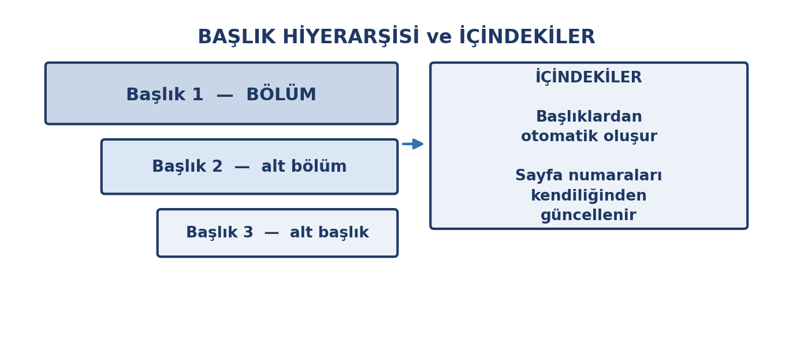
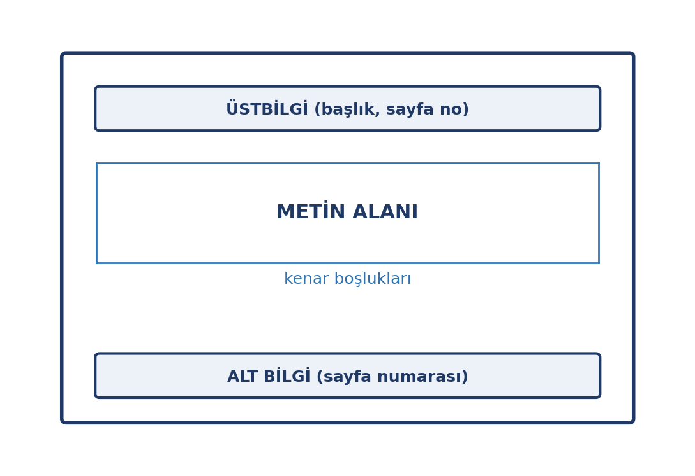
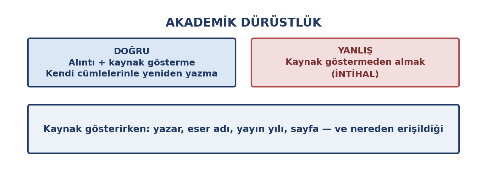

# Bu Haftanın Çerçevesi

## Öğrenme Çıktıları

- Belge oluşturur, kaydeder ve dışa aktarır.
- Metin ve paragraf biçimlendirmesini kullanır.
- Stillerle başlık hiyerarşisi kurar.
- Tablo ve görsel ekler, sayfa düzenini ayarlar.
- İçindekiler, dipnot ve kaynakça oluşturur.
- Akademik dürüstlük ilkelerini uygular.
- Erişilebilir belge hazırlar.

# Temel Kavramlar

## İki Temel İş

Kelime işlemci, metin ağırlıklı belgeler üretir: **içerik yazmak** ve **biçimlendirmek**.

| Kavram | Anlamı |
|:---|:---|
| Belge | Oluşturduğunuz dosya |
| Karakter biçimi | Yazı tipi, boyut, kalın |
| Paragraf biçimi | Hizalama, aralık, girinti |
| Stil | Adlandırılmış biçim kümesi |
| Sayfa düzeni | Kenar boşluğu, yön, boyut |

## Kaydetme ve Biçimler

- **`.docx`:** Düzenlenebilir hâli
- **PDF:** Paylaşım ve teslim için; bozulmaz, düzenlenmesi zor

Ödev tesliminde genellikle **PDF** istenir.

## Belgeyi Sık Sık Kaydedin

Otomatik kaydetmeyi açık tutun; ayrıca `Ctrl + S` alışkanlığı edinin.

# Biçimlendirme

## İki Düzey

- **Karakter:** yazı tipi, punto, kalın, italik, renk
- **Paragraf:** hizalama, satır aralığı, girinti, listeler

## Tutarlılık

Aynı belgede farklı yazı tipleri ve puntolar dağınık görünür.

Bir kez karar verin, belge boyunca ona sadık kalın.

**En kolay yol:** stiller.

# Stiller

## Stil Nedir?

Bir dizi biçim ayarının **adlandırılmış** hâlidir.

Örneğin "Başlık 1" stili; belirli bir yazı tipi, punto, kalınlık ve boşluğu içerir.

## Stillerin Sağladıkları

- **Hız:** seç, uygula
- **Tutarlılık:** aynı stil = aynı görünüm
- **Yapı:** program hangi metnin başlık olduğunu bilir
- **Otomatik içindekiler**

## Başlık Hiyerarşisi

{width=74%}

## Başlığı Elle Kalınlaştırmayın

Metni kalın yapıp puntosunu büyütmek onu **başlık yapmaz** — yalnızca başlık gibi *gösterir*.

Gerçek başlık, stil uygulanmış metindir.

**Fark nerede çıkar?** İçindekiler oluşturmaya kalktığınızda: elle biçimlendirilmiş başlıklar içindekilere hiç girmez.

# Tablo ve Görsel

## Tablolar

- **Başlık satırı** bulunsun
- Metin sola, **sayılar sağa** hizalansın
- Az sayıda **yatay çizgi** yeterli

## Görseller

- **Çözünürlük:** basıldığında bulanık olmasın
- **Boyut:** sürükleyerek büyütmeyin
- **Altyazı:** numara ve açıklama ekleyin
- **Telif:** kaynağı belirtin

# Sayfa Düzeni

## Ayarlanacak Öğeler

| Öğe | Ne yapar |
|:---|:---|
| Kenar boşlukları | Metin ile kenar arası |
| Yönlendirme | Dikey / yatay |
| Sayfa boyutu | A4 |
| Üstbilgi / altbilgi | Tekrarlanan bilgi |
| Sayfa numarası | Altbilgiye eklenir |

{width=52%}

## Sayfa Numarası Neden Gerekli?

Numarasız bir belgede "3. sayfadaki tabloya bakın" denemez.

Sayfa numarası belgeyi **başvurulabilir** kılar.

# Uzun Belge Yönetimi

## Üç Zorunlu Özellik

- **İçindekiler:** yalnızca stillerle çalışır
- **Dipnot:** sayfa altında ek bilgi
- **Kaynakça:** yararlanılan kaynakların listesi

## İçindekiler ve Kaynakça Kuralı

Kaynakçadaki her giriş metinde anılmalı; metinde anılan her kaynak kaynakçada olmalı.

# Akademik Dürüstlük

## En Önemli Bölüm

{width=74%}

## İntihal Nedir?

Başkasının fikrini, cümlesini veya eserini **kaynak göstermeden** kendi çalışmanız gibi sunmaktır.

Kasten olabileceği gibi dikkatsizlikten de olur — sonucu aynıdır.

## İntihal Yalnızca Kopyala-Yapıştır Değildir

- Bir cümleyi birkaç kelimesini değiştirip kullanmak
- Yapay zekâ metnini kendi çalışmanız gibi sunmak
- Bir fikri kaynak göstermeden kendi fikriniz gibi yazmak
- Başkasının ödevini kendi adınıza teslim etmek

## Doğru Yol

- **Alıntı** yapıyorsanız: tırnak içinde gösterin + kaynak belirtin
- **Kendi cümlelerinizle** anlatıyorsanız: yine kaynak belirtin

## Kaynak Nasıl Gösterilir?

- **Yazar** adı
- **Eser** adı
- **Yayın yılı**
- **Sayfa numarası** (alıntıysa)
- **Nereden erişildiği**

Hangi biçim (APA, MLA, IEEE) kullanılacaksa **tutarlı** olunmalıdır.

## Kaynak Yönetimi Araçları

Ücretsiz araçlar (örneğin **Zotero**):

- Kaynağı tek tıkla kaydeder
- Metin içi atıfları oluşturur
- Kaynakçayı istenen biçimde üretir
- Belgeyle bütünleşir

Kaynak göstermeyi kolaylaştırarak **intihali önler**.

# Erişilebilirlik

## Belgenizi Herkes Okuyacak

- **Gerçek başlık stilleri** kullanın (ekran okuyucular başlıklarla gezinir)
- **Görsellere alternatif metin** ekleyin
- **Yalnızca renkle anlatmayın**
- **Okunabilir punto:** gövde metni 11–12
- **Yeterli kontrast** sağlayın
- **Tablo başlık satırını** tanımlayın

## Alternatif Metin (Alt Text)

"Bu resim ne anlatıyor?" sorusunun kısa yanıtı.

Örnek: *"2019–2026 arasında öğrenci sayısının sürekli arttığını gösteren çizgi grafik."*

# Kapanış

## Uygulama: Kendi Ödevinizi Biçimlendirin

1. Üç başlıklı kısa bir metin yazın — başlıkları **stil** olarak uygulayın
2. Tablo ve görsel ekleyin; altyazı yazın
3. **İçindekiler** oluşturun — çalışıyor mu?
4. Bir alıntı ekleyip kaynağını gösterin
5. Görsele alternatif metin ekleyip PDF olarak kaydedin

Notla değerlendirilmez.

## Özet

- **İçerik** ve **biçim** ayrı işler
- **Stiller**: hız, tutarlılık, yapı, otomatik içindekiler
- Uzun belgede **içindekiler, dipnot, kaynakça**
- **İntihal** yalnızca kopyala-yapıştır değildir
- **Kaynak yönetimi araçları** intihali önler
- **Erişilebilirlik**: gerçek başlıklar, alt metin, kontrast

## Gelecek Hafta

**Elektronik tablo ve grafik okuma** — formüller, fonksiyonlar, sıralama, grafik oluşturma ve yanıltıcı grafikler.
