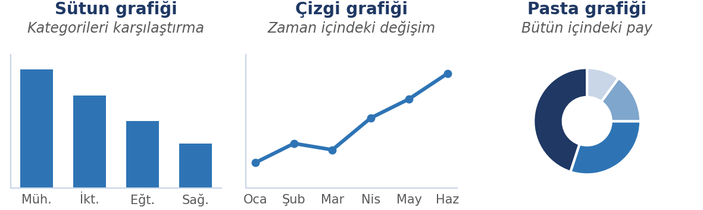
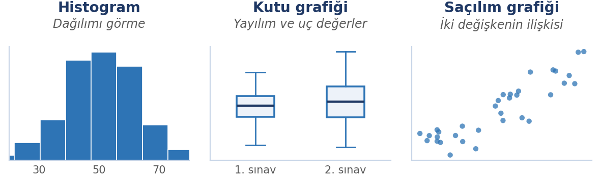
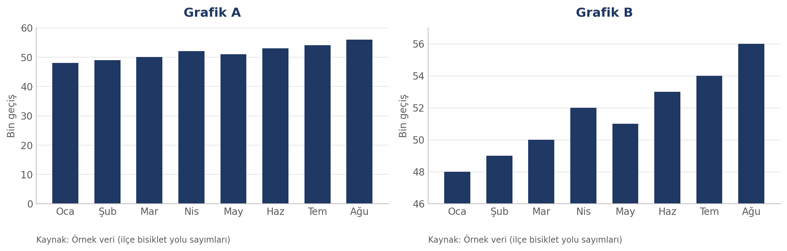

# Giriş

Bir sayı listesine bakmakla o listeyi anlamak aynı şey değildir. Elli satırlık bir tabloda hangi değerin yüksek, hangisinin düşük olduğunu gözle görmek zordur; toplamı ya da ortalaması sorulduğunda ise elle hesaplamak hem yavaş hem hataya açıktır. **Elektronik tablo** yazılımları tam bu noktada devreye girer: veriyi düzenli bir ızgarada tutar, formüllerle otomatik hesaplar ve sonucu grafikle gösterir.

Bu hafta iki beceriyi bir arada ele alıyoruz. Birincisi **tablo kurmak ve ondan sonuç çıkarmak** — formül yazmak, fonksiyon kullanmak, veriyi sıralamak, grafik oluşturmak. İkincisi ise **grafiği doğru okumak**: karşınıza konan bir grafiğin sizi yanıltıp yanıltmadığını anlamak. İkisi ayrılmaz, çünkü grafiği üreten ile grafiği okuyan aynı araçları kullanır — birinde iyi olmak, diğerinde de dikkatli olmayı gerektirir.

::: {.callout-note}
## Bu haftanın temel fikri

Bir tablo ya da grafik, ham veriyi değil, **birinin seçtiği hâlini** gösterir. Doğru sonuca varmak için hem aracı kullanmayı hem de sunulanı sorgulamayı bilmek gerekir.
:::

# Bu Haftanın Öğrenme Çıktıları

- Elektronik tablonun temel kavramlarını (hücre, satır, sütun, aralık, sayfa) tanır.
- Formül yazar; göreli ve mutlak başvuru arasındaki farkı açıklar.
- Temel fonksiyonları (topla, ortalama, ortanca, mak, min, eğer, eğersay) amaca uygun kullanır.
- Veriyi biçimlendirir, sıralar ve filtreler; ikisi arasındaki farkı açıklar.
- Veri türüne uygun grafiği seçer ve grafik oluşturur.
- Bir grafiği eleştirel biçimde okur; yanıltıcı görselleri teşhis eder.
- Yüzde değişim, yüzde puan ve ortalama–ortanca ayrımlarını doğru kullanır.

# Elektronik Tablo Nedir?

Elektronik tablo, verinin satır ve sütunların kesiştiği hücrelerde tutulduğu ve bu hücreler arasında **formüllerle ilişki kurulabildiği** bir yazılımdır. Asıl gücü şurada: bir hücreye yazdığınız formül, başka hücrelerdeki değerleri girdi olarak kullanır; girdi değiştiğinde sonuç kendiliğinden güncellenir.

Tablo yalnızca hesaplama aracı değildir; aynı zamanda küçük bir **veri tabanı** ve **görselleştirme** aracıdır. Günlük ve mesleki hayatta en sık karşılaşacağınız kullanım alanları:

- Bütçe ve harcama takibi
- Not, puan ve karne dökümü
- Anket sonuçlarının sayılması ve oranlanması
- Stok ve envanter listeleri
- Deney veya ölçüm verilerinin karşılaştırılması

Tablo uygulamalarının da bilgisayara kurulan ve tarayıcıda çalışan **çevrimiçi** sürümleri vardır; aradaki farklar için 7. haftadaki karşılaştırmaya bakın.

# Temel Kavramlar

| Kavram | Ne demek | Örnek |
|:---|:---|:---|
| Hücre | Satır ve sütunun kesiştiği tek bir kutu | B3 |
| Satır | Yatay sıra; numarayla gösterilir | 5. satır |
| Sütun | Dikey sıra; harfle gösterilir | C sütunu |
| Aralık | Birden çok hücrenin oluşturduğu bölge | A2:A20 |
| Sayfa | Aynı dosya içindeki ayrı tablo yüzeyi | Sayfa1, Sayfa2 |
| Çalışma kitabı | Tablo dosyasının tamamı | `butce.xlsx` |

Hücre adresi **sütun harfi + satır numarası** olarak yazılır: `C5`, C sütunu ile 5. satırın kesişimidir. Aralık yazarken iki adres iki nokta ile birleştirilir: `A2:A20`, A2'den A20'ye kadar olan bütün hücreleri kapsar.

# Veri Girişi ve Veri Türleri

Bir hücreye yazdığınız her şey aynı türde değildir ve tablo bu türü kendisi belirlemeye çalışır.

| Tür | Örnek | Not |
|:---|:---|:---|
| Metin | "Ankara" | Genellikle sola yaslanır |
| Sayı | 1250, 3.75 | Genellikle sağa yaslanır |
| Tarih / saat | 12.03.2026 | Sayı gibi işlem görür, üzerine hesap yapılabilir |
| Mantıksal | DOĞRU / YANLIŞ | Koşul sonuçlarında kullanılır |
| Formül | `=A1+A2` | Eşittir işaretiyle başlar |

::: {.callout-tip}
## Hizalama bir ipucudur

Girdiğiniz değer sağa yaslanıyorsa tablo onu sayı olarak algılamıştır; sola yaslanıyorsa metin olarak. Bir sayı sola yaslanıyorsa büyük olasılıkla içinde boşluk ya da harf vardır ve **hesaba katılmayacaktır**. Bunu fark etmenin en hızlı yolu, sütunun toplamını alıp beklenen sonuçla karşılaştırmaktır.
:::

# Veri Alışverişi: CSV

Tabloları başka programlara aktarmanın en yaygın yolu **CSV**'dir (İngilizce *comma-separated values*, virgülle ayrılmış değerler). Bir CSV dosyası aslında **düz metindir**: her satır bir kaydı, satırdaki her alan bir sütunu temsil eder; alanların arasına virgül — bazı ülkelerde ve bazı programlarda noktalı virgül — konur.

```text
ad,soyad,not
Ayşe,Yılmaz,85
Mehmet,Kaya,72
```

CSV'nin en önemli özelliği şudur: **değerleri taşır, biçimlendirmeyi taşımaz.** Renkler, kalın yazı, birleştirilmiş hücreler, formüller ve grafikler CSV'ye geçmez; yalnızca ham veri aktarılır. Bir dosyayı CSV olarak kaydedip yeniden açtığınızda biçimlendirmenizin kaybolmasının nedeni budur.

Buna karşılık neredeyse **her** program CSV okuyabilir; bu yüzden farklı programlar arasında veri alışverişinin ortak biçimidir.

::: {.callout-tip}
## Sütunlar birleşmiş görünüyorsa

Bir CSV dosyasını açtığınızda bütün veri tek sütuna yığılmışsa, sorun genellikle **ayraç uyuşmazlığıdır**: dosya noktalı virgülle ayrılmışken program virgül bekliyordur (ya da tersi). Dosyayı içe aktarırken ayracı elle belirterek bu sorunu çözebilirsiniz.
:::

# Formüller ve Hücre Başvuruları

## Formül nasıl yazılır

Formüller **eşittir işaretiyle başlar**. Aksi hâlde tablo yazdığınızı metin olarak kabul eder.

| Yazım | Anlamı |
|:---|:---|
| `=A1+A2` | İki hücreyi toplar |
| `=A1-B1` | Çıkarır |
| `=A1*B1` | Çarpar |
| `=A1/B1` | Böler |
| `=(A1+A2)/2` | Parantez içindeki işlem önce yapılır |

Formülde hücre değeri yerine **hücre adresi** yazmak esastır. `=A1+A2` yazmak yerine `=120+250` yazarsanız, A1'deki değeri değiştirdiğinizde sonuç güncellenmez; tablonun bütün faydası kaybolur.

## Göreli ve mutlak başvuru

Bir formülü başka bir hücreye kopyaladığınızda başvurular nasıl davranacaktır?

- **Göreli başvuru (`A1`):** Kopyalandığı yöne göre adres kayar. Bir satır aşağı kopyalarsanız `A1` → `A2` olur.
- **Mutlak başvuru (`$A$1`):** Kopyalansa bile adres sabit kalır. `$` işareti sütunu veya satırı kilitler (`$A1` yalnızca sütunu, `A$1` yalnızca satırı kilitler).

Bu ayrım özellikle **sabit bir değere göre oranlama** yaparken kritiktir. Örneğin her ürünün toplam içindeki payını hesaplarken toplam hücresi mutlak yazılmalıdır: `=B2/$B$10`.

## Yüzde hesabı: yüzde değişim ve yüzde puan

Tabloda en sık yapılan hesaplardan biri iki değer arasındaki değişimdir. Burada bir tuzak var.

- **Yüzde puan** farkı: iki oran arasındaki doğrudan çıkarma. %20'den %25'e çıkış **5 puan**dır.
- **Göreli değişim**: farkın başlangıç değerine bölünmesi. Aynı çıkış, 5 ÷ 20 = **%25 artış**tır.

| Durum | Yüzde puan farkı | Göreli değişim |
|:---|:---|:---|
| %20 → %25 | 5 puan | %25 artış |
| %2 → %3 | 1 puan | %50 artış |
| %50 → %55 | 5 puan | %10 artış |

Tabloya dikkat edin: aynı "5 puan" artış, tabana göre %25, %50 ya da %10 olarak ifade edilebiliyor. Bu yüzden bir haberde "yüzde 25 arttı" ifadesini gördüğünüzde **neyin yüzde 25'i** olduğunu sormak gerekir.

::: {.callout-warning}
## Küçük taban etkisi

Bir olayın görülme sayısı 2'den 6'ya çıktığında "vakalar %200 arttı" demek matematiksel olarak doğrudur. Ama 4 vakalık bir artış bir eğilim göstermez. Oran haberlerinde ilk sorulacak soru **taban sayı kaç** olmalıdır.
:::

# Temel Fonksiyonlar

Fonksiyonlar, tek tek hücre yazmak yerine bir aralığı topluca işleyen hazır formüllerdir.

| Fonksiyon | Ne yapar | Örnek |
|:---|:---|:---|
| `TOPLA` | Aralıktaki sayıları toplar | `=TOPLA(B2:B50)` |
| `ORTALAMA` | Aritmetik ortalamayı verir | `=ORTALAMA(B2:B50)` |
| `ORTANCA` | Sıralı verinin ortasındaki değeri verir (medyan) | `=ORTANCA(B2:B50)` |
| `MAK` / `MİN` | En büyük ve en küçük değeri verir | `=MAK(B2:B50)` |
| `EĞERSAY` | Koşulu sağlayan hücreleri sayar | `=EĞERSAY(C2:C50;">=70")` |
| `EĞER` | Koşula göre iki farklı sonuç döndürür | `=EĞER(B2>=70;"Geçti";"Kaldı")` |
| `SAY` | Sayı içeren hücreleri sayar | `=SAY(B2:B50)` |

Fonksiyonun içine yazılan `B2:B50` bir aralıktır; birden çok aralık kullanmak için aralarına noktalı virgül konur: `=TOPLA(B2:B10;C2:C10)`. Metin ve sayı bir arada olduğunda `SAY` yalnızca sayıları sayar — `EĞERSAY` ise koşula bağlı sayım yapar. Bu ikisi sık karıştırılır.

## Ortalama ve ortanca: hangisi ne zaman

`ORTALAMA` bütün değerleri toplayıp sayıya böler; `ORTANCA` ise veriyi sıraya dizip ortadaki değeri alır. Aradaki fark, **uç değerler** söz konusu olduğunda ortaya çıkar.

Bir sınıfta 9 öğrenci 40 puan, 1 öğrenci 100 puan almış olsun:

- Aritmetik ortalama: **46**
- Ortanca: **40**

Tek bir yüksek değer, ortalamayı sınıfın neredeyse tamamının aldığı notun üstüne çekmiştir. Ortanca uç değerlerden etkilenmediği için grubu daha iyi temsil eder. Aynı ayrım gelir ve servet istatistiklerinde çok belirgindir: "ortalama gelir" ile "ortanca gelir" arasındaki fark, toplumun dağılımı hakkında birbirinden çok farklı iki tablo çizer.

::: {.callout-tip}
## Pratik kural

Veride uç değer olabileceğinden kuşkulanıyorsanız (gelir, harcama, görüntülenme, hasılat) ortalamayı tek başına kullanmayın;ortancayı da hesaplayıp ikisini karşılaştırın. Aralarındaki büyük fark, veride çarpık bir dağılım olduğunun işaretidir.
:::

# Biçimlendirme

Biçimlendirme, veriyi değiştirmez; **okunmasını** değiştirir. Bu yüzden amaçlı yapılmalıdır.

- **Sayı biçimi:** ondalık basamak sayısı, binlik ayırıcı, para birimi, yüzde.
- **Tarih biçimi:** gün–ay–yıl sırası; tarihler sayı gibi işlem gördüğü için biçim yalnızca görünüşü etkiler.
- **Yazı tipi, kenarlık ve dolgu:** başlıkları ve önemli hücreleri ayırmak için.
- **Koşullu biçimlendirme:** bir eşiğin altında kalanların kendiliğinden renklenmesi. Örneğin 70'in altındaki notların kırmızı görünmesi.
- **Sütun genişliği ve satır yüksekliği:** hücrede `###` görüyorsanız sütun dardır, veri kaybolmuş değildir.

::: {.callout-warning}
## Birleştirilmiş hücrelerden kaçının

Görsel olarak düzenli görünse de birleştirilmiş hücreler **sıralama ve filtrelemeyi bozar**; formüllerin aralıklarını da şaşırtır. Başlık satırını ortalamak için hücre birleştirmek yerine "ortala" hizalamasını kullanın.
:::

# Sıralama ve Filtreleme

Bu iki işlem sık karıştırılır, oysa amaçları farklıdır.

| | Sıralama | Filtreleme |
|:---|:---|:---|
| Ne yapar | Satırların yerini değiştirir | Yalnızca koşulu sağlayanları gösterir |
| Veriye etkisi | Kalıcı olarak yeniden düzenler | Veriyi silmez, geçici olarak gizler |
| Tipik kullanım | En yüksekten en düşüğe listeleme | Yalnızca bir sınıfın veya tarihin kayıtları |

Sıralama yaparken **bütün satırı** seçmek şarttır; yalnızca bir sütunu sıralarsanız diğer sütunlarla bağlantı kopar ve veri anlamsızlaşır. Başlık satırını sabitlemek de (dondurma) uzun listelerde yön kaybetmemek için gereklidir.

# Grafik Oluşturma

Grafik, sayıları görsel biçime çevirir. Doğru grafik türü, verinin ne söylediğini ortaya çıkarır; yanlış tür ise olmayan bir sonucu ima eder.

## Hangi veri için hangi grafik

| Amaç | Uygun grafik |
|:---|:---|
| Kategorileri karşılaştırmak | Sütun veya çubuk |
| Zaman içindeki değişimi göstermek | Çizgi |
| Bütün içindeki payı göstermek | Pasta veya yığılmış çubuk |
| Dağılımı göstermek | Histogram, kutu grafiği |
| İki değişken arasındaki ilişki | Dağılım (saçılım) |
| Coğrafi dağılım | Harita (alan ≠ değer) |

Nasıl bir grafik oluşturulur: önce **veriyi seçin** (başlık satırıyla birlikte), sonra **grafik türünü** seçin. Ardından eksik bırakılmaması gereken üç şey var — **grafik başlığı**, **eksen etiketleri ve birimler**, **veri kaynağı notu**. Bu üçünü eklemek, grafiği "çizilmiş" olmaktan çıkarıp "anlaşılır" hâle getirir.

Pasta grafikler için bir uyarı: yalnızca **az sayıda dilim** ve **birbirinden belirgin biçimde farklı oranlar** olduğunda işe yarar. Altı yedi dilimli, oranları yakın pastalar okunamaz.

{width=90%}

{width=90%}

Coğrafi dağılım için kullanılan **harita** bu örneklerin dışındadır: haritada alan büyüklüğü değeri göstermediği için okunurken ayrıca dikkat gerekir.

# Grafiklerin Doğru Okunması

Grafiği üretmeyi öğrendik. Şimdi diğer yönüne geçiyoruz: karşımıza konan bir grafiğe güvenip güvenemeyeceğimizi nasıl anlarız?

::: {.callout-note}
## Grafik tarafsız bir resim değildir

Bir grafik, **tercihlerle kurulmuş bir iddiadır**. Onu hazırlayan kişi hangi veriyi alacağına, hangi aralığı göstereceğine, ekseni nereden başlatacağına ve neyi vurgulayacağına karar verir. Bu kararların bir kısmı bilgisizlikten, bir kısmı okuyanı yönlendirmek amacıyla alınır.
:::

## Yanıltma taktikleri

Yanıltma yöntemleri sınırlı sayıdadır ve tanındıklarında bir daha işe yaramazlar. Dört grupta toplanır:

| Grup | Taktik | Nasıl yanıltır |
|:---|:---|:---|
| **Eksen** | Kesilmiş eksen | Dikey eksen sıfırdan başlamaz; küçük fark devasa görünür |
| | Ters çevrilmiş eksen | Eksen alışılmadık yönde çizilir; artış aşağı görünür |
| | Ölçek aralığı oynama | Aynı veri, farklı aralıklarla iki farklı hikâye anlatır |
| **Ölçek ve oran** | Alan ve hacim yanılsaması | İki kat büyük değer, iki boyutta büyütülünce dört kat görünür |
| | Üç boyutlu efekt | Perspektif, uzaktaki dilimi küçük gösterir |
| | Çift eksen | İlgisiz iki seri, olmayan bir ilişki varmış gibi görünür |
| **Seçme ve gizleme** | Seçilmiş zaman aralığı | Başlangıç ve bitiş noktası seçilerek eğilim tersine çevrilir |
| | Eksik veri, "diğer" kovası | Kayıp noktalar gizlenir, kararsızlar tek başlıkta toplanır |
| | Seçilmiş karşılaştırma grubu | Sonucu belirleyen, kiminle karşılaştırıldığıdır |
| **Tasarım** | Renk ve vurgu | İstenen seri canlı, diğerleri soluk çizilir |
| | Kalabalık gösterim | Süsleme, asıl veriyi görünmez kılar |
| | Başlıkla verinin uyuşmaması | Okuyucu başlığa güvenir, grafiğin ayrıntısına bakmaz |

## Kontrol listesi

Bir grafiğe her baktığınızda şu dokuz soruyu hızlıca gözden geçirmek çoğu yanıltmayı yakalar:

1. Eksen sıfırdan mı başlıyor?
2. Birimler ve ölçek yazılı mı?
3. Kaynak ve tarih var mı?
4. Kaç veri noktası var; kayıp veri gizlenmiş mi?
5. Grafik başlığı verinin söylediğiyle uyumlu mu?
6. Karşılaştırma grubu adil mi?
7. Renkler bir şey mi ima ediyor?
8. Tam veri kümesine erişilebiliyor mu?
9. Grafik, eşlik ettiği metinle aynı şeyi mi söylüyor?

# Uygulama: Aynı Veri, İki Grafik

**Hangi araçla:** çevrimiçi ücretsiz bir tablo aracı (Google Sheets gibi) ya da kurulabilen ücretsiz bir paket (LibreOffice Calc gibi). Aşağıdaki adımlar ikisinde de aynıdır.

## Etkinliğin verisi

Bir ilçenin bisiklet yolundan aylık geçiş sayıları (bin olarak):

| Ay | Oca | Şub | Mar | Nis | May | Haz | Tem | Ağu |
|:-------------|:------|:------|:------|:------|:------|:------|:------|:------|
| Bin geçiş | 48 | 49 | 50 | 52 | 51 | 53 | 54 | 56 |

Sekiz ayda 48 binden 56 bine çıkan, yani yaklaşık %17 artan bir seri. Şimdi aynı verinin iki farklı grafiğine bakın.

## Adım 1 — İki grafiği karşılaştırın

Aşağıdaki iki grafik **birebir aynı veriden** üretilmiştir. Sayılar, aylar, renkler, kaynak notu — hepsi aynıdır. Yalnızca bir karar farklıdır.



## Adım 2 — Farkı teşhis edin

1. Hangisi size daha büyük bir artış olduğu izlenimini veriyor?
2. İkisinde de aynı sayılar olduğuna göre bu izlenim farkı nereden geliyor?
3. Farkı yaratan tek karar neydi?

::: {.callout-tip}
## Etkinliğin yanıtı

**Grafik B** yanıltıcıdır. İki grafik arasındaki tek fark **dikey eksenin başlangıç noktasıdır**: Grafik A ekseni 0'dan başlatırken Grafik B ekseni 46'dan başlatır. Bu, gerçekte %17 olan artışı çok daha büyük gösterir.

Kullanılan taktik **kesilmiş eksen**dir. Sütun grafiklerinde sütun yüksekliği doğrudan değeri temsil ettiği için dikey eksenin sıfırdan başlaması gerekir; aksi hâlde okuyucu yükseklikleri birbirine oranlayarak yanlış bir sonuca varır.
:::

## Adım 3 — Kendiniz üretin

8. haftada öğrendiğiniz araçla küçük bir veri kümesi girin; bir kez **kasten yanıltıcı**, bir kez de **dürüst** grafik oluşturun. İkisini yan yana koyup yanıltıcı sürümde hangi kararları değiştirdiğinizi not edin. Bu adım, taktikleri bir daha unutmayacak biçimde öğretir.

# Özet

- Elektronik tablo, hücreler arasında **formüllerle ilişki kuran** bir yazılımdır; girdi değişince sonuç kendiliğinden güncellenir.
- Formüller `=` ile başlar; **göreli** başvuru kopyalanınca kayar, **mutlak** başvuru (`$A$1`) sabit kalır.
- **Yüzde puan** ile **göreli yüzde değişim** farklı şeylerdir; karıştırıldığında değişim olduğundan büyük görünür.
- **Ortalama** uç değerlerden etkilenir, **ortanca** etkilenmez; ikisini karşılaştırmak verinin dağılımını gösterir.
- **Sıralama** veriyi yeniden düzenler, **filtreleme** yalnızca gösterir.
- Yanıltma taktikleri dört grupta toplanır: eksen, ölçek ve oran, seçme ve gizleme, tasarım.
- Grafiğe her bakışta sorulacak dokuz soruluk bir kontrol listesi vardır.

# Kendini Sınama Soruları

1. Bir formülü bir satır aşağı kopyaladığınızda `A1` ve `$A$1` başvuruları nasıl davranır?
2. Bir oranın %40'tan %50'ye çıkması yüzde puan ve göreli değişim olarak nasıl ifade edilir?
3. Aynı veri kümesinde `ORTALAMA` ile `ORTANCA` neden farklı çıkar? Hangi durumda hangisini tercih edersiniz?
4. `SAY` ile `EĞERSAY` arasındaki fark nedir?
5. Sıralama ile filtreleme arasındaki temel fark nedir; hangisi veriyi kalıcı olarak değiştirir?
6. Zaman içindeki değişimi göstermek için hangi grafik türü uygundur; neden?
7. Dikey ekseni 45'ten başlayan bir sütun grafiği okuyucuyu nasıl yanıltır?
8. Elinizde bir grafik olduğunda ilk bakacağınız üç şey nedir?

# Kaynaklar

Bu haftanın konularını destekleyen, kamuya açık kaynaklar:

- **Kullanılan ofis yazılımının resmî kılavuzları** — formüller, fonksiyonlar, sıralama, filtreleme ve grafik oluşturma belgeleri.
- **Türkiye İstatistik Kurumu (TÜİK)** — resmî istatistikler ve verilerin okunmasına ilişkin yayınlar. (tuik.gov.tr)
- **Gapminder** — veri okuryazarlığı ve yanıltıcı grafikler üzerine ücretsiz eğitim materyalleri. (gapminder.org)
- **Our World in Data** — açık erişimli veri görselleştirme örnekleri. (ourworldindata.org)

Haftaya özel ek okuma önerileri ve güncel bağlantılar, dersin çevrimiçi ortamında ayrıca paylaşılır.
