# Giriş

Bir sayı listesine bakmakla o listeyi anlamak aynı şey değildir. Elli satırlık bir tabloda hangi değerin yüksek, hangisinin düşük olduğunu gözle görmek zordur; toplamı ya da ortalaması sorulduğunda ise elle hesaplamak hem yavaş hem hataya açıktır. **Hesap tablosu** yazılımları tam bu noktada devreye girer: veriyi düzenli bir ızgarada tutar, formüllerle otomatik hesaplar ve sonucu grafikle gösterir.

Bu hafta iki beceriyi bir arada ele alıyoruz. Birincisi **hesap tablosu kurmak ve ondan sonuç çıkarmak** — formül yazmak, işlev kullanmak, veriyi sıralamak, grafik oluşturmak. İkincisi ise **grafiği doğru okumak**: karşınıza konan bir grafiğin sizi yanıltıp yanıltmadığını anlamak. İkisi ayrılmaz, çünkü grafiği üreten ile grafiği okuyan aynı araçları kullanır — birinde iyi olmak, diğerinde de dikkatli olmayı gerektirir.

::: {.callout-note}
## Bu haftanın temel fikri

Bir tablo ya da grafik, ham veriyi değil, **birinin seçtiği hâlini** gösterir. Doğru sonuca varmak için hem aracı kullanmayı hem de sunulanı sorgulamayı bilmek gerekir.
:::

# Bu Haftanın Öğrenme Çıktıları

- Hesap tablosunun temel kavramlarını (hücre, satır, sütun, aralık, sayfa) tanır.
- Formül yazar; göreli ve mutlak başvuru arasındaki farkı açıklar.
- Temel işlevleri (topla, ortalama, mak, min, eğer, eğersay, say) ve metin, mantıksal, tarih işlevlerini amaca uygun kullanır.
- Veriyi biçimlendirir, sıralar ve filtreler; ikisi arasındaki farkı açıklar.
- Veri türüne uygun grafiği seçer ve grafik oluşturur.
- Bir grafiği eleştirel biçimde okur; yanıltıcı görselleri teşhis eder.
- Yüzde değişim ile yüzde puan ayrımını doğru kullanır.

# Hesap Tablosu Nedir?

Hesap tablosu, verinin satır ve sütunların kesiştiği hücrelerde tutulduğu ve bu hücreler arasında **formüllerle ilişki kurulabildiği** bir yazılımdır. Asıl gücü şurada: bir hücreye yazdığınız formül, başka hücrelerdeki değerleri girdi olarak kullanır; girdi değiştiğinde sonuç kendiliğinden güncellenir.

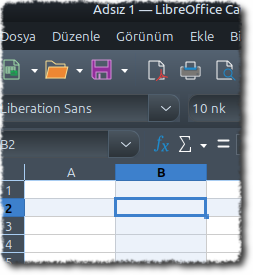{width=32%}

Hesap tablosu yalnızca hesaplama aracı değildir; aynı zamanda küçük bir **veri tabanı** ve **görselleştirme** aracıdır. Günlük ve mesleki hayatta en sık karşılaşacağınız kullanım alanları:

- Bütçe ve harcama takibi
- Not, puan ve karne dökümü
- Anket sonuçlarının sayılması ve oranlanması
- Stok ve envanter listeleri
- Deney veya ölçüm verilerinin karşılaştırılması

Hesap tablosu uygulamalarının da bilgisayara kurulan ve tarayıcıda çalışan **çevrimiçi** sürümleri vardır; aradaki farklar için 7. haftadaki karşılaştırmaya bakın.

# Temel Kavramlar

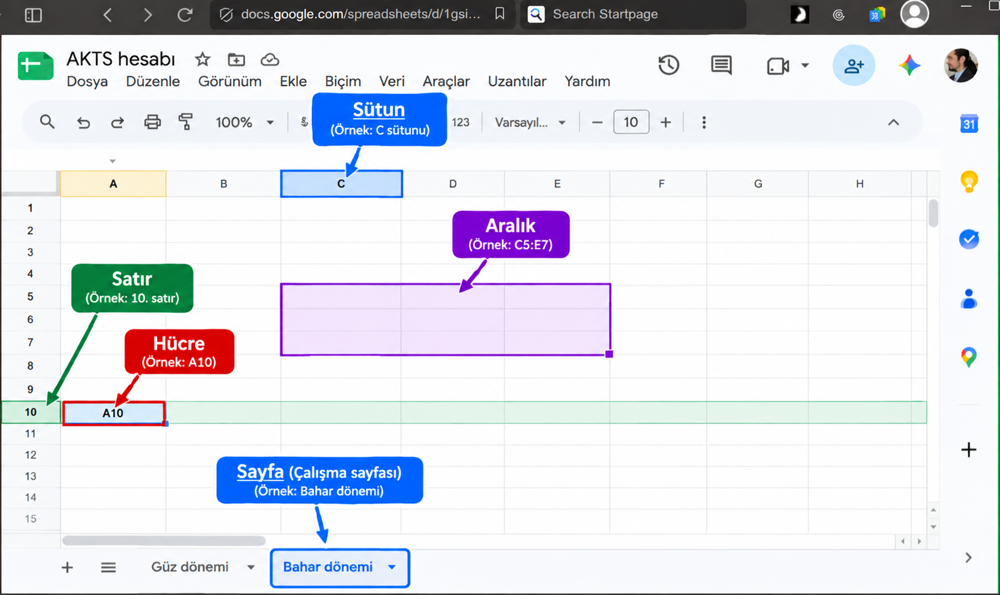{width=52%}

| Kavram | Ne demek | Örnek |
|:---|:---|:---|
| Hücre | Satır ve sütunun kesiştiği tek bir kutu | B3 |
| Satır | Yatay sıra; numarayla gösterilir | 5. satır |
| Sütun | Dikey sıra; harfle gösterilir | C sütunu |
| Aralık | Birden çok hücrenin oluşturduğu bölge | A2:A20 |
| Sayfa | Aynı dosya içindeki ayrı tablo yüzeyi | Sayfa1, Sayfa2 |
| Çalışma kitabı | Hesap tablosu dosyasının tamamı | `butce.xlsx` |

Hücre adresi **sütun harfi + satır numarası** olarak yazılır: `C5`, C sütunu ile 5. satırın kesişimidir. Aralık yazarken iki adres iki nokta ile birleştirilir: `A2:A20`, A2'den A20'ye kadar olan bütün hücreleri kapsar.

# Veri Girişi ve Veri Türleri

Bir hücreye yazdığınız her şey aynı türde değildir ve program bu türü kendisi belirlemeye çalışır.

```{=latex}
\begin{center}
\setlength{\arrayrulewidth}{0.3pt}%
\renewcommand{\arraystretch}{1.15}%
\begin{tabular}{@{}>{\raggedright\arraybackslash}p{2.4cm}>{\raggedright\arraybackslash}p{3.6cm}>{\raggedright\arraybackslash}p{9.6cm}@{}}
\toprule
\textbf{Tür} & \textbf{Örnek} & \textbf{Not}\\
\midrule
Metin & ``Ankara'' & Genellikle sola yaslanır\\
Sayı & 1250; 3,14 & Genellikle sağa yaslanır\\
Tarih / saat & 12.03.2026 & Sayı gibi işlem görür, üzerine hesap yapılabilir\\
Mantıksal & DOĞRU / YANLIŞ & Koşul sonuçlarında kullanılır\\
Formül & \texttt{=A1+A2} & Eşittir işaretiyle başlar\\
\bottomrule
\end{tabular}
\end{center}
```

Türkçede ondalık ayraç **virgüldür**: pi sayısını tabloya çoğunlukla `3,14` olarak yazarız. Bu ayraç bilgisayarın **bölge ayarından** gelir; İngilizce hazırlanmış belgelerde ve İngilizce bölgeli programlarda nokta kullanılır. Bölgesi Türkçe bir tabloda `3.14` yazarsanız program onu sayı değil **metin** sayar — hücrenin sola yaslanmasından bunu hemen fark edersiniz.

::: {.callout-tip}
## Hizalama bir ipucudur

Girdiğiniz değer sağa yaslanıyorsa program onu sayı olarak algılamıştır; sola yaslanıyorsa metin olarak. Bir sayı sola yaslanıyorsa büyük olasılıkla içinde boşluk ya da harf vardır ve **hesaba katılmayacaktır**. Bunu fark etmenin en hızlı yolu, sütunun toplamını alıp beklenen sonuçla karşılaştırmaktır. Mantıksal değerlerde (DOĞRU / YANLIŞ) hizalama programdan programa değişir; bu ipucu onlar için güvenilir değildir. Formülde hizalamayı formülün kendisi değil **sonucunun türü** belirler: sayı üreten formül sağa, metin üreten formül sola yaslanır.
:::

# Veri Alışverişi: CSV

Hesap tablolarını başka programlara aktarmanın en yaygın yolu **CSV**'dir (İngilizce *comma-separated values*, virgülle ayrılmış değerler). Bir CSV dosyası aslında **düz metindir**: her satır bir kaydı, satırdaki her alan bir sütunu temsil eder; alanların arasına virgül konur.

Türkçe bölge ayarında ondalık ayraç virgül olduğu için alanları **noktalı virgül** ayırır:

```text
Ad;Yaş;Not;Şehir
Ahmet;21;85;Bilecik
Ayşe;22;92;Eskişehir
```

CSV'nin en önemli özelliği şudur: **değerleri taşır, biçimlendirmeyi taşımaz.** Renkler, kalın yazı, birleştirilmiş hücreler, formüller ve grafikler CSV'ye geçmez; yalnızca ham veri aktarılır. Bir dosyayı CSV olarak kaydedip yeniden açtığınızda biçimlendirmenizin kaybolmasının nedeni budur.

Buna karşılık neredeyse **her** program CSV okuyabilir; bu yüzden farklı programlar arasında veri alışverişinin ortak biçimidir.

::: {.callout-tip}
## Sütunlar birleşmiş görünüyorsa

Bir CSV dosyasını açtığınızda bütün veri tek sütuna yığılmışsa, sorun genellikle **ayraç uyuşmazlığıdır**: dosya noktalı virgülle ayrılmışken program virgül bekliyordur (ya da tersi). Dosyayı içe aktarırken ayracı elle belirterek bu sorunu çözebilirsiniz.
:::

# Formüller ve Hücre Başvuruları

## Formül nasıl yazılır

Formüller **eşittir işaretiyle başlar**; aksi hâlde yazılanlar metin olarak kabul edilir.

| Yazım | Anlamı |
|:---|:---|
| `=A1+A2` | İki hücreyi toplar |
| `=A1-B1` | Çıkarır |
| `=A1*B1` | Çarpar |
| `=A1/B1` | Böler |
| `=(A1+A2)/2` | Parantez içindeki işlem önce yapılır |

Formülde hücre değeri yerine **hücre adresi** yazmak esastır. `=A1+A2` yazmak yerine `=120+250` yazarsanız, A1'deki değeri değiştirdiğinizde sonuç güncellenmez; tablonun bütün faydası kaybolur.

## Göreli ve mutlak başvuru

Bir formülü başka bir hücreye kopyaladığınızda başvurular nasıl davranacaktır?

- **Göreli başvuru (`A1`):** Kopyalandığı yöne göre adres kayar. Bir satır aşağı kopyalarsanız `A1` → `A2` olur; iki hücre sağa kopyalarsanız `A1` → `C1` olur.
- **Mutlak başvuru (`$A$1`):** Kopyalansa bile adres sabit kalır. `$` işareti sütunu veya satırı kilitler (`$A1` yalnızca sütunu, `A$1` yalnızca satırı kilitler).

Bu ayrım özellikle **sabit bir değere göre oranlama** yaparken kritiktir. Örneğin her ürünün toplam içindeki payını hesaplarken toplam hücresinin satırı kilitlenir: `=B2/B$9`. Formül sağa doğru da kopyalanacaksa sütunun da kilitlenmesi gerekir: `=B2/$B$9`.

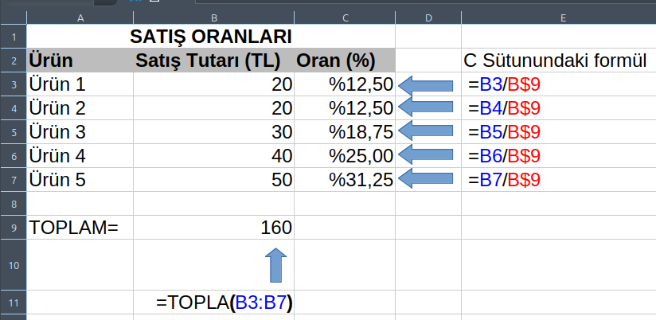{width=65%}

Görseldeki formül `=B3/B$9` bir satır aşağı kopyalandığında `=B4/B$9` olur: pay göreli olduğu için kayar, toplam hücresinde satır kilitli olduğu için sabit kalır. Satır kilidi kaldırılsaydı ikinci satırda toplam hücresi `B10`'a kayar ve oran yanlış çıkardı.

# İşlevler

İşlevler, belirli bir hesaplamayı yapan hazır formüllerdir. Bir işlev, adı ve parantez içindeki argümanlarıyla yazılır; argüman bir hücre, aralık ya da sabit değer olabilir.

## Matematik ve sayma işlevleri

| İşlev | Ne yapar | Örnek |
|:---|:---|:---|
| `TOPLA` | Aralıktaki sayıları toplar | `=TOPLA(B2:B50)` |
| `ORTALAMA` | Aritmetik ortalamayı verir | `=ORTALAMA(B2:B50)` |
| `MAK` / `MİN` | En büyük ve en küçük değeri verir | `=MAK(B2:B50)` |
| `EĞERSAY` | Koşulu sağlayan hücreleri sayar | `=EĞERSAY(C2:C50;">=70")` |
| `SAY` | Sayı içeren hücreleri sayar | `=SAY(B2:B50)` |

İşlev adları arayüzün diline göre değişir: İngilizce arayüzlü uygulamalarda aynı işlevlerin İngilizce adları görülebilir; işlevleri değişmez.

::: {.callout-note}
## Aralık mı, tek tek değer mi?

**İki nokta üst üste (`:`)** aralık belirtir: `B2:B50`, B2'den B50'ye kadar bütün hücreleri tek bir bütün olarak verir. **Noktalı virgül (`;`)** ise hücreleri tek tek, ayrı ayrı değerlendirir: `=TOPLA(B2;B4;B6)` yalnızca bu üç hücreyi toplar, aradakileri (B3, B5) hesaba katmaz. İkisi birlikte de kullanılır: `=TOPLA(B2:B10;C2:C10)`.
:::

İşlevleri somut bir tabloda deneyelim. A sütununda öğrenci adı, B sütununda vize notu, C sütununda final notu var. Gökhan vizeye girmediği için B8 hücresine sayı değil **metin** yazılmıştır.

```{=latex}
\begin{center}
{\small
\setlength{\arrayrulewidth}{0.3pt}%
\renewcommand{\arraystretch}{1.15}%
\begin{tabular}{|>{\centering\arraybackslash}p{0.6cm}|>{\raggedright\arraybackslash}p{2.6cm}|r|r|}
\hline
 & \textbf{A} & \textbf{B} & \textbf{C}\\
\hline
\textbf{1} & \textbf{Öğrenci} & \textbf{Vize} & \textbf{Final}\\
\hline
\textbf{2} & Ayşe & 60 & 70\\
\hline
\textbf{3} & Berk & 70 & 45\\
\hline
\textbf{4} & Ceren & 80 & 90\\
\hline
\textbf{5} & Deniz & 90 & 55\\
\hline
\textbf{6} & Efe & 50 & 40\\
\hline
\textbf{7} & Fatma & 100 & 85\\
\hline
\textbf{8} & Gökhan & \emph{Girmedi} & 60\\
\hline
\end{tabular}}
\end{center}

\begin{center}
{\small
\begin{tabular}{@{}>{\raggedright\arraybackslash}p{6.4cm}r>{\raggedright\arraybackslash}p{5.6cm}@{}}
\textbf{Formül} & \textbf{Sonuç} & \textbf{Ne yapar}\\
\midrule[0.3pt]
\texttt{=TOPLA(B2:B8)} & 450 & Altı vize notunu toplar \\
\texttt{=ORTALAMA(B2:B8)} & 75 & 450 ÷ 6 \\
\texttt{=MAK(B2:B8)} & 100 & En yüksek vize notu \\
\texttt{=MİN(B2:B8)} & 50 & En düşük vize notu \\
\texttt{=EĞERSAY(B2:B8;">=70")} & 4 & 70 ve üzeri alanlar \\
\texttt{=EĞERSAY(B2:B8;"Girmedi")} & 1 & ``Girmedi'' yazan hücre \\
\texttt{=SAY(B2:B8)} & 6 & Sayı içeren hücreler \\
\texttt{=SAY(A2:A8)} & 0 & Adlar metindir, sayı değil \\
\bottomrule[0.3pt]
\end{tabular}}
\end{center}
```

`TOPLA`, `ORTALAMA`, `MAK` ve `MİN` metni yok sayar: toplam altı sayının toplamıdır, ortalama 450 ÷ **6** = 75 olur — yedi hücreye değil, altı sayıya bölünür. `SAY` yalnızca sayı içeren hücreleri saydığı için B sütununda **6**, A sütununda **0** verir. `EĞERSAY` koşula uyanı sayar; ölçüt sayı (`">=70"`) ya da metin (`"Girmedi"`) olabilir.

Türkçe bölge ayarında ondalık ayraç virgül olduğu için formülde argümanları ayıran işaret **noktalı virgüldür**: `=TOPLA(B2:B10;C2:C10)`.

## Metin işlevleri

Metni parçalar, birleştirir ve temizler. Sabit genişlikli veriler (plaka, öğrenci no, telefon no gibi) tipik kullanım alanıdır.

```{=latex}
\begin{center}
{\small
\setlength{\arrayrulewidth}{0.3pt}%
\renewcommand{\arraystretch}{1.15}%
\begin{tabular}{|>{\centering\arraybackslash}p{0.6cm}|>{\raggedright\arraybackslash}p{2.2cm}|>{\raggedright\arraybackslash}p{2.2cm}|>{\raggedright\arraybackslash}p{2.6cm}|}
\hline
 & \multicolumn{1}{>{\centering\arraybackslash}p{2.2cm}|}{\textbf{A}} & \multicolumn{1}{>{\centering\arraybackslash}p{2.2cm}|}{\textbf{B}} & \multicolumn{1}{>{\centering\arraybackslash}p{2.6cm}|}{\textbf{C}}\\
\hline
\textbf{1} & \textbf{Ad} & \textbf{Soyad} & \textbf{Kod}\\
\hline
\textbf{2} & Ayşe & Yılmaz & 00TR1234\\
\hline
\textbf{3} & Berk & Demir & 16BK0457\\
\hline
\end{tabular}}
\end{center}

\begin{center}
{\small
\begin{tabular}{@{}>{\raggedright\arraybackslash}p{6.2cm}>{\raggedright\arraybackslash}p{2.2cm}>{\raggedright\arraybackslash}p{4.8cm}@{}}
\textbf{Formül} & \textbf{Sonuç} & \textbf{Ne yapar}\\
\midrule[0.3pt]
\texttt{=BİRLEŞTİR(A2;" ";B2)} & Ayşe Yılmaz & Ad ve soyadı birleştirir \\
\texttt{=SOLDAN(C2;2)} & 00 & İlk iki karakter \\
\texttt{=PARÇAAL(C2;3;2)} & TR & 3. karakterden iki harf \\
\texttt{=SAĞDAN(C2;4)} & 1234 & Son dört karakter \\
\texttt{=UZUNLUK(C2)} & 8 & Karakter sayısı \\
\bottomrule[0.3pt]
\end{tabular}}
\end{center}
```
Fazla boşlukları `KIRP` ile temizleyebilir, harf düzenini `BÜYÜKHARF` ve `KÜÇÜKHARF` ile standardize edebilirsiniz.

## Mantıksal işlevler

Birden çok koşulu tek kararda birleştirir. `VE` bütün koşullar doğruysa, `YADA` en az biri doğruysa DOĞRU verir; `DEĞİL` sonucu tersine çevirir. Böylece \texttt{=EĞER(VE(B2>=50;C2>=50);}\allowbreak\texttt{"Geçti";}\allowbreak\texttt{"Kaldı")} vizeden de finalden de geçmeyi tek koşulda arar. Üç sonuç gerektiğinde `EĞER` iç içe yazılır: önce \texttt{=EĞER(VE(B3>=50;C3>=50);}\allowbreak\texttt{"Geçti";}\allowbreak\texttt{"Bütünleme")} yazılır, kalanlar için ikinci bir `EĞER` eklenir. Parantez çoğaldıkça formül okunaksızlaştığı için ara sonucu ayrı hücrede tutmak daha iyidir. Beklenmeyen hata iletilerini gizlemek için `EĞERHATA` kullanılır: `=EĞERHATA((C8-B8)/B8;"Vize yok")`, vizeye girilmemişse `#DEĞER!` yerine "Vize yok" yazar.

```{=latex}
\begin{center}
{\small
\begin{tabular}{@{}>{\raggedright\arraybackslash}p{6.4cm}>{\raggedright\arraybackslash}p{1.8cm}>{\raggedright\arraybackslash}p{4.6cm}@{}}
\textbf{Formül} & \textbf{Sonuç} & \textbf{Ne yapar}\\
\midrule[0.3pt]
\texttt{=VE(B2>=50;C2>=50)} & DOĞRU & İki koşul da sağlanıyor \\
\texttt{=YADA(B3<50;C3<50)} & DOĞRU & En az biri sağlanıyor \\
\texttt{=EĞER(C2>=50;"Geçti";"Kaldı")} & Geçti & C2'deki 70 eşiği geçiyor \\
\texttt{=EĞER(C3>=50;"Geçti";"Kaldı")} & Kaldı & C3'teki 45 eşiğin altında \\
\texttt{=EĞER(VE(B3>=50;C3>=50);\newline\hspace*{1.1em}"Geçti";"Bütünleme")} & Bütünleme & İki koşula göre sonuç \\
\texttt{=EĞERHATA((C8-B8)/B8;\newline\hspace*{1.1em}"Vize yok")} & Vize yok & Hatayı metinle gizler \\
\bottomrule[0.3pt]
\end{tabular}}
\end{center}
```

## Hata kodları ve çözümleri

Formüllerde bir sorun olduğunda program hücreye bir hata kodu yazar. Bu kodu tanımak, sorunu gizlemek yerine çözmenin ilk adımıdır. En sık karşılaşılan dört hata kodu şunlardır:

| Hata Kodu | Anlamı | Yaygın Nedeni | Çözümü |
|:---|:---|:---|:---|
| `#BAŞV!` (`#REF!`) | Geçersiz başvuru | Formüldeki bir hücre silinmiş veya taşınmış | Silinen hücrenin adresini formülde güncelleyin |
| `#DEĞER!` (`#VALUE!`) | Geçersiz değer türü | Sayı beklenen yerde metin var | İlgili hücredeki metni sayıya çevirin veya formülü düzeltin |
| `#SAYI!` (`#NUM!`) | Geçersiz sayı | Matematiksel olarak imkânsız işlem (ör. negatif sayının karekökü) | Girdi değerlerini kontrol edin |
| `#AD?` (`#NAME?`) | Tanınmayan ad | İşlev adı yanlış yazılmış veya tanımsız aralık adı kullanılmış | İşlev adının yazımını kontrol edin |

Türkçe arayüzlü LibreOffice Calc'ta hata kodları `#BAŞV!`, `#DEĞER!`, `#SAYI!` ve `#AD?` biçimindedir. Aynı hatalar İngilizce arayüzlü Excel ve Google Sheets'te sırasıyla `#REF!`, `#VALUE!`, `#NUM!` ve `#NAME?` olarak görünür. Hata kodu ne olursa olsun çözüm yolu aynıdır: kodu okuyun, kaynağını bulun ve girdiyi düzeltin.

## Tarih ve saat işlevleri

Tarih, sayı olarak saklandığı gerçeğine dayanır: 1 = 01.01.1900. Bu yüzden iki tarih birbirinden çıkarılınca **gün farkı** çıkar; `=B2-BUGÜN()` teslime kalan günü verir, aynı işi `=GÜNSAY(BUGÜN();B2)` de yapar. `BUGÜN()` ve `ŞİMDİ()` her açılışta yenilendiği için "kalan gün" hücresi kendiliğinden değişir. Tarihin parçaları `YIL`, `AY` ve `GÜN` ile alınır: 15.03.2007 için sırasıyla 2007, 3 ve 15. Yaş hesabında `=YIL(BUGÜN())-YIL(A2)` yalnızca yıl farkını verir; doğum günü henüz gelmediyse sonuç bir fazla çıkar.

```{=latex}
\begin{center}
{\small
\setlength{\arrayrulewidth}{0.3pt}%
\renewcommand{\arraystretch}{1.15}%
\begin{tabular}{|>{\centering\arraybackslash}p{0.6cm}|>{\raggedleft\arraybackslash}p{2.6cm}|>{\raggedleft\arraybackslash}p{2.6cm}|}
\hline
 & \multicolumn{1}{>{\centering\arraybackslash}p{2.6cm}|}{\textbf{A}} & \multicolumn{1}{>{\centering\arraybackslash}p{2.6cm}|}{\textbf{B}}\\
\hline
\textbf{1} & \textbf{Doğum} & \textbf{Teslim}\\
\hline
\textbf{2} & 15.03.2007 & 20.11.2026\\
\hline
\end{tabular}}
\end{center}

\begin{center}
{\small
\begin{tabular}{@{}>{\raggedright\arraybackslash}p{5.2cm}>{\raggedright\arraybackslash}p{2.4cm}>{\raggedright\arraybackslash}p{5.8cm}@{}}
\textbf{Formül} & \textbf{Sonuç} & \textbf{Ne yapar}\\
\midrule[0.3pt]
\texttt{=BUGÜN()} & bugünün tarihi & Açılışta güncellenir \\
\texttt{=B2-BUGÜN()} & kalan gün & Teslime kalan gün sayısı \\
\texttt{=GÜNSAY(BUGÜN();B2)} & kalan gün & İki tarih arasındaki gün \\
\texttt{=YIL(A2)} & 2007 & Doğum yılı \\
\texttt{=AY(A2)} & 3 & Doğum ayı \\
\texttt{=GÜN(A2)} & 15 & Doğum günü \\
\bottomrule[0.3pt]
\end{tabular}}
\end{center}
```

## Yapay zekâ destekli işlevler

Bazı uygulamalarda yapay zekâ desteği de kullanılmaya başladı. Google Sheets'te `=GEMINI("…")` ya da `=AI("…")` formülü, verilen aralıktaki veriyi okuyup metin üretebiliyor: aşağıdaki örnekte ürün, hedef ve kitle hedefi hücrelerinden bir reklam metni yazılmış. İşlevin kullanılabilirliği ve kullanım sınırları hesaba ve plana göre değişebilir; bazı hesaplarda hiç görünmeyebilir. Yapay zekâyı 12 ve 13. haftalarda ayrıca ele alacağız.

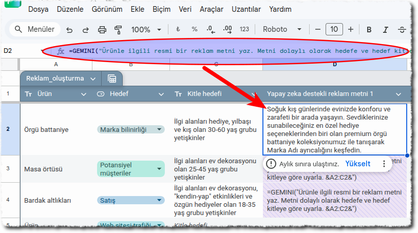{width=65%}

# Biçimlendirme

Biçimlendirme, veriyi değiştirmez; **okunmasını** değiştirir. Bu yüzden bir amaca hizmet etmeli, süs olsun diye yapılmamalıdır. En sık kullanılan biçimler sayı, tarih ve hücre görünümüyle ilgilidir; koşullu biçimlendirme ise bunlardan ayrı bir iş görür.

## Sayı, tarih ve hücre biçimleri

- **Sayı biçimi:** ondalık basamak sayısı, binlik ayırıcı, para birimi, yüzde.
- **Tarih biçimi:** gün–ay–yıl sırası; tarihler sayı gibi işlem gördüğü için biçim yalnızca görünüşü etkiler.
- **Yazı tipi, kenarlık ve dolgu:** başlıkları ve önemli hücreleri ayırmak için.
- **Sütun genişliği ve satır yüksekliği:** hücrede `###` görüyorsanız sütun dardır, veri kaybolmuş değildir.

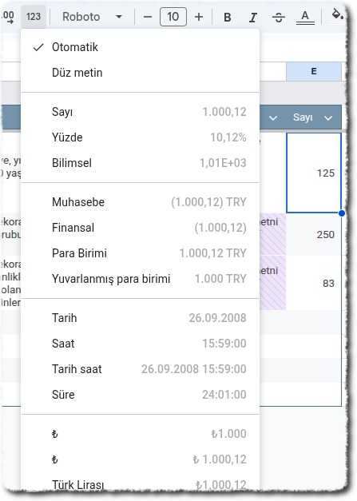{width=42%}

## Koşullu biçimlendirme

Koşullu biçimlendirme, bir hücrenin görünüşünü içindeki değere bağlar: değer belirlenen koşulu sağladığında hücre kendiliğinden renklenir. Koşul bir kez tanımlandığında biçim, değer değiştikçe kendini günceller; hücreleri elle boyamak gerekmez.

Aynı araç, çok farklı soruları yanıtlar:

- 50'nin altındaki notları kırmızıya boya (hücre vurgulama kuralı).
- Bütün değerleri en küçüğü kırmızı, en büyüğü yeşil olacak biçimde renklendir (renk ölçeği).
- Her hücrenin yanına değerine uygun bir simge koy: trafik ışığı, WiFi çekim gücü gibi (simge kümesi).
- En yüksek yüzde 10'luk dilime giren değerleri kalın yaz (ilk/son kuralı).

{width=40%}

# Sıralama ve Filtreleme

Bu iki işlem sık karıştırılır, oysa amaçları farklıdır.

::: {tbl-colwidths="[18,41,41]"}
| | Sıralama | Filtreleme |
|:---|:---|:---|
| Ne yapar | Satırların yerini değiştirir | Filtreye uymayanları gizler |
| Veriye etkisi | Kalıcı olarak yeniden düzenler | Veriyi silmez |
| Tipik kullanım | En yüksekten en düşüğe listeleme | Yalnızca 70 ve üstü notlar |
:::

Sıralama yaparken **bütün tabloyu** seçmek şarttır; yalnızca bir sütunu sıralarsanız diğer sütunlarla bağlantı kopar ve veri anlamsızlaşır. Başlık satırını sabitlemek de (dondurma) uzun listelerde yön kaybetmemek için kullanılabilir.

::: {.callout-warning}
## Birleştirilmiş hücrelerden kaçının

Görsel olarak düzenli görünse de birleştirilmiş hücreler **sıralama ve filtrelemeyi bozar**; formüllerin aralıklarını da şaşırtır. Bu yüzden yalnızca gerçekten gerektiğinde kullanılmalıdır.
:::

# Özet Tablolar (Pivot Table)

Veri miktarı arttıkça, satır satır formül yazmak veya filtre uygulamak yetersiz kalır. **Özet tablo** (pivot table), büyük bir veri kümesini sürükle-bırak yöntemiyle gruplayıp özetlemeye yarayan bir araçtır.

Örneğin yüzlerce satırlık bir satış tablosunda, her bölgenin toplam satışını görmek istediğinizi düşünün. Özet tablo, tek bir tıklamayla bölgeleri satırlara, ürünleri sütunlara yerleştirir ve kesişimlerine toplamları yazar. Ham veri değişmez; yalnızca özet bir görünüm oluşturulur.

Temel mantığı üç adımdır:
1. **Grupla:** Hangi değişkene göre özetleneceğini seçin (ör. bölge, ay, kategori).
2. **Topla/Say:** Hangi değerin hesaplanacağını seçin (ör. satış tutarı, adet).
3. **Yerleştir:** Alanları satır, sütun ve değer bölgelerine sürükleyin.

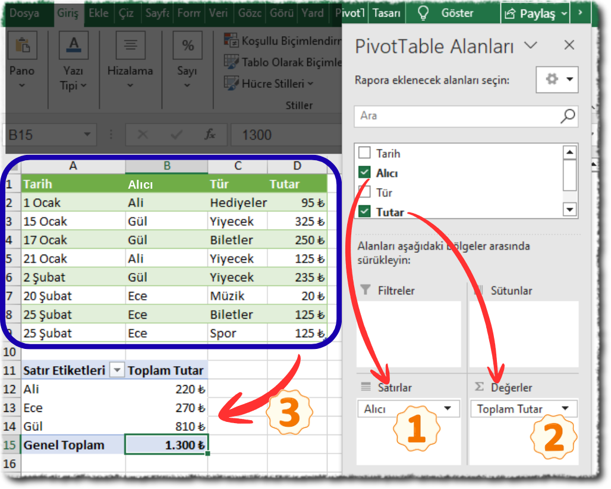{width=80%}

Özet tablolar, formül yazmadan saniyeler içinde rapor üretmenin en hızlı yoludur; ancak ham veriyi değiştirmediği için yanlış gruplama yapıldığında yanıltıcı sonuçlar verebilir. Oluşturduğunuz özeti her zaman ham veriyle karşılaştırarak doğrulayın.

# Grafik Oluşturma

Grafik, sayıları görsel biçime çevirir. Doğru grafik türü, verinin ne söylediğini ortaya çıkarır; yanlış tür ise olmayan bir sonucu ima eder.

Bir grafik nasıl oluşturulur: önce **veriyi seçin** (başlık satırıyla birlikte), sonra **grafik türünü** seçin. Ardından eksik bırakılmaması gereken üç şey var — **grafik başlığı**, **eksen etiketleri ve birimler**, **veri kaynağı notu**. Bu üçünü eklemek, grafiği "çizilmiş" olmaktan çıkarıp "anlaşılır" hâle getirir.

```{=latex}
\begin{figure}[htbp]
\centering
\begin{minipage}[c]{0.25\linewidth}
\centering\small
\begin{tabular}{@{}lr@{}}
\toprule
İsim & Boy \\
\midrule
Ece & 160 \\
Veli & 168 \\
Metin & 172 \\
Ali & 174 \\
Musa & 169 \\
İrem & 158 \\
Gül & 161 \\
\bottomrule
\end{tabular}
\end{minipage}\hfill
\begin{minipage}[c]{0.72\linewidth}
\centering
\includegraphics[width=\linewidth,keepaspectratio]{gorseller/diagram-grafik-anatomi.png}
\end{minipage}
\caption{Bir çubuk grafiğin parçaları: başlık, düşey ve yatay eksenler ile etiketleri, sayısal ölçek, veri çubukları ve değerleri.}
\end{figure}
```

## Çokça kullanılan grafik türleri

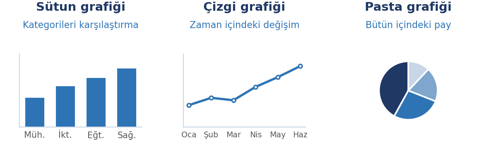{width=90%}

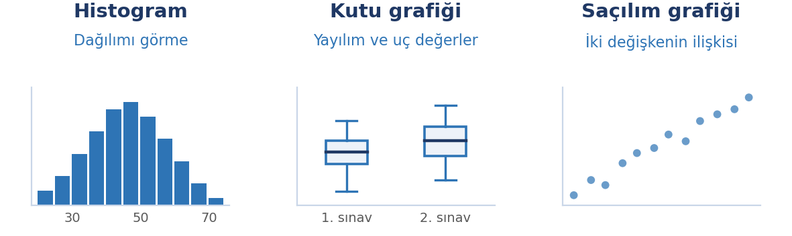{width=90%}

::: {tbl-colwidths="[32,68]"}
| Grafik türü | Kullanım amacı |
|:---|:---|
| Sütun veya çubuk grafiği | Kategorileri karşılaştırmak |
| Çizgi grafiği | Zaman içindeki değişimi göstermek |
| Pasta veya yığılmış çubuk | Bütün içindeki payı göstermek |
| Histogram | Dağılımı göstermek |
| Kutu grafiği | Yayılımı ve uç değerleri göstermek |
| Saçılım (dağılım) grafiği | İki değişken arasındaki ilişki |
| Harita | Coğrafi dağılım (alanın büyüklüğü değerin kendisi değildir) |
:::

Pasta grafikler için bir uyarı: yalnızca **az sayıda dilim** ve **birbirinden belirgin biçimde farklı oranlar** olduğunda işe yarar. Altı yedi dilimli, oranları yakın pastalar okunamaz.

## Diğer grafik türleri

Yukarıda bahsedilen grafikler en sık kullanılanlardır; seçenek bunlarla sınırlı değildir. İki aşama arasındaki akışı göstermek için **Sankey diyagramı**, metinlerde en sık geçen sözcükleri öne çıkarmak için **kelime bulutu**, iki değişkenin kesişimini yoğunlukla göstermek için **ısı haritası**, parça–bütün ilişkisini alanla göstermek için **ağaç haritası (treemap)**, coğrafi dağılımı göstermek için **harita** kullanılır. Bu şekilde onlarca farklı grafik türü kullanılabilir. İhtiyaca göre en iyi grafik türünü tespit etmek için farklı denemeler yapabilirsiniz.

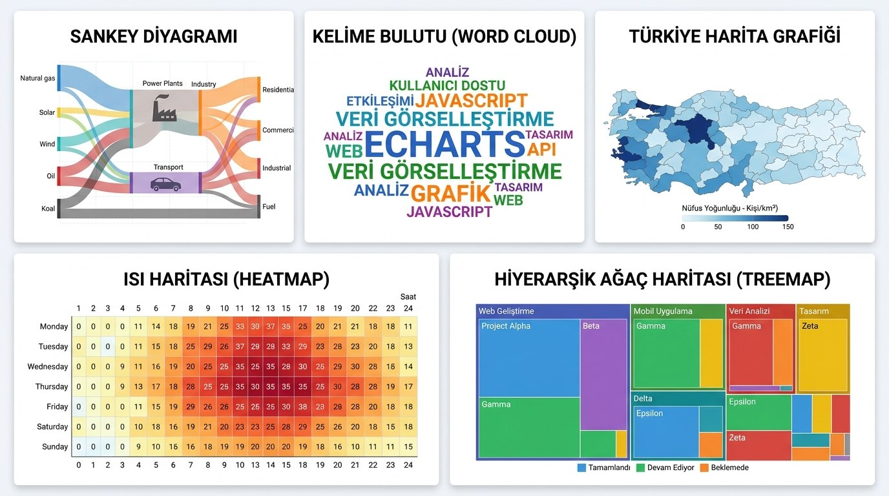{width=95%}

## Yapay zekâ ile grafik çizme

Grafiği elle çizmek yerine yapay zekâya çizdirmek de mümkündür: "ECharts ile radar grafiği oluştur" gibi bir istek, çalışan bir örnek üretir. Apache ECharts ve Chart.js ücretsiz, açık kaynaklı JavaScript kütüphaneleridir; kod tarayıcıda çalışır, kurulum gerektirmez. Üretilen grafiğin başlığı, eksenleri, birimleri ve ölçeği yine de gözle denetlenmelidir. Apache ECharts ve Chart.js örnek grafiklerini kendi web sitelerinden inceleyebilirsiniz.[^ornekler]

[^ornekler]: Apache ECharts: <https://echarts.apache.org/examples/> · Chart.js: <https://www.chartjs.org/docs/latest/samples/>

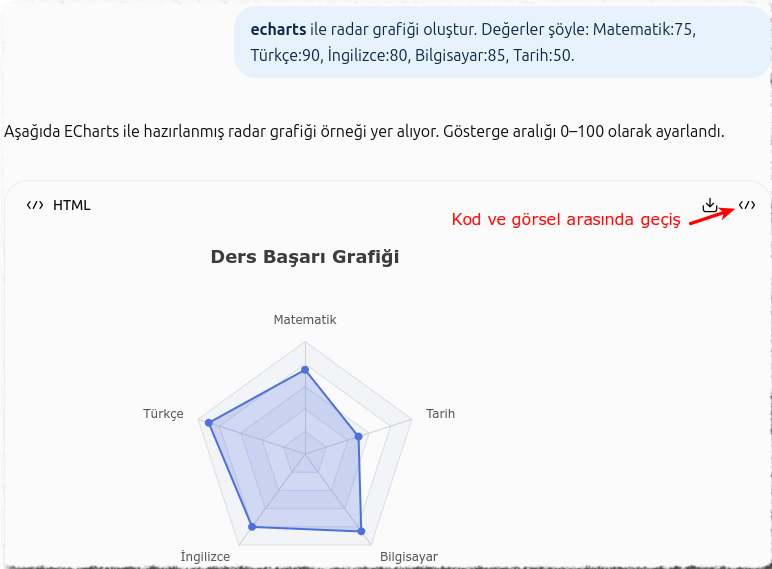{width=72%}

# Grafiklerin ve Sayıların Doğru Okunması

Grafiği üretmeyi öğrendik. Şimdi diğer yönüne geçiyoruz: karşımıza konan bir grafiğe ve arkasındaki sayılara güvenip güvenemeyeceğimizi nasıl anlarız?

::: {.callout-note}
## Grafik tarafsız bir resim değildir

Bir grafik, **tercihlerle kurulmuş bir iddiadır**. Onu hazırlayan kişi hangi veriyi alacağına, hangi aralığı göstereceğine, ekseni nereden başlatacağına ve neyi vurgulayacağına karar verir. Bu kararların bir kısmı bilgisizlikten, bir kısmı okuyanı yönlendirmek amacıyla alınır.
:::

Yanıltma yöntemleri sınırlı sayıdadır ve tanındıklarında bir daha işe yaramaz. Dört grupta toplanır; en sık karşılaşılan üç örnek **kesilmiş eksen**, **alan ve hacim yanılsaması** ile **seçilmiş zaman aralığıdır**. Üç örneğin doğru ve yanıltıcı sürümü aşağıdaki şemada yan yana durur.

## Eksen kaynaklı yanıltmalar

**Kesilmiş eksen.** Dikey eksen sıfırdan başlamaz. 96, 98, 97 ve 99 değerleri 0–100 aralığında neredeyse aynı yükseklikteyken, eksen 95'ten başlatılınca aralarındaki 1–2 puanlık fark devasa görünür.

Bu grupta ayrıca **ters çevrilmiş eksen** (değerler büyürken grafiğin aşağı inmesi) ve **eşit olmayan aralıklı eksen** (etiketlerin 0, 10, 20, 50 gibi düzensiz yerleştirilmesi) de okuyucuyu yanıltır.

## Ölçek ve oran kaynaklı yanıltmalar

**Alan ve hacim yanılsaması.** Değerler 10, 20 ve 30'dur. Doğru grafikte dairenin **alanı** değerle orantılıdır; yanıltıcı grafikte ise **çapı** büyütülür. İkinci durumda iki kat değer dört kat büyük görünür, çünkü alan çapın karesiyle büyür.

Bu grupta **üç boyutlu efekt** (perspektifin uzak dilimleri küçültmesi) ve **çift eksen kullanımı** (ilgisiz iki serinin aynı yönde yükseliyormuş gibi gösterilmesi) da yanıltıcı sonuçlar doğurur.

## Seçme ve gizleme kaynaklı yanıltmalar

**Seçilmiş zaman aralığı.** Bütün seri 52'den 65'e yükselirken aradan seçilen 4–7 aralığı düşüyor; yalnızca o aralık gösterildiğinde eğilim tersine dönmüş görünür.

Bunun yanında **eksik veri** (kararsızların veya cevap vermeyenlerin grafikten çıkarılarak yüzdelerin yeniden hesaplanması) ve **seçilmiş karşılaştırma grubu** (dört grup içinden yalnızca istenen sonucu destekleyenlerin gösterilmesi) da sık başvurulan yanıltma yöntemleridir.

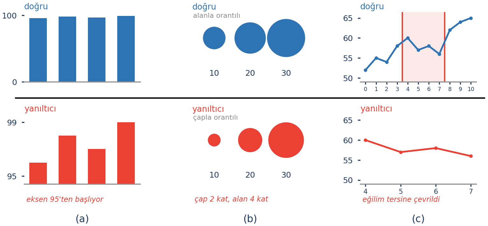{width=95%}

## Tasarım kaynaklı yanıltmalar

**Renk ve vurgu.** Dört çubuk aynı veriyi taşır. Yalnızca biri canlı, ötekiler soluk çizilince göz istenen çubuğa gider; veri değişmemiştir.

**Kalabalık gösterim.** Grafiğe gereksiz ızgara çizgileri, çerçeveler ve ayrıntılar eklendiğinde göz süslemeye takılır, asıl veri geri planda kalır.

**Başlıkla verinin uyuşmaması.** Düşen bir çizginin üstüne "artış" başlığı konursa okuyucu grafiğe değil başlığa inanır.

Yanıltma yalnızca grafikte olmaz; yüzdeler de aynı farkı iki farklı büyüklükte gösterebilir.

## Yüzde puan ve göreli değişim

İki değer arasındaki değişimi anlatmanın iki yolu vardır ve karıştırılmaları yaygındır.

- **Yüzde puan farkı:** iki oran arasındaki doğrudan çıkarma. %20'den %25'e çıkış **5 puan**dır.
- **Göreli değişim:** farkın başlangıç değerine bölünmesi. Aynı çıkış, 5 ÷ 20 = **%25 artış**tır.

::: {#fig-yuzde-puan layout-ncol=2}
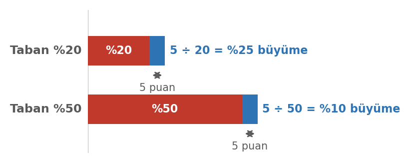{width=98%}

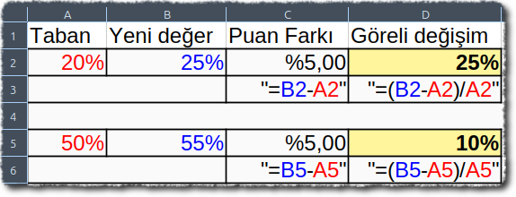{width=98%}

Aynı 5 puanlık fark iki farklı tabanda: taban %20 iken 5 ÷ 20 = %25, taban %50 iken 5 ÷ 50 = %10 büyüme. Sağda aynı örnek, Microsoft Excel'de iki ayrı formülle hesaplanmış.
:::

Aynı 5 puan; taban %20 iken %25, taban %50 iken %10'luk bir artış demektir: taban küçüldükçe, aynı puan farkının etkisi büyür. Bu yüzden oran içeren bir haberde ilk soru şu olmalıdır: **neyin yüzde kaçı, tabanı kaç?** Küçük tabanda etki daha da çarpıcıdır: 2 vakadan 6 vakaya çıkış "%200 arttı" demektir; ama arada yalnızca 4 vaka var. Sayılar bu kadar küçükken birkaç vaka artışı, artışın süreceği anlamına gelmez.

Hesap tablosunda ikisi **iki ayrı formül** olur: puan farkı için `=B2-A2`, göreli değişim için `=(B2-A2)/A2`. Birincisi **sayı**, ikincisi **yüzde** biçiminde gösterilir; aynı tabloya iki farklı biçim vermek kavramların karışmasını önler.

## Kontrol listesi

Bir grafiğe her baktığınızda şu dokuz soruyu hızlıca gözden geçirmek çoğu yanıltmayı yakalar:

1. Sütun ve alan grafiğinde eksen sıfırdan mı başlıyor?
2. Birimler ve ölçek yazılı mı?
3. Kaynak ve tarih var mı?
4. Kaç veri noktası var; kayıp veri gizlenmiş mi?
5. Grafik başlığı verinin söylediğiyle uyumlu mu?
6. Karşılaştırma grubu adil mi?
7. Renkler bir şey mi ima ediyor?
8. Tam veri kümesine erişilebiliyor mu?
9. Grafik, eşlik ettiği metinle aynı şeyi mi söylüyor?


# Uygulama: Kendiniz Üretin

Bu hafta öğrendiğiniz araçla küçük bir veri kümesi girin; bir kez **kasten yanıltıcı**, bir kez de **dürüst** grafik oluşturun. İkisini yan yana koyup yanıltıcı sürümde hangi kararları değiştirdiğinizi not edin.

# Özet

- Hesap tablosu, hücreler arasında **formüllerle ilişki kuran** bir yazılımdır; girdi değişince sonuç kendiliğinden güncellenir.
- Formüller `=` ile başlar; **göreli** başvuru kopyalanınca kayar, **mutlak** başvuru (`$A$1`) sabit kalır.
- **Yüzde puan** ile **göreli yüzde değişim** farklı şeylerdir; karıştırıldığında değişim olduğundan büyük görünür.
- **CSV** değerleri taşır, biçimlendirmeyi taşımaz; bu yüzden programlar arasında ortak biçimdir.
- **Biçimlendirme** veriyi değil görünüşü değiştirir; koşullu biçimlendirme değere göre kendini günceller.
- **Sıralama** veriyi yeniden düzenler, **filtreleme** yalnızca gösterir.
- **Grafik türü** verinin türüne göre seçilir: kategoriler için sütun, zaman için çizgi, pay için pasta.
- Yanıltma taktikleri dört grupta toplanır: eksen, ölçek ve oran, seçme ve gizleme, tasarım.
- Grafiğe her bakışta sorulacak dokuz soruluk bir kontrol listesi vardır.

# Kendini Sınama Soruları

1. Bir formülü bir satır aşağı kopyaladığınızda `A1` ve `$A$1` başvuruları nasıl davranır?
2. Bir oranın %40'tan %50'ye çıkması yüzde puan ve göreli değişim olarak nasıl ifade edilir?
3. `SAY` ile `EĞERSAY` arasındaki fark nedir?
4. Sıralama ile filtreleme arasındaki temel fark nedir; hangisi veriyi kalıcı olarak değiştirir?
5. Zaman içindeki değişimi göstermek için hangi grafik türü uygundur; neden?
6. Dikey ekseni 45'ten başlayan bir sütun grafiği okuyucuyu nasıl yanıltır?
7. Elinizde bir grafik olduğunda ilk bakacağınız üç şey nedir?
8. Bir CSV dosyası hangi bilgileri taşımaz?
9. Koşullu biçimlendirme hücrenin değerini değiştirir mi; neyi değiştirir?

# Kaynaklar

Bu haftanın konularını destekleyen, kamuya açık kaynaklar:

- **Kullanılan ofis yazılımının resmî kılavuzları** — formüller, işlevler, sıralama, filtreleme ve grafik oluşturma belgeleri.
- **Türkiye İstatistik Kurumu (TÜİK)** — resmî istatistikler ve verilerin okunmasına ilişkin yayınlar. (tuik.gov.tr)
- **Gapminder** — veri okuryazarlığı ve yanıltıcı grafikler üzerine ücretsiz eğitim materyalleri. (gapminder.org)
- **Our World in Data** — açık erişimli veri görselleştirme örnekleri. (ourworldindata.org)
- **Görsel kaynakları:** Ekran görüntüleri LibreOffice Calc, Google Sheets ve Microsoft Excel uygulamalarından alınmıştır; Google Sheets görselindeki kavram etiketleri tarafımızca eklenmiştir. Özet tablo adımları görseli, Excel ekran görüntüsü üzerine eklenen numaralı işaretler ve oklarla tarafımızca hazırlanmıştır. Bu haftanın diyagramları (grafik türleri, yanıltma şeması) kendi çizimimizdir.

Haftaya özel ek okuma önerileri ve güncel bağlantılar, dersin çevrimiçi ortamında ayrıca paylaşılır.
