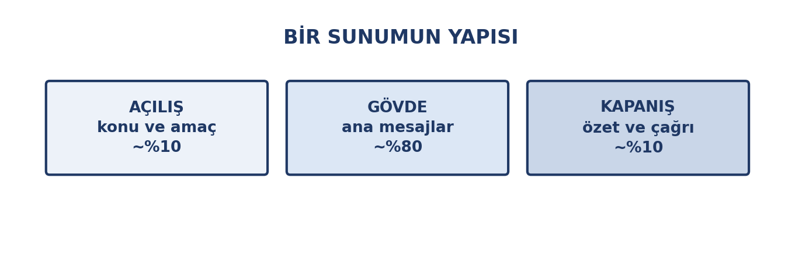
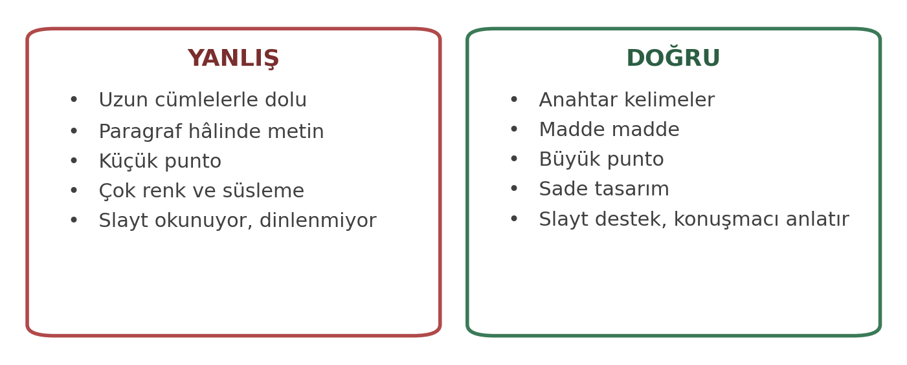
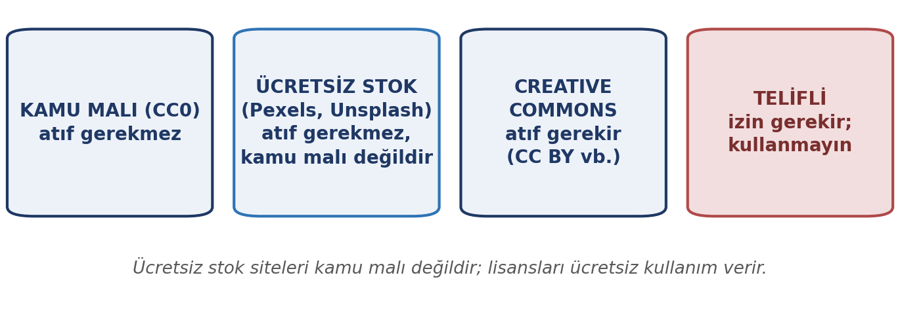
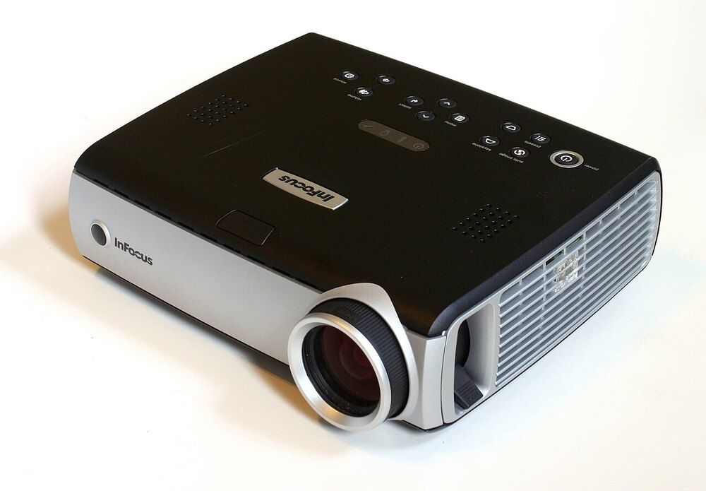
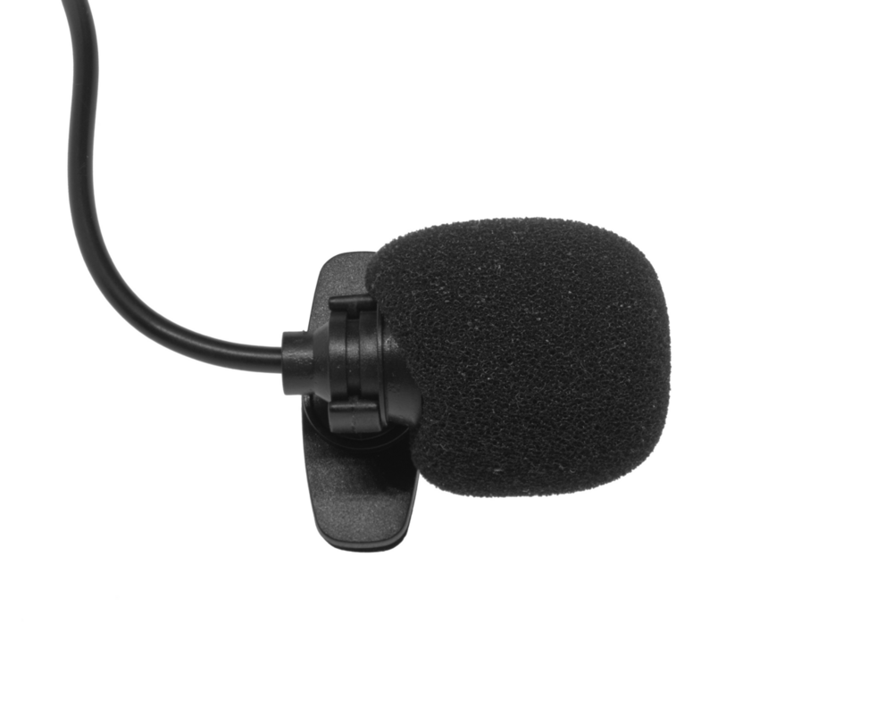

# Giriş

Üniversite hayatınızda ve iş hayatında fikirlerinizi **anlatmanız** gerekecek: sınıfta bir ödevi sunmak, bir projeyi tanıtmak, bir öneriyi savunmak. Sunum yazılımları bu iş için araçtır — ama iyi bir sunum, iyi bir slayttan fazlasıdır.

Sunum uygulamalarının da bilgisayara kurulan ve tarayıcıda çalışan **çevrimiçi** sürümleri vardır; aradaki farklar için 7. haftadaki karşılaştırmaya bakın.

Bu haftanın temel iddiası şu: **slayt, konuşmanın yerini almaz; onu destekler.** En iyi slaytlar üzerinde en az yazı olanlardır. Çünkü insanlar aynı anda hem okuyup hem dinleyemez; slaytı okumaya başladıkları anda sizi dinlemeyi bırakırlar.

::: {.callout-note}
## Bu haftanın temel fikri

Slayt bir **vitrindir**, depo değil. Üzerinde anahtar kelimeler olur; ayrıntıyı konuşmacı anlatır.
:::

# Bu Haftanın Öğrenme Çıktıları

- Bir sunumun yapısını (açılış, gövde, kapanış) planlar.
- Slaytta metin yoğunluğunu ve okunabilirliği ayarlar.
- Görselleri telif kurallarına uygun biçimde kullanır.
- Tasarım tutarlılığını sağlar.
- Tablo ve grafiği slayda uygun biçimde yerleştirir.
- Etkili sunum tekniklerini uygular.
- Erişilebilir sunum hazırlar.

# Bir Sunumun Yapısı

Her sunum üç bölümden oluşur ve bu bölümlerin ağırlığı bellidir.

{width=76%}

| Bölüm | Ne yapar | Süre payı |
|:---|:---|:---|
| **Açılış** | Konuyu ve amacı tanıtır, dinleyicinin dikkatini toplar | ~%10 |
| **Gövde** | Ana mesajları sırayla işler | ~%80 |
| **Kapanış** | Özetler ve ne yapılması gerektiğini söyler | ~%10 |

## Açılış

Dinleyici ilk 30 saniyede karar verir: dinleyecek mi? İyi bir açılış konuyu tanıtır, **neden önemli olduğunu** söyler ve genellikle bir soru ya da çarpıcı bir veriyle başlar.

## Gövde

Ana mesajların işlendiği bölümdür. Burada en sık yapılan hata, çok fazla mesaj vermeye çalışmaktır. **Üç ana mesaj** kuralı iyi bir ölçüdür: dinleyici genellikle üçten fazlasını hatırlamaz.

## Kapanış

Sunumun en çok atlanan ama en etkili kısmıdır. Kapanış, ana mesajları hatırlatır ve **ne yapılması gerektiğini** söyler. "Teşekkürler" demek bir kapanış değildir.

# Slayt Tasarımı

## Metin yoğunluğu

{width=80%}

Bir slaytta uyulacak basit kurallar:

- **Madde madde yazın**, paragraf yazmayın.
- **Anahtar kelimeler** kullanın; cümleyi konuşurken kurun.
- **Satır başına 6–8 kelime**, slayt başına 6 maddeyi geçmeyin.
- **Punto büyük olsun:** sınıfın arkasından okunabilmeli.
- **Boşluk bırakın:** slaytın nefes alması okunabilirliği artırır.

::: {.callout-warning}
## Slaytı okumayın

Slaytta yazanı kelimesi kelimesine okumak, sunumun en sık yapılan hatasıdır. Dinleyici zaten okuyabiliyor. Konuşmacının işi **okunanı açıklamak**, tekrar etmek değil.

**Pratik ölçü:** Slaytı, üzerindeki yazıyı okumadan anlatabiliyor musunuz? Cevap "hayır" ise slaytta fazla yazı var demektir.
:::

## Tasarım tutarlılığı

Tutarlılık, profesyonel görünümün temelidir:

- **Renk paleti:** En fazla iki üç renk. Kurumsal renk varsa ona sadık kalın.
- **Yazı tipi:** Tüm slaytlarda aynı yazı tipi ve punto düzeni.
- **Yerleşim:** Başlık hep aynı yerde, gövde hep aynı hizada.
- **Görsel dil:** Aynı tür görseller (ya gerçek fotoğraf ya çizim, karışık değil).

::: {.callout-tip}
## Şablon kullanın

Sıfırdan tasarım yapmak yerine bir **şablon** seçip ona sadık kalmak, hem zaman kazandırır hem tutarlılığı garantiler. Şablonun rengini ve yazı tipini değiştirmek yeterlidir.
:::

# Görsel Kullanımı ve Telif

Görseller sunumu güçlendirir — ama yalnızca doğru kullanıldığında.

## Görsel seçimi

- **İlgili olmalı:** Süs olsun diye görsel koymak dikkati dağıtır.
- **Kaliteli olmalı:** Bulanık görsel, içeriği de zayıf gösterir.
- **Bir mesajı desteklemeli:** Her görselin bir işi olmalı.
- **Metni tekrarlamamalı:** Görsel, yazılanı tekrarlamak yerine ona katkı yapmalı.

## Telif ve lisans

{width=76%}

İnternetten bulduğunuz her görseli kullanamazsınız. Görsellerin lisansı vardır:

| Kaynak türü | Kullanım |
|:---|:---|
| **Kamu malı (CC0)** | Telif süresi dolmuş ya da hakkından feragat edilmiş; serbest, atıf gerekmez |
| **Ücretsiz lisanslı stok siteleri** (Pexels, Unsplash vb.) | Ücretsiz kullanılır, atıf gerekmez; ancak **kamu malı değildir** ve lisans koşulları vardır |
| **Creative Commons (CC)** | Lisans şartına uyulur; genellikle atıf gerekir |
| **Telifli** | İzin gerekir; aksi hâlde kullanılamaz |

::: {.callout-warning}
## Kaynak göstermek telif sorununu çözmez

Bir görselin altına kaynak yazmak, onu kullanma hakkını vermez. **Lisansı uygun olan** görselleri seçin; kaynak gösterme ayrı bir yükümlülüktür.

Ücretsiz stok sitelerini ve Creative Commons arama araçlarını tercih edin.
:::

# Tablo ve Grafik Yerleştirme

Slaytta tablo ve grafik kullanacaksanız, bunlar **basitleştirilmelidir**.

- **Tabloda az satır ve sütun:** Eldeki büyük tabloyu olduğu gibi aktarmayın; yalnızca vurgulamak istediğiniz satırları gösterin.
- **Grafikte büyük punto:** Eksen etiketleri arkadan okunmalı.
- **Tek mesaj:** Her grafik bir şeyi göstermeli; üç eğriyi üst üste koyup hepsini anlatmaya çalışmayın.
- **Vurgulama:** Anlatmak istediğiniz değeri renkle ya da işaretle belirtin.

Geçen hafta gördüğümüz **yanıltıcı grafikler** konusunu hatırlayın: sunumunuzda grafik kullanırken eksenin sıfırdan başlamasına, ölçeklere ve kaynak belirtmeye dikkat edin. Kendi hazırladığınız grafik de yanıltıcı olabilir.

# Etkili Sunum Teknikleri

Slayt hazırlamak işin yarısıdır; sunmak diğer yarısı.

## Sunmadan önce

- **Prova yapın.** Yüksek sesle, ayakta, süre tutarak.
- **Süreyi ölçün.** Verilen süreyi aşmak, en sık yapılan sunum hatasıdır.
- **Teknik kontrol yapın.** Projeksiyon, ses, dosya biçimi — önceden deneyin.
- **Yedek kopya taşıyın.** Sunumunuzu PDF olarak da yanınızda bulundurun.

::: {#fig-sunum-donanim layout-ncol=2}
{width=90%}

{width=90%}

Sunumdan önce projeksiyon ve ses düzeneği denenmeli; ses için genellikle yaka mikrofonu kullanılır.
:::

## Sunarken

- **Dinleyiciye bakın.** Slayta değil.
- **Yavaş ve net konuşun.** Heyecanlı bir sunucu hızlanır.
- **Sesinizi ayarlayın.** Arka sıradan duyulmalı.
- **Ellerinizle oynamayın.** Sakin duruş güven verir.
- **Slaytı okumayın.** Söyleyeceğinizi bilin.
- **Geçişleri planlayın.** "Bir sonraki slaytta…" gibi ifadeler akışı kolaylaştırır.

## Soru-cevap

Sunumun sonunda sorular gelir. Birkaç nokta işe yarar:

- **Bilmediğiniz soruya "bilmiyorum" deyin.** Uydurmaktan iyidir.
- **Soruyu tekrar edin.** Hem herkes duyar hem siz düşünmek için zaman kazanırsınız.
- **Kısa yanıtlayın.** Uzun yanıt, soruyu soranı da dinleyiciyi de yorar.

::: {.callout-tip}
## En iyi prova, duyulmaktır

Sunumunuzu bir arkadaşınıza yapın. Anlatırken nerede takıldığınızı ve hangi slaytta kafa karıştırdığınızı en iyi o zaman görürsünüz.
:::

# Erişilebilir Sunum

Sunumunuz da belgeler gibi erişilebilir olmalıdır:

- **Okunabilir punto kullanın:** küçük punto hem sınıfın arkasından hem ekran okuyucudan okunmaz.
- **Yeterli kontrast sağlayın:** açık gri metin beyaz zeminde kaybolur.
- **Yalnızca renkle anlatmayın:** "kırmızı olanlar" yerine metinle de belirtin.
- **Görsellere alternatif metin ekleyin.**
- **Slayt başlıklarını anlamlı yazın:** "Slayt 5" değil, "Sonuçlar".

# Uygulama: Kısa Bir Sunum Hazırlayın

**Hangi araçla:** çevrimiçi ücretsiz bir sunum aracı (Google Slides gibi) ya da kurulabilen ücretsiz bir paket (LibreOffice Impress gibi). Aşağıdaki adımlar ikisinde de aynıdır.

## Adım 1 — Konu ve mesaj seçin

Bir konu seçin ve o konuda anlatmak istediğiniz **üç ana mesajı** yazın.

## Adım 2 — Yapıyı kurun

Açılış, gövde ve kapanış için kaçar slayt kullanacağınızı planlayın. Kapanışta ne söyleyeceğinizi şimdiden yazın.

## Adım 3 — Slaytları hazırlayın

Her slaytta en fazla altı madde ve az metin kullanın. Bir görsel ekleyin — lisansı uygun olan. Görsele altyazı ve alternatif metin yazın.

## Adım 4 — Prova yapın

Sunumunuzu yüksek sesle, süre tutarak bir kez baştan sona anlatın. Nerede takıldınız?

::: {.callout-tip}
## Teslim ve değerlendirme

Bu uygulama notla değerlendirilmez. Amacı, sunum hazırlamanın her adımını bir kez deneyimlemenizdir.
:::

# Özet

- Sunum üç bölümden oluşur: **açılış (%10), gövde (%80), kapanış (%10)**.
- **Slayt bir vitrindir, depo değil:** az metin, anahtar kelime, büyük punto.
- Slaytı okumak, sunumun en sık yapılan hatasıdır.
- **Tasarım tutarlılığı** profesyonel görünümün temelidir: renk, yazı tipi, yerleşim.
- Görseller **lisansına uygun** seçilmelidir; kaynak göstermek telif sorununu çözmez.
- Tablo ve grafikler slayt için **basitleştirilmelidir**.
- Etkili sunum **prova** ister: yüksek sesle, süre tutarak, yedek kopyayla.
- **Soru-cevap** bölümünde bilmediğinizi söylemek uydurmaktan iyidir.

# Kendini Sınama Soruları

1. Bir sunumun üç bölümü ve süre payları nedir?
2. "Slayt bir vitrindir, depo değil" ne anlama gelir?
3. Slaytta metin yoğunluğu için hangi pratik ölçü kullanılabilir?
4. Tasarım tutarlılığı için nelere dikkat edilir?
5. Creative Commons lisanslı bir görseli kullanırken ne yapmak gerekir?
6. Kaynak göstermek neden telif sorununu çözmez?
7. Sunum öncesi yapılması gereken üç hazırlık nedir?
8. Soru-cevap bölümünde bilmediğiniz bir soru gelirse ne yapmalısınız?

# Kaynaklar

- **Ücretsiz stok görsel siteleri** — lisansı uygun görsel kaynakları.
- **Creative Commons** — lisans türleri ve arama araçları. (creativecommons.org)
- **Sunum yazılımınızın resmî kılavuzu** — şablonlar, erişilebilirlik ve dışa aktarma.
- **W3C Erişilebilirlik Girişimi** — sunum erişilebilirliği ilkeleri. (w3.org/WAI)

**Görsel kaynakları.** Bu haftanın notlarındaki fotoğraflar Wikimedia Commons'tan alınmıştır. Aşağıdaki iki fotoğrafın künyesi:

- Projeksiyon cihazı — *InFocus IN34*, Dave Pape, kamu malı.
- Yaka mikrofonu — *GA100 Mic*, 多多123, CC BY 4.0.

Yaka mikrofonu fotoğrafı için kaynak gösterme zorunludur; projeksiyon karesi kamu malı olduğu için zorunlu değildir.

Haftaya özel ek okuma önerileri ve güncel bağlantılar, dersin çevrimiçi ortamında ayrıca paylaşılır.
