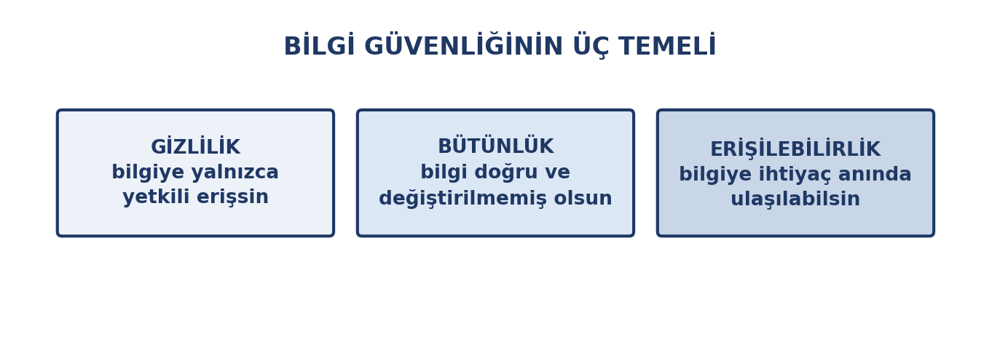
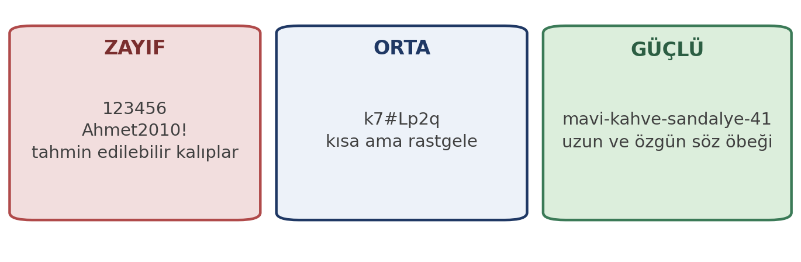
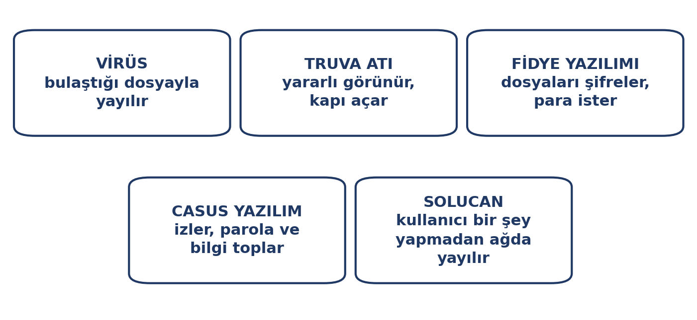

# Giriş

Dijital hayatta en değerli varlığınız **hesaplarınız ve verilerinizdir**. Bir e-posta hesabını kaybetmek yalnızca mesajlara erişememek değildir: o hesapla sıfırlanan diğer bütün parolalar, sizin adınıza gönderilen mesajlar ve itibarınız da kaybedilir.

Bu hafta güvenliği bir "teknik uzman işi" olarak değil, **günlük alışkanlıklar** olarak ele alıyoruz. Saldırıların büyük kısmı karmaşık yazılımlarla değil, **insanları ikna ederek** yapılır. Dolayısıyla korunmanın büyük kısmı da bilgi ve dikkatle ilgilidir.

::: {.callout-note}
## Bu haftanın temel fikri

Güvenlikte en zayıf halka teknoloji değil, **insandır**. Sistemleri kırmak çoğu zaman zor, insanı ikna etmek kolaydır.
:::

# Bu Haftanın Öğrenme Çıktıları

- Bilgi güvenliğinin üç temel ilkesini açıklar.
- Güçlü parola oluşturur ve parola yöneticisi kullanır.
- İki adımlı doğrulamayı etkinleştirir ve önemini açıklar.
- Oltalama saldırılarını tanır ve doğru davranır.
- Zararlı yazılım türlerini ve bulaşma yollarını bilir.
- Güncelleme ve yedekleme alışkanlığı geliştirir.
- Cihaz ve hesap güvenliği için doğru ayarları uygular.

# Bilgi Güvenliğinin Üç Temeli

{width=78%}

| İlke | Ne demek | İhlal örneği |
|:---|:---|:---|
| **Gizlilik** | Bilgiye yalnızca yetkili kişiler erişir | Hesabınızın ele geçirilmesi |
| **Bütünlük** | Bilgi doğrudur ve değiştirilmemiştir | Notlarınızın değiştirilmesi |
| **Erişilebilirlik** | Bilgiye ihtiyaç anında ulaşılır | Fidye yazılımı dosyaları kilitler |

Bu üç ilkeden biri bozulduğunda güvenlik ihlali vardır.

# Parola Yönetimi

Parola, hesabınızın kapısıdır. Ama çoğu kişi aynı parolayı birden çok yerde kullanır — ve bu, tek bir sızıntının **bütün hesaplarınızı** ele geçirmesi anlamına gelir.

::: {.callout-note}
## "Parola" ile "şifreleme" farkı

Erişim için girdiğiniz gizli dizeye **parola** denir. **Şifreleme** ise verinin okunamaz hâle getirilmesidir; parola yöneticinizin kasası ya da `https` bağlantısı gibi şeyler şifreleme ile korunur. Günlük dilde ikisine de "şifre" denir; bu metinde erişim için **parola**, verinin korunması için **şifreleme** sözcükleri kullanılır.
:::

{width=78%}

## Güçlü parola nasıl olur?

- **Uzunluk önemlidir:** Uzun bir parola, karmaşık ama kısa bir paroladan daha güçlüdür.
- **Her hesap için farklı olmalıdır.** Bir sızıntı diğerlerine bulaşmasın.
- **Kişisel bilgi içermemelidir:** doğum tarihi, isim, plaka, takım adı — bunlar tahmin edilebilir.
- **Tahmin edilebilir kalıplar kullanmayın:** `123456`, `qwerty`, `parola`, `Ahmet2010!`.

::: {.callout-tip}
## Parola yerine söz öbeği

Birbirinden ilgisiz birkaç kelimeyi birleştirmek, hem akılda kolay kalır hem de tahmin edilmesi çok zordur.

Örnek yapı: `mavi-kahve-sandalye-41` gibi. Uzun, özgün ve tahmin edilemez. **Kendi örneğinizi üretin; buradaki örneği kullanmayın.**
:::

## Parola yöneticisi

Bütün parolaları akılda tutmak mümkün değildir. **Parola yöneticisi** yazılımlar bu işi sizin yerinize yapar:

- Her hesap için rastgele, güçlü parola üretir
- Bunları şifreli bir kasada saklar
- Yalnızca **bir ana parolayı** hatırlamanız yeterlidir
- Parolaları siteye otomatik doldurur

## İki adımlı doğrulama (2FA)

Parolanız çalınsa bile hesabınızın korunmasını sağlayan ikinci katmandır: **bildiğiniz bir şey** (parola) + **sahip olduğunuz bir şey** (telefon, uygulama kodu, donanım anahtarı).

::: {.callout-warning}
## İki adımlı doğrulamayı açın

Özellikle şu hesaplarda iki adımlı doğrulama **mutlaka** açık olmalıdır:

- E-posta hesabınız (çünkü diğer bütün parolalar oraya sıfırlanır)
- e-Devlet ve bankacılık
- Sosyal medya hesapları

Kısa mesajla gelen kod, hiç yoktan iyidir; ancak **uygulama tabanlı** kod üreten yöntemler daha güvenlidir.
:::

# Sosyal Mühendislik

Saldırganların çoğu teknik bir açıklık aramaz; **insanı** hedefler. İnsanların güvenme, yardım etme ve acele etme eğilimini kullanarak güvenlik önlemlerini atlatmaya **sosyal mühendislik** denir.

Sık kullanılan yöntemler:

- **Güven kazanmak:** Kendini yetkili ya da tanıdık biri olarak tanıtmak.
- **Taklit etmek:** Özellikle telefonla bir kurumun ya da yakının yerine geçmek.
- **Yardım ediyor görünmek:** Bir sorun yaratıp çözümü kendisi sunmak.
- **Ortak tanıdık üzerinden yakınlık kurmak:** "Ahmet de beni tanıyor" gibi.
- **Çöp karıştırmak:** Atılan belgelerden, notlardan bilgi toplamak.

Bu yöntemlerin ortak yanı, sizi **düşünmeden hareket etmeye** itmeleridir. Teknik önlemler ne kadar güçlü olursa olsun, en iyi savunma durup düşünmektir.

# Oltalama (Phishing)

**Oltalama**, sizi kandırarak parola veya kişisel bilgi vermeye ikna etme saldırısıdır. E-posta, kısa mesaj, telefon araması ya da sahte web sitesiyle yapılabilir.

{width=78%}

## En sık görülen biçimler

| Biçim | Nasıl işler |
|:---|:---|
| **E-posta oltalaması** | Kurumdan gelmiş gibi görünen sahte e-posta |
| **SMS oltalaması (smishing)** | Kargo, banka, fatura bildirimi görünümlü mesaj |
| **Telefon oltalaması (vishing)** | Kendini banka görevlisi olarak tanıtan arama |
| **Sahte web sitesi** | Gerçek sitenin birebir kopyası |

::: {.callout-warning}
## Dört altın kural

**1. Acele ettiren her mesaj şüphelidir.** "Hemen", "son saatler", "hesabınız kapatılacak" gibi ifadeler baskı kurmaya yöneliktir.

**2. Bağlantıya tıklamayın.** Bunun yerine siteye kendiniz, adresini yazarak gidin.

**3. Göndereni başka kanaldan doğrulayın.** Kurumdan geldiğini düşündüğünüz bir mesaj varsa, kurumu bilinen numarasından arayın.

**4. Parolanızı kimseye vermeyin.** Hiçbir kurum e-posta, mesaj veya telefonla parola istemez.
:::

# Zararlı Yazılımlar

**Zararlı yazılım (malware)**, cihaza zarar vermek ya da bilgi çalmak amacıyla yazılmış programdır.

{width=80%}

| Tür | Ne yapar |
|:---|:---|
| **Virüs** | Bulaştığı dosyayla yayılır, diğer dosyaları bozar |
| **Truva atı** | Yararlı program gibi görünür, arka kapı açar |
| **Fidye yazılımı** | Dosyaları şifreler, açmak için para ister |
| **Casus yazılım** | Kullanımı izler, parola ve bilgi toplar |
| **Solucan** | Kullanıcı bir şey yapmadan ağda yayılır |

## Zombi bilgisayarlar

Bazı zararlı yazılımlar bilgisayarınızda hemen bir şey bozmaz. Sessizce çalışır, uzaktaki bir **komut merkezine** bağlanır ve oradan gelen emirleri uygular. Böyle bir bilgisayara **zombi bilgisayar**, bu bilgisayarlardan oluşan ağa **botnet** denir.

Zombi bilgisayarlar genellikle topluca hareket eder: bir siteyi çökertmek, spam göndermek ya da başka sistemlere saldırmak için kullanılırlar. Kullanıcı çoğu zaman hiçbir şey fark etmez; bilgisayar normal çalışmaya devam eder.

Bu yüzden "bilgisayarımda önemli bir veri yok, güvenlik beni ilgilendirmez" demek yanlıştır: cihazınız farkında olmadan bir saldırganın işini görmeye başlayabilir ve bunun hukuki sonuçları olabilir.

## Nasıl bulaşır?

- **Beklenmedik ekler:** Özellikle `.exe`, `.zip` dosyaları
- **Sahte indirme siteleri:** "Ücretsiz program" vaadiyle sunulan yazılımlar
- **Korsan yazılımlar ve kırılmış uygulamalar**
- **Takılan USB bellekler**
- **Güncellenmemiş yazılımlardaki açıklar**

::: {.callout-tip}
## Yazılımı kaynağından indirin

Kurduğunuz her programı **üreticinin kendi sitesinden** veya resmî uygulama mağazalarından indirin. Arama motoru sonuçlarının en üstünde çıkan "reklam" bağlantıları sahte olabilir.

Korsan yazılım, bedava görünür; ama ödediğiniz bedel parayla değil, **verilerinizle** olur.
:::

# Güncelleme ve Yedekleme

## Güncellemeler neden önemli?

Güncellemeler yalnızca yeni özellik eklemez; **bilinen güvenlik açıklarını kapatır**. Saldırganlar bu açıkları bilir ve güncellenmemiş sistemleri hedef alır.

- İşletim sistemi güncellemelerini ertelemeyin.
- Tarayıcı ve eklentileri güncel tutun.
- Kullandığınız uygulamaları güncelleyin.

## Yedekleme: fidye yazılımına karşı en iyi savunma

Fidye yazılımı dosyalarınızı şifrelediğinde, **yedek varsa** fidye ödemenize gerek kalmaz — dosyaları yedekten geri yüklersiniz. 4. haftada gördüğümüz **3-2-1 kuralı** burada da geçerlidir.

::: {.callout-tip}
## Yedeği bağlı tutmayın

Fidye yazılımları bağlı olan yedek diskleri de şifreler. Bu yüzden **harici yedeği işiniz bittiğinde çıkarın**; bulut yedeği ise sürüm geçmişi tutuyorsa daha güvenlidir.
:::

# Cihaz ve Hesap Güvenliği

Günlük hayatta uygulanacak pratik önlemler:

- **Ekran kilidi kullanın:** Telefon ve bilgisayarda parola, desen veya biyometrik kilit.
- **Otomatik kilitleme süresini kısaltın:** Bilgisayardan uzaklaştığınızda kilitlenmeli.
- **Ortak bilgisayarda oturumu kapatın:** Sekmeyi kapatmak yetmez; "çıkış yap" demek gerekir.
- **Tarayıcıya parola kaydetmeyin:** Ortak cihazlarda özellikle.
- **Genel WiFi ağlarında hassas işlem yapmayın** (5. hafta).
- **Kullanmadığınız hesapları kapatın:** Her hesap bir risk yüzeyidir.
- **Veri ihlali bildirimlerini takip edin:** Bir hizmet sızarsa parolanızı değiştirin.

## Güvenlik duvarı ve varsayılan ayarlar

**Güvenlik duvarı**, ağdan gelen ve giden trafiği denetleyen, izin verilmeyen bağlantıları engelleyen korumadır. İşletim sistemlerinin çoğunda **hazır olarak açık** gelir; kapatmak korumayı zayıflatır. Benzer şekilde çoğu sistemde bir antivirüs de yerleşik gelir.

Buradan çıkan pratik sonuç şudur: varsayılan güvenlik ayarları sıradan bir kullanıcı için genellikle **yeterlidir**. Yeni bir "güvenlik yazılımı" indirmeye gerek yoktur; gerekli olan açık olan korumayı kapatmamak ve güncel tutmaktır.

## Güvenli alışveriş ve ödeme

İnternetten alışveriş ve bankacılık, bilgisayarınıza saldırılmasını gerektirmez: bilgilerinizi **siz** yanlış yere yazarsanız kaybolurlar.

- **Adresi ve kilidi kontrol edin.** Ödeme sayfası `https` olmalı ve adres çubuğunda kilit simgesi bulunmalıdır.
- **Adresi kendiniz yazın.** E-postadan ya da başka bir siteden gelen bağlantıya tıklamak yerine kurumun adresini doğrudan yazın.
- **Bankacılık parolanızı kimseyle paylaşmayın.** Bankalar dâhil hiçbir kurum parolanızı istemez.
- **Sanal kart kullanın.** Alışverişe özel, limiti düşük bir sanal kart, asıl kart bilgilerinizin açığa çıkma riskini azaltır.
- **Ödemeleri hesap özetinden doğrulayın.** Beklemediğiniz bir harcama görürseniz bankanıza bildirin.

# Doğru Bilinen Yanlışlar

| Yanlış inanış | Gerçek |
|:---|:---|
| "Antivirüs varsa güvendeyim" | Antivirüs önemlidir ama tek başına yetmez; en zayıf halka insandır |
| "Beni hedef almazlar, sıradan biriyim" | Saldırılar otomatiktir, milyonlarca kişiye aynı anda gider |
| "Gizli moddayım, güvendeyim" | Gizli mod sizi anonim yapmaz |
| "Parolam karmaşık, güvendeyim" | Aynı parolayı her yerde kullanıyorsanız, tek sızıntı hepsini açar |
| "Sadece güvenli sitelere giriyorum" | Güvenli bir sitenin reklamı ya da eklentisi zararlı olabilir |
| "Mac/Linux'a virüs bulaşmaz" | Bulaşır; kullanıcı sayısı az olduğu için hedef daha seyrektir |
| "Dosyayı sildim, gitti" | Geri dönüşüm kutusu boşaltılmadıkça geri alınabilir; kalıcı silme farklı işlemdir |

# Uygulama: Kendi Güvenliğinizi Denetleyin

## Adım 1 — Parola alışkanlığınızı değerlendirin

Kaç hesapta **aynı** parolayı kullandığınızı düşünün. En az iki hesabınız için yeni ve farklı parolalar belirleyin.

## Adım 2 — İki adımlı doğrulamayı açın

E-posta hesabınızda ve varsa e-Devlet hesabınızda iki adımlı doğrulamayı etkinleştirin. Hangi yöntemi kullandınız?

## Adım 3 — Bir oltalama e-postasını inceleyin

Gelen kutunuzdaki şüpheli bir e-postayı (varsa) açmadan inceleyin: gönderen adresi, bağlantı hedefi, dil hataları. Şüpheli işaretleri yazın.

## Adım 4 — Güncelleme durumunuzu kontrol edin

Cihazınızın işletim sistemi ve tarayıcısı güncel mi? Ertelenmiş güncelleme var mı?

::: {.callout-tip}
## Teslim ve değerlendirme

Bu uygulama notla değerlendirilmez. Amacı, güvenlik alışkanlıklarınızı somut adımlarla iyileştirmektir.
:::

# Özet

- Bilgi güvenliğinin üç temeli: **gizlilik, bütünlük, erişilebilirlik**.
- **Parola** uzun ve her hesap için farklı olmalıdır; **parola yöneticisi** kullanmak en pratik çözümdür.
- **İki adımlı doğrulama**, parola çalınsa bile hesabı korur; e-posta ve e-Devlet'te mutlaka açık olmalıdır.
- **Oltalama** saldırıları acele ettirir; bağlantıya tıklamadan başka kanaldan doğrulanır.
- **Zararlı yazılımlar** en çok beklenmedik ek, sahte indirme ve korsan yazılımla bulaşır.
- **Güncellemeler** bilinen açıkları kapatır; **yedekleme** fidye yazılımına karşı en iyi savunmadır.
- Güvenlikte en zayıf halka **insandır**; doğru bilinen yanlışlar bizi savunmasız bırakır.

# Kendini Sınama Soruları

1. Bilgi güvenliğinin üç temel ilkesini yazın ve birer ihlal örneği verin.
2. Uzun bir parola neden karmaşık ama kısa bir paroladan daha güçlüdür?
3. Parola yöneticisi nasıl çalışır; hangi tek bilgiyi hatırlamak yeterlidir?
4. İki adımlı doğrulamanın sağladığı koruma nedir? Hangi hesapta mutlaka açık olmalıdır?
5. Oltalama saldırılarının en belirgin ortak özelliği nedir?
6. Truva atı ile virüs arasındaki fark nedir?
7. Fidye yazılımına karşı en etkili savunma nedir ve neden?
8. "Antivirüs varsa güvendeyim" inanışı neden yanlıştır?

# Kaynaklar

- **USOM** — güvenlik uyarıları ve farkındalık içerikleri. (usom.gov.tr)
- **BTK** — İnternet'in bilinçli ve güvenli kullanımına ilişkin yayınlar. (btk.gov.tr)
- **TÜBİTAK BİLGEM** — bilişim güvenliği farkındalık yayınları. (tubitak.gov.tr)
- **Kullanılan işletim sistemi ve tarayıcının resmî güvenlik sayfaları.**

Haftaya özel ek okuma önerileri ve güncel bağlantılar, dersin çevrimiçi ortamında ayrıca paylaşılır.
