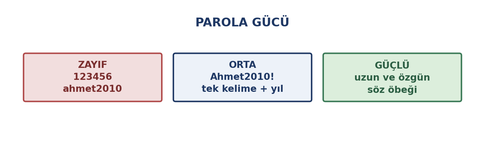
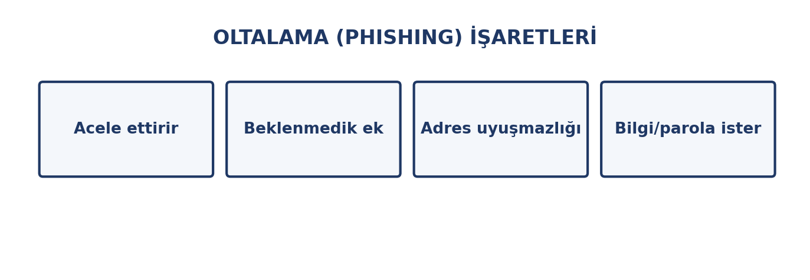
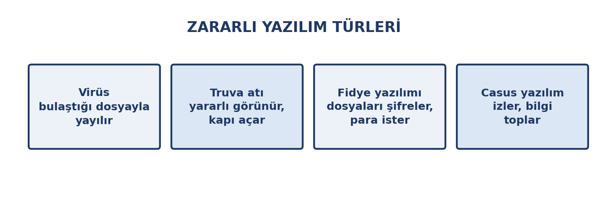

# Bu Haftanın Çerçevesi

## Öğrenme Çıktıları

- Bilgi güvenliğinin üç ilkesini açıklar.
- Güçlü parola oluşturur, parola yöneticisi kullanır.
- İki adımlı doğrulamanın önemini açıklar.
- Oltalama saldırılarını tanır.
- Zararlı yazılım türlerini bilir.
- Güncelleme ve yedekleme alışkanlığı geliştirir.

# Güvenliğin Üç Temeli

## Gizlilik · Bütünlük · Erişilebilirlik

{width=76%}

| İlke | İhlal örneği |
|:---|:---|
| Gizlilik | Hesabın ele geçirilmesi |
| Bütünlük | Notların değiştirilmesi |
| Erişilebilirlik | Fidye yazılımı |

## En Zayıf Halka İnsandır

Sistemleri kırmak zor, **insanı ikna etmek kolaydır**.

Saldırıların büyük kısmı teknik değil, **ikna** yoluyla yapılır.

# Parola Yönetimi

## Parola Gücü

{width=76%}

## Güçlü Parola Kuralları

- **Uzunluk** önemlidir
- **Her hesap için farklı** parola
- **Kişisel bilgi içermesin** — doğum tarihi, isim, plaka
- **Kalıp kullanmayın** — `123456`, `qwerty`, `Ahmet2010!`

## Parola Yerine Söz Öbeği

Birbirinden ilgisiz kelimeleri birleştirmek hem akılda kalır hem tahmin edilemez.

`mavi-kahve-sandalye-41` gibi bir **yapı** — ama kendi örneğinizi üretin.

## Parola Yöneticisi

- Her hesap için **rastgele** parola üretir
- Şifreli bir **kasada** saklar
- Tek bir **ana parola** hatırlamanız yeter
- Otomatik doldurur

## İki Adımlı Doğrulama (2FA)

**Bildiğiniz bir şey** (parola) + **sahip olduğunuz bir şey** (telefon, kod, anahtar).

Parolanız çalınsa bile hesabınız korunur.

**Uygulama tabanlı kodlar**, SMS kodundan daha güvenlidir.

## Nerede Mutlaka Açık Olmalı?

- **E-posta** — diğer bütün parolalar oraya sıfırlanır
- **e-Devlet ve bankacılık**
- **Sosyal medya hesapları**

# Oltalama

## Sizi Kandırarak Bilgi Almak

E-posta, SMS, telefon araması ya da sahte siteyle yapılır.

{width=76%}

## Biçimler

| Biçim | Nasıl işler |
|:---|:---|
| E-posta | Kurumdan gelmiş gibi görünür |
| SMS | Kargo, banka, fatura bildirimi |
| Telefon | Kendini banka görevlisi tanıtır |
| Sahte site | Gerçek sitenin kopyası |

## Dört Altın Kural

1. **Acele ettiren mesaj şüphelidir**
2. **Bağlantıya tıklamayın** — adresi kendiniz yazın
3. **Başka kanaldan doğrulayın**
4. **Parolanızı kimseye vermeyin**

Hiçbir kurum e-posta veya telefonla parola istemez.

# Zararlı Yazılımlar

## Türler

{width=78%}

## Nasıl Bulaşır?

- **Beklenmedik ekler** (`.exe`, `.zip`)
- **Sahte indirme siteleri**
- **Korsan / kırılmış yazılımlar**
- **Takılan USB bellekler**
- **Güncellenmemiş yazılım açıkları**

## Yazılımı Kaynağından İndirin

Yalnızca **üreticinin sitesinden** veya resmî mağazalardan.

Arama sonuçlarındaki **reklam bağlantıları** sahte olabilir.

Korsan yazılımın bedeli parayla değil, **verilerinizle** ödenir.

# Güncelleme ve Yedekleme

## Güncelleme Neden Önemli?

Yalnızca yeni özellik eklemez; **bilinen güvenlik açıklarını kapatır**.

Saldırganlar güncellenmemiş sistemleri hedefler.

## Yedekleme: Fidyeye Karşı En İyi Savunma

Dosyalar şifrelendiğinde **yedek varsa** fidye ödemek gerekmez.

4. haftanın **3-2-1 kuralı** burada da geçerli.

Yedeği **bağlı tutmayın** — fidye yazılımı bağlı diskleri de şifreler.

# Cihaz ve Hesap Güvenliği

## Günlük Önlemler

- **Ekran kilidi** kullanın
- **Otomatik kilitleme** süresini kısaltın
- **Ortak cihazda oturumu kapatın** — sekmeyi kapatmak yetmez
- **Tarayıcıya parola kaydetmeyin** (ortak cihazda)
- **Genel WiFi'da hassas işlem yapmayın**
- **Kullanmadığınız hesapları kapatın**
- **Veri ihlali bildirimlerini** takip edin

# Doğru Bilinen Yanlışlar

## Yaygın Yanlış İnanışlar

| Yanlış inanış | Gerçek |
|:---|:---|
| "Antivirüs varsa güvendeyim" | Tek başına yetmez; zayıf halka insan |
| "Beni hedef almazlar" | Saldırılar otomatiktir |
| "Gizli moddayım, güvendeyim" | Gizli mod anonim yapmaz |
| "Parolam karmaşık" | Aynı parolayı her yerde kullanıyorsanız risk var |
| "Mac/Linux'a virüs bulaşmaz" | Bulaşır, hedef daha seyrek |
| "Dosyayı sildim, gitti" | Geri dönüşüm kutusu boşaltılmadıysa döner |

# Kapanış

## Uygulama: Kendi Güvenliğinizi Denetleyin

1. Kaç hesapta **aynı** parolayı kullanıyorsunuz? İki hesap için yenisini belirleyin.
2. E-posta ve e-Devlet'te **iki adımlı doğrulamayı** açın.
3. Şüpheli bir e-postayı açmadan inceleyin: gönderen, bağlantı, dil hataları.
4. Cihazınızın güncelleme durumunu kontrol edin.

Notla değerlendirilmez.

## Özet

- **Gizlilik · bütünlük · erişilebilirlik**
- Parola: **uzun, her hesapta farklı**; parola yöneticisi kullanın
- **2FA** e-posta ve e-Devlet'te mutlaka açık
- **Oltalama** acele ettirir; tıklamayın, doğrulayın
- **Yazılımı kaynağından indirin**
- **Güncelleme** açıkları kapatır, **yedek** fidyeye karşı korur
- En zayıf halka **insandır**

## Gelecek Hafta

**Kişisel veriler ve dijital etik** — kişisel veri nedir, KVKK farkındalığı, dijital ayak izi, gizlilik ayarları, telif ve lisanslar.
