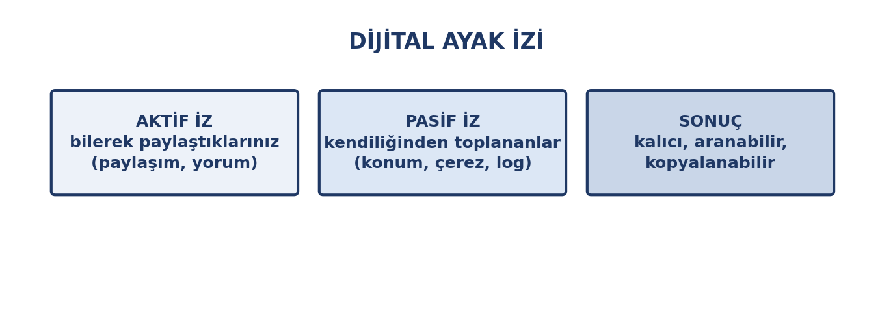
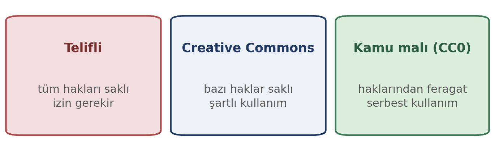

# Bu Haftanın Çerçevesi

## Öğrenme Çıktıları

- Kişisel veri kavramını açıklar.
- KVKK'nın temel ilkelerini ve haklarını bilir.
- Dijital ayak izini açıklar.
- Gizlilik ayarlarını ve izinleri yönetir.
- Telif ve lisans türlerini ayırt eder.
- Dijital ortamda sorumlu davranır.

# Kişisel Veri

## Tanım

Kimliği **belirli veya belirlenebilir** bir kişiye ilişkin her türlü bilgidir.

Önemli olan tek başına tanımlaması değil; **başka bilgilerle birleşince** sizi tanımlayabilmesidir.

## Kişisel Veri Örnekleri

| Veri | Neden |
|:---|:---|
| Ad, soyad, TC kimlik no | Doğrudan kimlik |
| Telefon, e-posta, adres | İletişim |
| Doğum tarihi ve yeri | Kimlikle birleşir |
| Konum, IP adresi | Cihaza/kişiye bağlanır |
| Fotoğraf, ses kaydı | Biyometrik |
| Sağlık, banka bilgisi | **Özel nitelikli** |

## Özel Nitelikli Veri

Sağlık, din, etnik köken, biyometrik veri, ceza mahkûmiyeti…

Daha **sıkı** korunur. Paylaşırken çok daha dikkatli olunmalıdır.

::: {.callout-warning}
**Özel nitelikli veriler daha sıkı korunur.** Sağlık, din, etnik köken ve biyometrik veriler bu kapsamdadır; işlenmeleri özel şartlara bağlıdır.
:::

# KVKK

## Temel Kavramlar

| Kavram | Anlamı |
|:---|:---|
| Veri sorumlusu | Veriyi işleyen kurum |
| İlgili kişi | Verisi işlenen — **siz** |
| Veri işleme | Toplama, saklama, paylaşma |

## İlgili Kişinin Hakları

- İşlenip işlenmediğini **öğrenme**
- Buna ilişkin **bilgi talep etme**
- Amacını **öğrenme**
- Eksik/yanlışsa **düzeltilmesini isteme**
- **Silinmesini isteme**
- Zarara uğradıysanız **tazminat**

## Hakkınızı Nasıl Kullanırsınız?

Veri sorumlusuna **yazılı başvuru** ile.

Yanıt gelmezse **Kişisel Verileri Koruma Kurulu**'na şikâyet edilebilir.

Kurum sitelerinde "Aydınlatma Metni" ve "Başvuru Formu" bulunur.

# Dijital Ayak İzi

## Çevrimiçi Bıraktığınız İzler

{width=76%}

## İki Tür

| Tür | Kapsam |
|:---|:---|
| **Aktif** | Bilerek paylaştıklarınız |
| **Pasif** | Kendiliğinden toplananlar |

## Üç Özellik

- **Kalıcı:** Silinse de kopyalanmış olabilir
- **Aranabilir:** Yıllar sonra çıkabilir
- **Birleştirilebilir:** Farklı kaynaklar birleştirilir

## İş Hayatında

İşverenler ve komiteler aday hakkında **açık kaynak araştırması** yapar.

**Ölçü:** *"Bunu beş yıl sonra işverenim görsün ister miydim?"*

# Gizlilik Ayarları

## Uygulama İzinlerini Sorgulayın

- **Gerekli mi?** İşi için şart mı?
- **Orantılı mı?** Fener uygulaması konumu neden ister?
- **Ne zaman?** "Yalnızca kullanırken" daha güvenli

## Sosyal Medya Ayarları

- **Profil görünürlüğü**
- **Konum paylaşımını kapatın**
- **Etiketleme onayı** isteyin
- **Eski paylaşımları** gözden geçirin
- **Üçüncü taraf erişimleri** kaldırın

# Telif ve Lisans

## Eserle Birlikte Doğar

{width=76%}

| Durum | Ne yapabilirsiniz |
|:---|:---|
| Telifli | İzin gerekir |
| Creative Commons | Şartlara uyarak kullanım |
| Kamu malı / açık | Serbest |

## Sık Yapılan Telif Hataları

- **Görsel:** İnternetten alınan fotoğrafı kullanmak
- **Metin:** Uzun alıntıyı kaynaksız almak
- **Yazılım:** Korsan kullanmak
- **Müzik/video:** Sunumda telifli müzik

## Kritik Ayrım

**Kaynak göstermek, kullanım hakkı vermez.**

Lisans ayrı, atıf ayrı bir konudur. İkisi de gerekir.

# Dijital Etik

## Çevrimiçi Nezaket

- **Göndermeden okuyun** — ton kaybolur
- **Büyük harfle yazmayın** — bağırmak sayılır
- **Kişisel tartışmayı herkese açık yapmayın**
- **İzinsiz fotoğraf paylaşmayın**
- **Yanlış bilgiyi yaymayın**

## Dijital Etiğin İlkeleri

- **Kaynağı belirtin**
- **İzinsiz erişmeyin** — başkasının hesabına girmek suçtur
- **Zarar vermeyin** — hedef gösterme, taciz, iftira
- **Gizliliğe saygı gösterin**
- **Erişilebilirliği düşünün**

# Kapanış

## Uygulama: Dijital Ayak İzinizi İnceleyin

1. **Adınızı arama motorunda aratın** — ne çıkıyor?
2. **Uygulama izinlerini** gözden geçirin, en az iki gereksizi kapatın
3. **Sosyal medya gizliliğini** düzenleyin, en az bir ayarı değiştirin
4. Kullanmayı düşündüğünüz bir görselin **lisansını** kontrol edin

Notla değerlendirilmez.

## Özet

- **Kişisel veri**: kimliği belirli/belirlenebilir kişiye ilişkin bilgi
- **Özel nitelikli veri** daha sıkı korunur
- **KVKK**: öğrenme, düzeltme, silme, tazminat hakları
- **Dijital ayak izi**: kalıcı, aranabilir, birleştirilebilir
- **İzinler ve gizlilik ayarları** düzenli gözden geçirilmeli
- **Kaynak göstermek kullanım hakkı vermez**
- **Dijital etik**: kaynak belirt, izinsiz erişme, zarar verme

## Gelecek Hafta

**Yapay zekâ okuryazarlığı** — yapay zekâ nedir ve ne değildir, günlük kullanım alanları, nasıl öğrenir, büyük veri, sınırlar ve etik sorular.
