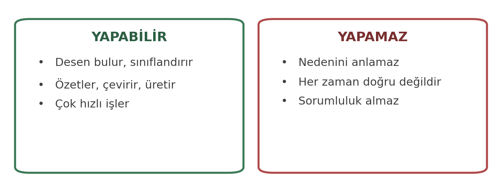
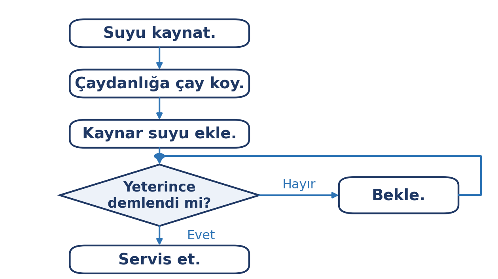
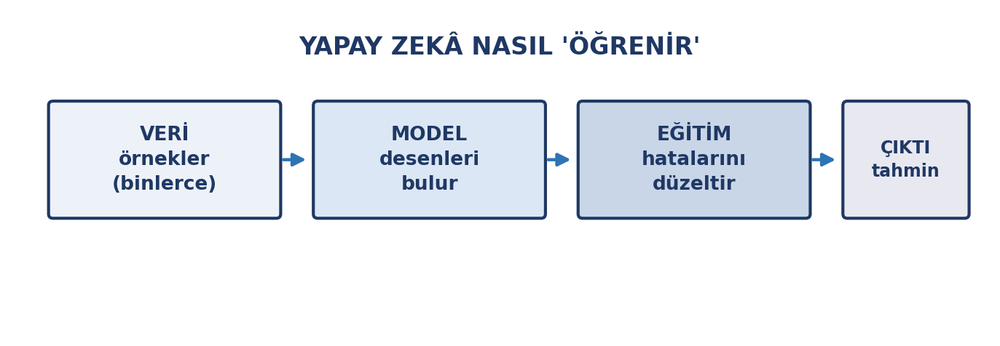

# Giriş

Yapay zekâ, son yıllarda günlük hayatın görünmez bir parçası hâline geldi: telefonunuzdaki öneriler, harita uygulamasının trafik tahmini, e-postanızın spam filtresi, fotoğraf uygulamanızın yüz tanıması… Bunların hepsi yapay zekâ kullanır.

Bu hafta yapay zekâyı **anlamaya** odaklanıyoruz — nasıl çalıştığını, neleri yapabildiğini ve neleri **yapamadığını**. Gelecek hafta ise bu bilgiyi kullanma pratiğine geçeceğiz.

::: {.callout-note}
## Bu haftanın temel fikri

Yapay zekâ, **desen bulan** bir sistemdir. Bu, onu çok güçlü ama aynı zamanda **yanılabilir** kılar. Doğru kullanım, sınırlarını bilmekle başlar.
:::

# Bu Haftanın Öğrenme Çıktıları

- Yapay zekânın ne olduğunu ve ne olmadığını açıklar.
- Günlük hayatta yapay zekânın hangi alanlarda kullanıldığını örneklendirir.
- Algoritma kavramını ve akış diyagramının öğelerini (sıra, karar, tekrar) açıklar.
- Yapay zekânın veriyle nasıl öğrendiğini kavramsal düzeyde açıklar.
- Büyük veri kavramının yapay zekâ ile ilişkisini açıklar.
- Yapay zekânın sınırlarını ve yanılgılarını tanır.
- Yapay zekâ ile ilgili etik soruları tartışır.

# Yapay Zekâ Nedir?

**Yapay zekâ (YZ)**, insanların yaptığı bazı işleri — tanıma, sınıflandırma, tahmin, üretme — bilgisayarların yapabilmesini sağlayan yöntemlerin bütünüdür.

Önemli bir ayrım: yapay zekâ, **yapay olarak bilinçli** değildir. Düşünmez, anlamaz, niyet taşımaz. Yaptığı şey, elindeki **verilerdeki desenleri** bulup bu desenlere göre çıktı üretmektir.

{width=78%}

| Yapabilir | Yapamaz |
|:---|:---|
| Desen bulur, sınıflandırır | Nedenini **anlamaz** |
| Özetler, çevirir, üretir | **Her zaman** doğru değildir |
| Çok hızlı işler | **Sorumluluk** almaz |
| Çok veriyi işler | Bağlamı tam kavramaz |

::: {.callout-tip}
## Doğru zihinsel model

Yapay zekâyı "her şeyi bilen bir uzman" gibi değil, **çok okuyup çok konuşan ama hiçbir şeyi gerçekten anlamayan** bir asistan gibi düşünün.

Bu benzetme, yapay zekâyı ne zaman kullanacağınızı ve ne zaman şüpheleneceğinizi gösterir.
:::

# Günlük Hayatta Yapay Zekâ

Yapay zekâ çoğu zaman adı geçmeden karşımıza çıkar:

| Alan | Örnek | Ne yapıyor |
|:---|:---|:---|
| **Öneri sistemleri** | Video, müzik, alışveriş önerileri | Beğenilerinize göre tahmin |
| **Sesli asistanlar** | Sesli komut, konuşmayı yazıya çevirme | Ses tanıma ve dil işleme |
| **Çeviri** | Otomatik çeviri araçları | Dil modelleri |
| **Görüntü işleme** | Yüz tanıma, fotoğraf düzenleme | Görsel desen tanıma |
| **Navigasyon** | Trafik tahmini, rota önerisi | Geçmiş veri analizi |
| **Güvenlik** | Spam filtresi, dolandırıcılık tespiti | Anormallik bulma |
| **Sağlık** | Görüntüden tarama desteği | Görsel sınıflandırma |
| **Metin üretimi** | Sohbet asistanları, özetleme | Dil modelleri |

::: {.callout-note}
## Görünmez ama her yerde

Bu ders boyunca kullandığınız pek çok araç — arama motorunuz, e-posta hesabınız, klavye önerileriniz — yapay zekâ içerir. Bunu fark etmek, teknolojiyle ilişkinizi değiştirir.
:::

# Yapay Zekâ Nasıl Öğrenir?

Yapay zekânın çoğu bugünkü biçimi **makine öğrenmesi**ne dayanır: programa kural yazmak yerine, **örneklerden öğrenmesi** sağlanır.

## Algoritma: adım adım tanımlamak

Bir işi bilgisayara yaptırmanın yolu, o işi **adım adım** tanımlamaktan geçer. Bu adım dizisine **algoritma** denir. Algoritmayı insan yazar; bilgisayar yalnızca yazılanı uygular.

Gündelik hayattan bir örnek — çay demlemek:

1. Suyu kaynat.
2. Çaydanlığa çay koy.
3. Kaynar suyu ekle.
4. Yeterince demlendi mi? Demlenmediyse bekle ve yeniden sor.
5. Servis et.

Bu adımlar bir **akış diyagramı** ile görselleştirilebilir. Şemada kutular işleri, baklava dilimi kararı, oklar ise izlenecek sırayı gösterir:

{width=72%}

Şemadaki "yeterince demlendi mi?" adımı bir **karardır** ve akışı ikiye böler; "bekle" adımı ise aynı karara geri döner. Böylece bir algoritmanın üç temel öğesi görünür olur: **sıra**, **karar** ve **tekrar**.

Bu kurallar **programlama dilleri** denen özel dillerle yazılır; yapay zekâ alanında en yaygın kullanılanı **Python**'dur.

::: {.callout-note}
## Bu ders programlama öğretmez

Algoritmayı burada, yapay zekânın neyi **farklı** yaptığını görebilmek için tanıdık. Geleneksel programlamada kuralları insan yazar; makine öğrenmesinde ise kurallar örneklerden çıkarılır. Bu ders boyunca kod yazmayacaksınız.
:::

{width=80%}

Süreç üç adımda özetlenebilir:

1. **Veri:** Sisteme çok sayıda örnek verilir. Örneğin milyonlarca etiketlenmiş fotoğraf ("bu kedi", "bu köpek").
2. **Model:** Sistem bu örneklerdeki ortak desenleri bulur.
3. **Eğitim:** Model, yanlış yaptığında düzeltilir; bu süreç milyonlarca kez tekrarlanır.

Sonuçta ortaya çıkan model, **yeni** bir örnek gördüğünde tahmin yapabilir.

## Derin öğrenme ve GPU bağlantısı

Bu eğitim süreci çok büyük hesaplama gücü gerektirir. 2. haftada gördüğümüz **grafik işlemci (GPU)**, "binlerce basit işi aynı anda yapar" özelliği sayesinde tam bu iş için uygundur. Bugün yapay zekâ modellerinin eğitiminde kullanılan donanımın temelini GPU'lar oluşturur. Büyük modellerin eğitimi tek bir bilgisayarda yapılmaz: binlerce GPU'nun bir arada çalıştığı **veri merkezlerinde**, haftalarca bazen aylarca süren bir işlemle gerçekleştirilir. 2. haftada gördüğümüz **süper bilgisayarların** çoğu da tam bu iş için kurulmuştur.

## Büyük veri

**Büyük veri**, geleneksel yöntemlerle işlenemeyecek kadar çok, hızlı ve çeşitli veri kütlesidir. Yapay zekâ ile ilişkisi döngüseldir:

- **Büyük veri → Yapay zekâ:** Modeller, eğitilmek için büyük veriye ihtiyaç duyar.
- **Yapay zekâ → Büyük veri:** Sistemler, kullanıldıkça yeni veri üretir; bu da modelleri besler.

Bu döngü, yapay zekânın neden hızla geliştiğini açıklar — ama aynı zamanda **veri gizliliği** sorununu da büyütür.

::: {.callout-warning}
## Veriniz modelin parçası olabilir

Bir yapay zekâ aracına yazdığınız metin, yüklediğiniz belge veya fotoğraf; hizmetin koşullarına bağlı olarak **modelin geliştirilmesinde kullanılabilir**.

Bu yüzden kişisel veri, özel belge veya başkasına ait bilgi içeren içerikleri yapay zekâ araçlarına yüklememek gerekir. Gelecek hafta bu konuyu ayrıntılı ele alacağız.
:::

# Yapay Zekânın Sınırları

## Yanılgı (halüsinasyon)

Dil modelleri, **kendinden emin bir tonda yanlış bilgi** üretebilir. Buna "yanılgı" (halüsinasyon) denir. Model, uydurduğu bir kaynağı gerçekmiş gibi sunabilir; olmayan bir kitap, makale veya olaydan söz edebilir.

::: {.callout-warning}
## Neden olur?

Model, **doğruyu aramaz**; bir sonraki kelimeyi tahmin eder. Bu tahmin çoğu zaman doğru sonuç verir ama bazen akla yatkın ama yanlış bir cevap üretir.

**Sonuç:** Yapay zekâdan aldığınız her olgusal bilgi — sayı, tarih, isim, kaynak — mutlaka bağımsız olarak doğrulanmalıdır.
:::

## Diğer sınırlar

| Sınır | Ne demek |
|:---|:---|
| **Önyargı** | Eğitildiği verideki önyargıları yansıtır |
| **Güncellik** | Eğitim tarihinden sonrasını bilemez (ya da yanlış bilir) |
| **Bağlam** | Sizin durumunuzu, amacınızı bilmez |
| **Kaynak gösterme** | Verdiği kaynaklar uydurma olabilir |
| **Matematik ve mantık** | Uzun işlemlerde hata yapabilir |

## Etik sorular

Yapay zekâ kullanımı bazı soruları gündeme getirir:

- **Önyargı:** Model, eğitildiği verideki ayrımcılığı öğrenip yansıtır mı?
- **Gizlilik:** Eğitim verisinde kişisel bilgiler var mı? Kullanıcı verisi nasıl kullanılıyor?
- **Sorumluluk:** Yapay zekâ bir hata yaptığında sorumlu kim — kullanıcı mı, geliştirici mi?
- **Şeffaflık:** Kararın nasıl alındığı açıklanabiliyor mu?
- **Emek ve telif:** Modeller, telifli eserlerle eğitildiyse üretilen içerik kimin?
- **İş hayatı:** Hangi işler dönüşecek, hangi beceriler değer kazanacak?

Bu soruların kesin cevapları yok; toplum olarak tartışılıyor. Sizin için önemli olan, **bu soruların farkında olmak**.

# Uygulama: Yapay Zekâyı Sorgulayın

## Adım 1 — Günlük kullanımınızı listeleyin

Son bir gün içinde kullandığınız uygulamaları düşünün. Hangilerinde yapay zekâ olduğunu tahmin ediyorsunuz? En az beş örnek yazın.

## Adım 2 — Bir yanılgı örneği bulun

Bir yapay zekâ aracına, doğrulayabileceğiniz olgusal bir soru sorun (örneğin bir tarih veya sayı). Sonra cevabı güvenilir bir kaynaktan kontrol edin. Doğru muydu?

## Adım 3 — Bir etik soru üzerine düşünün

Şu sorulardan birini seçip bir paragraf yazın: *Yapay zekâ bir tıbbi teşhis önerdiğinde sorumluluk kimde olmalı? Neden?*

## Adım 4 — Veri ilişkisini değerlendirin

Kullandığınız bir yapay zekâ aracının gizlilik koşullarını okuyun: verileriniz nasıl kullanılıyor, model eğitiminde kullanılıyor mu?

::: {.callout-tip}
## Teslim ve değerlendirme

Bu uygulama notla değerlendirilmez. Amacı, yapay zekâyı günlük hayatınızda fark etmeniz ve sınırlarını deneyimlemenizdir.
:::

# Özet

- **Yapay zekâ**, tanıma, sınıflandırma, tahmin ve üretme işlerini yapan yöntemler bütünüdür; **bilinçli değildir**.
- Günlük hayatta öneri sistemleri, sesli asistanlar, çeviri, navigasyon ve güvenlik gibi alanlarda görünmez biçimde kullanılır.
- **Makine öğrenmesi**, kuralları yazmak yerine **örneklerden öğrenmek** demektir: veri → model → eğitim.
- **GPU** ve **büyük veri**, yapay zekânın bugünkü gelişimini mümkün kılan iki temeldir.
- **Yanılgı (halüsinasyon)**, modelin kendinden emin biçimde yanlış bilgi üretmesidir; bu yüzden her olgusal bilgi doğrulanmalıdır.
- **Önyargı, gizlilik, sorumluluk, şeffaflık ve telif** yapay zekânın başlıca etik sorularıdır.
- Araca yüklediğiniz içerik, hizmetin koşullarına bağlı olarak **model eğitiminde kullanılabilir**.

# Kendini Sınama Soruları

1. Yapay zekânın "bilinçli olmadığı" ne demektir?
2. Günlük hayattan üç yapay zekâ örneği verin.
3. Makine öğrenmesini "kural yazmak"tan ayıran nedir?
4. GPU ile yapay zekâ arasındaki ilişkiyi açıklayın.
5. Büyük veri ile yapay zekâ arasındaki döngüyü açıklayın.
6. Yanılgı (halüsinasyon) nedir ve neden olur?
7. Yapay zekânın üç sınırını yazın.
8. Yapay zekâ ile ilgili üç etik soruyu yazın.

# Kaynaklar

- **UNESCO Yapay Zekâ Yeterlilik Çerçevesi (öğrenciler için)** — insan merkezli yaklaşım, etik, teknikler ve sistem tasarımı boyutları. (unesco.org)
- **Avrupa Birliği DigComp çerçevesi** — dijital yeterlilikler içinde yapay zekâ. (joint-research-centre.ec.europa.eu)
- **Kişisel Verileri Koruma Kurumu (KVKK)** — yapay zekâ ve kişisel veriler. (kvkk.gov.tr)
- **TÜBİTAK BİLGEM** — yapay zekâ ve bilişim güvenliği yayınları. (tubitak.gov.tr)

Haftaya özel ek okuma önerileri ve güncel bağlantılar, dersin çevrimiçi ortamında ayrıca paylaşılır.
