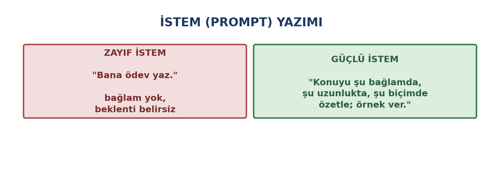
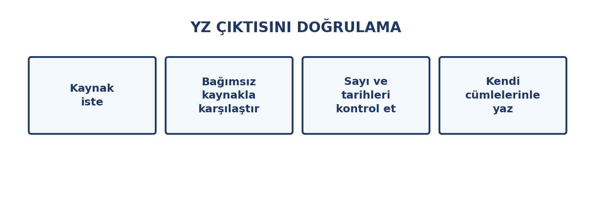

# Giriş

Geçen hafta yapay zekânın ne olduğunu ve sınırlarını öğrendik. Bu hafta **kullanma** pratiğine geçiyoruz: bu araçlardan nasıl verim alınır, çıktıları nasıl doğrulanır ve akademik hayatta nasıl **dürüstçe** kullanılır.

Temel yaklaşım şu: yapay zekâ, sizin yerinize düşünen bir varlık değil, **yanınızda çalışan bir araçtır**. Onu nasıl kullandığınız, sonucun kalitesini belirler.

::: {.callout-note}
## Bu haftanın temel fikri

Yapay zekâyı iyi kullanmak, **iyi soru sormak** ve **çıktıyı doğrulamak** demektir. İkisi birlikte yapılmadığında araç zarar verir.
:::

# Bu Haftanın Öğrenme Çıktıları

- Üretken yapay zekâ araçlarının türlerini ayırt eder.
- Etkili istem (prompt) yazar.
- Yapay zekâ çıktısını doğrulama adımlarını uygular.
- Akademik dürüstlük sınırları içinde yapay zekâdan yararlanır.
- Yapay zekâ araçlarına verilmemesi gereken bilgileri ayırt eder.
- Yapay zekâyı öğrenme sürecini destekleyecek biçimde kullanır.

# Üretken Yapay Zekâ Nedir?

**Üretken yapay zekâ**, yeni içerik üreten modellerdir: metin, görsel, ses, video, kod. Diğer yapay zekâ uygulamalarından farkı, **sınıflandırmak veya tahmin etmek yerine üretmesidir**.

| Tür | Ne üretir | Kullanım örneği |
|:---|:---|:---|
| **Metin** | Yazı, özet, liste | Taslak yazma, özetleme |
| **Görsel** | Fotoğraf, çizim | Sunum görseli, tasarım fikri |
| **Ses** | Konuşma, müzik | Seslendirme |
| **Video** | Kısa video, animasyon | Tanıtım materyali |
| **Kod** | Program kodu | Öğrenme, hata ayıklama |

::: {.callout-warning}
## "Üretir" ≠ "Doğrudur"

Bir metnin akıcı ve düzgün olması, doğru olduğu anlamına gelmez. Üretken modeller **inandırıcı görünen** çıktı üretmek üzere eğitilmiştir; doğruluk ikinci plandadır.

Geçen hafta gördüğümüz **yanılgı** sorunu burada en kritik hâline gelir.
:::

# İstem (Prompt) Yazımı

**İstem**, yapay zekâya verdiğiniz talimattır. Kalitesi, sonucun kalitesini belirler.

{width=80%}

## İyi bir istemin bileşenleri

| Bileşen | Ne yapar | Örnek |
|:---|:---|:---|
| **Görev** | Ne istediğinizi söyler | "Özetle", "Açıkla", "Karşılaştır" |
| **Bağlam** | Kim için, hangi amaçla | "Birinci sınıf öğrencisi için" |
| **Biçim** | Çıktının şekli | "Madde madde", "tablo hâlinde" |
| **Uzunluk** | Ne kadar ayrıntı | "En fazla 200 kelime" |
| **Örnek** | Beklentiyi gösterir | "Şu tonda yaz: …" |

## Zayıf ve güçlü istem

**Zayıf:** *"Bana ödev yaz."* — Görev belirsiz, bağlam yok, biçim yok.

**Güçlü:** *"Lise son sınıf öğrencisine bilgi güvenliğini anlatan bir metin için üç ana başlık öner. Her başlık tek cümle olsun, madde madde yaz."*

::: {.callout-tip}
## İstem yazımının altı kuralı

1. **Net olun.** Belirsiz talimat, belirsiz sonuç verir.
2. **Bağlam verin.** Kim için, hangi amaçla, hangi düzeyde.
3. **Biçimi belirtin.** Liste mi, tablo mu, paragraf mı?
4. **Tek adımda tek iş.** Karmaşık istekleri parçalara bölün.
5. **Örnek verin.** İstediğiniz üslubu bir cümleyle gösterin.
6. **Yineleyin.** İlk cevap iyi değilse düzeltme isteyin: "daha kısa", "daha resmî" gibi.
:::

# Çıktıyı Doğrulama

Yapay zekâ çıktısını kullanmadan önce doğrulamak **zorunludur**. Bu, güvensizlik değil, doğru kullanımdır.

{width=80%}

## Dört adım

1. **Kaynak isteyin.** "Bu bilgiyi hangi kaynaktan aldın?" diye sorun. Ama uyarı: **verdiği kaynak da uydurma olabilir.**
2. **Bağımsız kaynakla karşılaştırın.** Aynı bilgiyi güvenilir bir kaynaktan (kitap, kurumsal site, veri tabanı) kontrol edin.
3. **Sayı ve tarihleri kontrol edin.** Rakamlar, tarihler, isimler en çok hata yapılan alanlardır.
4. **Kendi cümlelerinizle yeniden yazın.** Hem öğrenirsiniz hem de metni sahiplenirsiniz.

::: {.callout-warning}
## Özellikle doğrulanması gerekenler

Şu tür bilgiler yapay zekâda en sık yanlış çıkar:

- **Kaynak künyeleri:** Yazar adı, kitap/makale adı, yayın yılı, sayfa numarası
- **Sayısal veriler:** İstatistikler, tarihler, oranlar
- **Atıflar:** "X şöyle demiştir" biçimindeki ifadeler
- **Hukuki ve tıbbi bilgiler**

Bu bilgileri **hiçbir zaman** doğrulamadan kullanmayın.
:::

# Akademik Dürüstlük

Bu bölüm, bu haftanın en önemli kısmıdır.

## Sınır nerede?

| Kullanım | Değerlendirme |
|:---|:---|
| Konuyu anlamak için soru sormak | ✔ Uygun |
| Kavramı farklı biçimde açıklamasını istemek | ✔ Uygun |
| Yazdığınız metni dil bilgisi açısından düzeltmek | ✔ Uygun (kurum politikasına bağlı) |
| Fikir üretmek için beyin fırtınası yapmak | ✔ Uygun |
| Ödevi baştan sona yazdırmak | ✘ Uygun değil |
| Üretilen metni kendi çalışmanız gibi teslim etmek | ✘ **İntihal** |
| Kaynak göstermeden çeviri yaptırmak | ✘ Uygun değil |

::: {.callout-warning}
## Yapay zekâ metnini kendi çalışmanız gibi sunmak intihaldir

Bir metni yapay zekâya yazdırıp kendi adınıza teslim etmek, 7. haftada gördüğümüz **intihal** tanımına girer — üstelik kaynak da gösterilemez.

**Kurallarınızı bilin.** Bölümünüzün veya dersinizin yapay zekâ kullanımına ilişkin politikası olabilir. Kullanım izinliyse bile **nasıl kullandığınızı belirtmeniz** gerekebilir.
:::

## Dürüst kullanım

- **Aracı öğrenme için kullanın:** anlamadığınız konuyu sormak, farklı açıklama istemek.
- **Metni kendiniz yazın.** Yapay zekâdan taslak, başlık önerisi veya dil düzeltmesi alabilirsiniz; son sözü siz yazın.
- **Kullandıysanız belirtin.** Öğretim elemanınızın istediği biçimde.
- **Yapay zekâ çıktısını kaynak olarak göstermeyin.** O bir kaynak değil, bir araçtır.

# Gizlilik: Araca Ne Verilmez

Yapay zekâ araçlarına yazdığınız her şey, hizmetin koşullarına bağlı olarak **kaydedilebilir ve model geliştirmede kullanılabilir**.

::: {.callout-warning}
## Bu bilgileri yapay zekâ araçlarına yazmayın

- **Kişisel veriler:** TC kimlik numarası, adres, telefon, sağlık bilgisi
- **Başkasına ait bilgiler:** Sizin olmayan kişisel veriler
- **Kurumsal gizli belgeler:** Sınav soruları, iç yazışmalar, sözleşmeler
- **Parola ve erişim bilgileri:** Hiçbir koşulda
- **Ödev/tez metninizin tamamı:** Başkasının erişimine açık hâle gelir

**Kural:** Bir belgeyi ya da bilgiyi yapay zekâ aracına yazmadan önce şu soruyu sorun — *"Bunun internete açık olması sorun yaratır mı?"*
:::

# Yapay Zekâyı Araç Olarak Kullanmak

Doğru kullanıldığında yapay zekâ, öğrenmeyi hızlandıran bir araçtır:

| İş | Nasıl yardımcı olur |
|:---|:---|
| **Anlamadığınız konu** | Farklı biçimde açıklamasını istemek |
| **Özetleme** | Uzun metni kısaltmak (ardından aslını kontrol ederek) |
| **Beyin fırtınası** | Başlık, örnek, karşı argüman önerisi |
| **Dil düzeltme** | Kendi yazdığınız metni düzeltmek |
| **Alıştırma** | Soru üretmesini isteyip kendinizi sınamak |
| **Yabancı dil** | Metni okuma düzeyinize göre basitleştirmek |
| **Dağınık veriyi düzenleme** | CSV gibi metin tabanlı veriyi sütunlara ayırmak, tutarsızlıkları bulmak |

::: {.callout-warning}
## Yapay zekâya veri verirken iki kural

**1. Kişisel ve gizli veriyi yüklemeyin.** Tabloda isim, kimlik numarası, sağlık bilgisi veya müşteri verisi varsa o dosyayı araca yüklemeyin.

**2. Çıktıyı doğrulayın.** Yapay zekâ düzenleme sırasında bir değeri sessizce değiştirebilir, satır atlayabilir veya uydurabilir. Kaydetmeden önce satır sayısını ve toplamları özgün dosyayla karşılaştırın.
:::

::: {.callout-tip}
## Öğrenmeyi kolaylaştırır mı, zorlaştırır mı?

**Kolaylaştırır:** Anlamadığınız yeri hemen sorabilir, örnek isteyebilirsiniz.

**Zorlaştırır:** Cevabı düşünmeden alırsanız öğrenmezsiniz. Sınavda yalnız olacaksınız.

**Pratik kural:** Yapay zekâyı **cevap makinesi** gibi değil, **çalışma arkadaşı** gibi kullanın. Önce kendiniz düşünün, sonra sorun.
:::

# Uygulama: Bir İstemi İyileştirin

## Adım 1 — Zayıf bir istem yazın

Bir konuda çok kısa ve belirsiz bir istem yazın (örneğin "bana X konusunu anlat").

## Adım 2 — İstemi güçlendirin

Aynı isteği; görev, bağlam, biçim, uzunluk ve örnek bileşenlerini ekleyerek yeniden yazın.

## Adım 3 — İki cevabı karşılaştırın

İki isteme alınan cevapları karşılaştırın. Güçlü istemin sonucu ne bakımdan daha iyi?

## Adım 4 — Bir çıktıyı doğrulayın

Güçlü istemden aldığınız cevaptaki bir olgusal bilgiyi (sayı, tarih, kaynak) bağımsız bir kaynaktan doğrulayın. Doğru muydu?

## Adım 5 — Dürüstlük sınırını yazın

Bir paragraf yazın: *Bu araçları ödevlerimde hangi sınırlar içinde kullanacağım? Nerede duracağım?*

::: {.callout-tip}
## Teslim ve değerlendirme

Bu uygulama notla değerlendirilmez. Amacı, yapay zekâ araçlarını bilinçli ve dürüst biçimde kullanma alışkanlığı kazandırmaktır.
:::

# Özet

- **Üretken yapay zekâ** yeni içerik üretir: metin, görsel, ses, video, kod.
- **İstem** kalitesi sonucu belirler: görev, bağlam, biçim, uzunluk ve örnek bileşenleri.
- **Doğrulama zorunludur:** kaynak isteyin, bağımsız kaynakla karşılaştırın, sayı ve tarihleri kontrol edin, kendi cümlelerinizle yazın.
- **Akademik dürüstlük:** öğrenmek için kullanmak uygundur; ödevi yazdırıp kendi çalışmanız gibi sunmak **intihaldir**.
- **Gizlilik:** kişisel veri, başkasının bilgisi, kurumsal belge ve parola yapay zekâ araçlarına verilmemelidir.
- Yapay zekâyı **cevap makinesi** değil, **çalışma arkadaşı** olarak kullanın: önce kendiniz düşünün.

# Kendini Sınama Soruları

1. Üretken yapay zekâyı diğer yapay zekâ uygulamalarından ayıran nedir?
2. İyi bir istemin beş bileşenini yazın.
3. "Bana ödev yaz" istemi neden zayıftır?
4. Yapay zekâ çıktısını doğrulamanın dört adımı nedir?
5. Yapay zekânın verdiği kaynak künyesi neden güvenilir sayılmaz?
6. Yapay zekâyı kullanmanın hangi biçimi intihal sayılır?
7. Yapay zekâ araçlarına yazılmaması gereken dört bilgi türünü sıralayın.
8. Yapay zekâ öğrenmeyi nasıl zorlaştırabilir?

# Kaynaklar

- **UNESCO Yapay Zekâ Yeterlilik Çerçevesi (öğrenciler için)** — etik kullanım ve sorumluluk. (unesco.org)
- **Üniversitenizin akademik dürüstlük ve intihal politikası** — yapay zekâ kullanımına ilişkin kurallar.
- **Kişisel Verileri Koruma Kurumu (KVKK)** — kişisel verilerin korunması. (kvkk.gov.tr)
- **Kullandığınız yapay zekâ aracının gizlilik koşulları** — verilerinizin nasıl kullanıldığı.

Haftaya özel ek okuma önerileri ve güncel bağlantılar, dersin çevrimiçi ortamında ayrıca paylaşılır.
