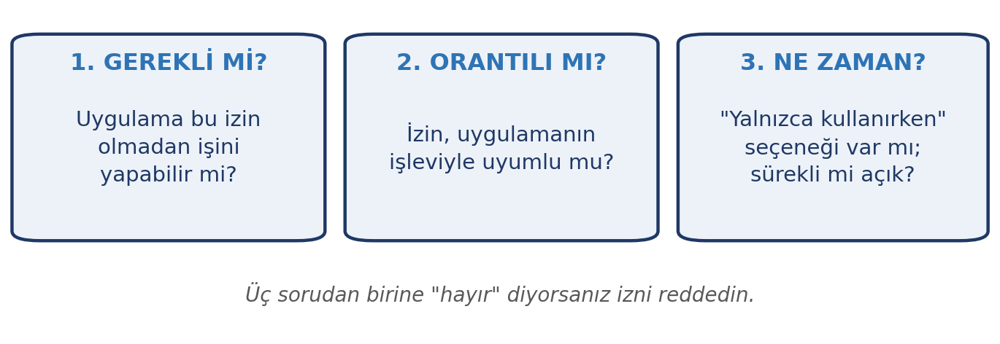
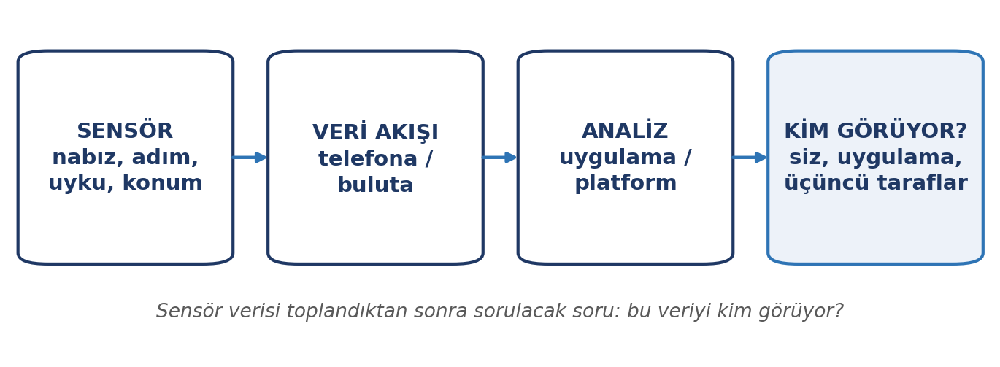
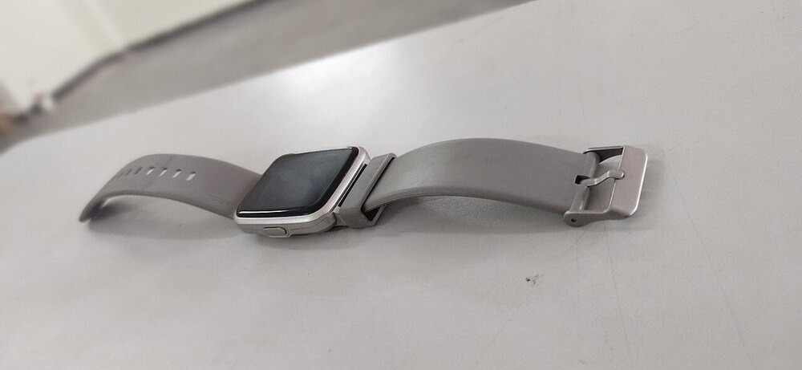
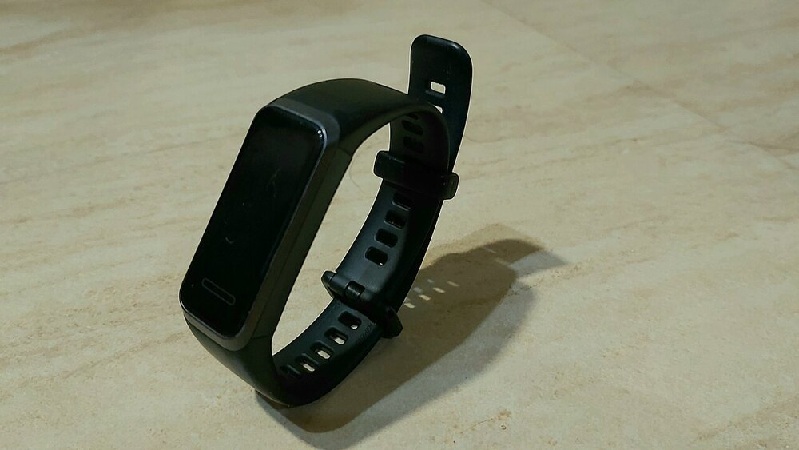
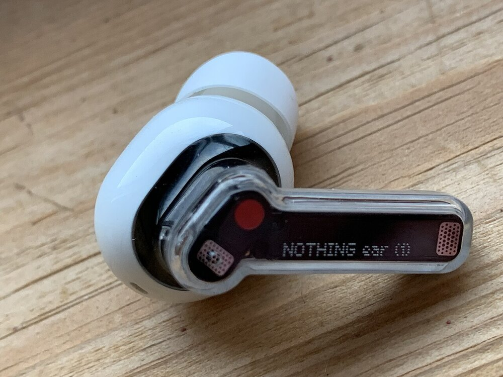
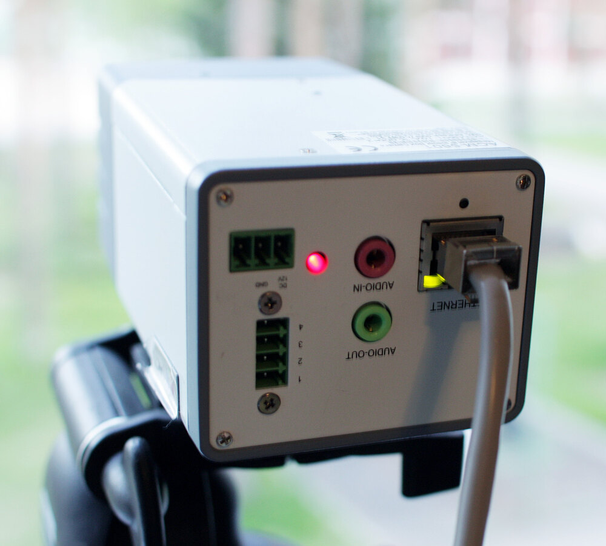
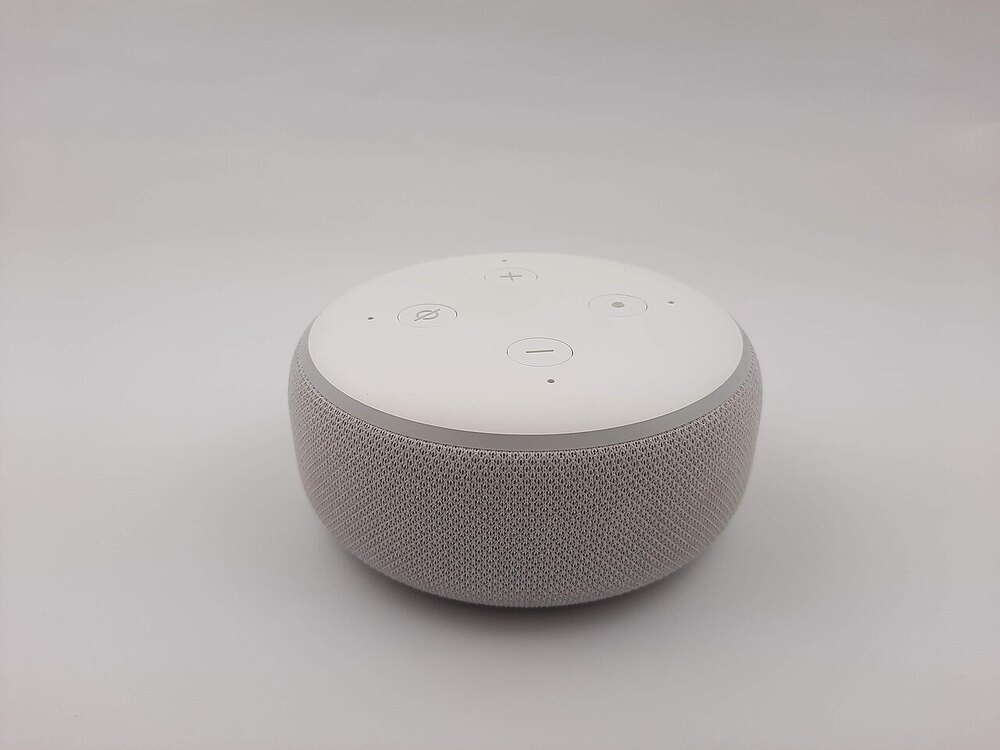

# Giriş

Bu, dönemin son haftası. Başladığımız yere dönüp bakalım: 1. haftada bilgi toplumundan ve dijital okuryazarlıktan söz ettik; 3. haftada mobil işletim sistemlerini **işletim sistemi olarak** tanıdık. Şimdi mobil cihazları **cihaz ve veri olarak** ele alacağız — ve dönemi, teknolojinin toplum üzerindeki etkilerine bakarak kapatacağız.

Cebimizdeki telefon, saatimizdeki sensör, evimizdeki akıllı cihaz… Hepsi veri topluyor. Bu haftanın sorusu şu: **Bu veriler nereye gidiyor ve bu bizim için ne anlama geliyor?**

::: {.callout-note}
## Bu haftanın temel fikri

Mobil cihazlar hayatımızı kolaylaştırır ama sürekli **veri toplar**. Bilinçli kullanıcı olmak, hangi verinin toplandığını ve kimin eriştiğini bilmekle başlar.
:::

# Bu Haftanın Öğrenme Çıktıları

- Mobil işletim sistemlerini ve uygulama ekosistemini açıklar.
- Uygulama izinlerini değerlendirir ve yönetir.
- Cihazlar arası senkronizasyonun fayda ve risklerini açıklar.
- Mobil cihaz güvenliği için gerekli önlemleri uygular.
- Giyilebilir teknolojilerin topladığı verileri tanır.
- Sağlık verisinin gizlilik boyutunu değerlendirir.
- Nesnelerin interneti kavramını ve risklerini açıklar.
- Teknolojinin toplumsal etkilerini tartışır.

# Mobil Cihazlar ve Ekosistem

**Mobil cihaz**, taşınabilir ve genellikle dokunmatik arayüzlü bilgisayardır: telefon, tablet, akıllı saat.

3. haftada mobil **işletim sistemlerini** tanımıştık: Android ve iOS. Burada ise **ekosisteme** bakıyoruz.

**Uygulama ekosistemi**, bir mobil işletim sistemi etrafında oluşan uygulama mağazası, geliştirici topluluğu ve hizmetler bütünüdür.

| Kavram | Anlamı |
|:---|:---|
| Uygulama mağazası | Uygulamaların indirildiği resmî kanal |
| Mağaza dışı kurulum | Güvenlik riski taşır; önerilmez |
| Ekosistem | Aynı sistemdeki cihazların birlikte çalışması |
| Senkronizasyon | Cihazlar arasında verinin eşitlenmesi |

::: {.callout-warning}
## Uygulamaları resmî mağazadan yükleyin

Mağaza dışından indirilen uygulamalar (kırılmış, "ücretsiz premium" gibi) en yaygın zararlı yazılım kaynaklarındandır.

Resmî mağazalar da kusursuz değildir; ama en azından bir denetimden geçer ve kaldırılabilir.
:::

# Uygulama İzinleri

Her uygulama kurulurken izin ister: konum, kamera, mikrofon, kişiler, dosyalar, bildirimler.

{width=78%}

Her izin için 11. haftada gördüğümüz üç soruyu sorun: **gerekli mi, orantılı mı, ne zaman** erişecek?

::: {.callout-tip}
## Tipik orantısız izinler

| Uygulama | İstediği izin | Değerlendirme |
|:---|:---|:---|
| Fener | Konum | **Orantısız** — reddedin |
| Not alma | Kişiler | **Orantısız** |
| Fotoğraf düzenleme | Kamera | Gerekli |
| Harita | Konum | Gerekli ("kullanırken") |
| Oyun | Mikrofon | Genellikle gereksiz |

**Kural:** İzin istendiğinde "neden?" diye sorun; gereksizse reddedin.
:::

# Senkronizasyon

**Senkronizasyon**, aynı hesaba bağlı cihazlar arasında verinin eşitlenmesidir: telefonunuzda çektiğiniz fotoğraf bilgisayarınızda görünür.

Bulut depolamanın ne olduğunu ve temel olanaklarını 4. haftada gördük; burada aynı verinin **cihazlar arası eşitlenmesine** odaklanıyoruz.

**Faydaları:** Cihaz değiştirince veri taşınır, kayıp riski azalır, her cihazdan erişim.

**Riskleri:**

- **Hesap ele geçirilirse** bütün cihazlardaki veriye erişilir.
- **Yanlışlıkla silinen** bir dosya bütün cihazlardan silinir.
- **Yedek yanlış hesapla eşitlenirse** veri karışır.
- **Bulut sağlayıcısı** verinin bir kopyasını tutar.

::: {.callout-warning}
## Senkronizasyon yedek değildir

Senkronizasyon "aynı veriyi her yerde gösterme", yedekleme ise "verinin ayrı bir kopyasını saklama"dır.

Bir dosyayı yanlışlıkla silip senkronizasyonun onu bütün cihazlardan silmesi, yedeğin neden ayrı bir şey olduğunu gösterir. **4. haftanın 3-2-1 kuralını hatırlayın.**
:::

# Mobil Cihaz Güvenliği

10. haftadaki güvenlik ilkeleri mobil cihazlar için de geçerlidir; birkaç ek nokta var:

- **Ekran kilidi kullanın:** parola, desen veya biyometrik. Basit desenler kolayca tahmin edilir.
- **Otomatik güncellemeyi açın:** mobil işletim sistemleri düzenli güvenlik yaması yayınlar.
- **Kayıp cihaz önlemini alın:** uzaktan bulma, kilitleme ve silme özelliklerini açın.
- **Genel şarj noktalarına dikkat:** tanımadığınız USB bağlantılarından şarj etmeyin; kendi adaptörünüzü kullanın.
- **Genel WiFi'da hassas işlem yapmayın** (5. hafta).
- **Bluetooth'u kullanmadığınızda kapatın** (5. hafta).
- **Kayıtlı kablosuz ağları temizleyin:** tanımadığınız ağları silin.

::: {.callout-tip}
## Telefonunuzda da iki adımlı doğrulama

Telefon numaranız, çoğu hesabınızın **kurtarma yolu**dur. Telefonunuz ele geçirilirse birçok hesabınıza erişilebilir.

Bu yüzden telefonunuzda **ekran kilidi** ve **SIM kart PIN'i** açık olmalıdır.
:::

# Giyilebilir Teknolojiler

**Giyilebilir teknoloji**, vücutta taşınan ve genellikle sensörlerle veri toplayan cihazlardır: akıllı saat, bileklik, akıllı kulaklık, akıllı gözlük.

{width=80%}

::: {#fig-giyilebilir layout-ncol=3}
{width=90%}

{width=90%}

{width=90%}

Giyilebilir cihazlar: akıllı saat, bileklik ve akıllı kulaklık.
:::

## Hangi veriler toplanır?

| Sensör | Topladığı veri |
|:---|:---|
| Hareket (ivmeölçer) | Adım sayısı, aktivite, uyku |
| Kalp atışı | Nabız, dinlenme nabzı, stres göstergesi |
| Oksijen (SpO₂) | Kan oksijen düzeyi |
| Konum (GPS) | Rota, hız, gidilen yerler |
| Mikrofon | Ses, ortam bilgisi |
| Cilt sıcaklığı | Sıcaklık değişimleri |

Bu veriler, tek başına önemsiz görünse de bir araya geldiklerinde **çok ayrıntılı bir sağlık ve davranış profili** oluşturur.

## Sağlık verisi ve gizlilik

Sağlık verisi, 11. haftada gördüğümüz **özel nitelikli kişisel veri** kapsamındadır ve daha sıkı korunur.

Sorulacak sorular:

- **Bu veriyi kim görecek?** Yalnızca siz mi, uygulama geliştiricisi mi, üçüncü taraflar mı?
- **Nereye gidiyor?** Veri cihazda mı kalıyor, buluta mı aktarılıyor?
- **Kimlerle paylaşılıyor?** Sağlık uygulamaları veriyi sigorta şirketleri, işverenler veya reklam verenlerle paylaşıyor mu?
- **Ne kadar süre saklanıyor?**
- **Silmek isterseniz silinebiliyor mu?**

::: {.callout-warning}
## Gizlilik politikasını okuyun

Bir sağlık uygulaması kurarken, verilerinizin nasıl kullanılacağını belirten gizlilik politikasını okuyun. Okumadan kabul etmek, verinizin nereye gittiğini bilmemek demektir.

**Özellikle dikkat:** ücretsiz sağlık uygulamalarında ödenen bedel genellikle **veridir**.
:::

# Nesnelerin İnterneti (IoT)

**Nesnelerin İnterneti**, günlük cihazların internete bağlanıp veri alışverişi yapmasıdır: akıllı televizyon, akıllı priz, güvenlik kamerası, sesli asistan, akıllı termostat.

::: {#fig-iot-cihazlar layout-ncol=2}
{width=90%}

{width=90%}

IoT cihazları internete bağlanır ve sürekli veri toplar.
:::

## Faydaları

- Uzaktan kontrol ve otomasyon
- Enerji tasarrufu
- Konfor ve kolaylık
- Sağlık takibi

## Riskleri

| Risk | Ne demek |
|:---|:---|
| **Zayıf güvenlik** | Bu cihazlar genellikle varsayılan parolayla gelir ve güncellenmez |
| **Sürekli veri** | Kullandığınız her cihaz veri toplar |
| **Ses kaydı** | Sesli asistanlar sürekli dinleme modundadır |
| **Kamera riski** | Güvenlik kameraları yanlış yapılandırılırsa dışarıdan izlenebilir |
| **Ağa giriş kapısı** | Güvensiz bir cihaz, ev ağınıza giriş kapısı olabilir |

::: {.callout-tip}
## Akıllı cihazlar için üç kural

1. **Varsayılan parolayı değiştirin.** Fabrika parolaları internette listelenmiştir.
2. **Yazılımını güncelleyin.** Üretici desteği biten cihazlar risklidir.
3. **Gereksiz kalmadıysa kapatın ya da kaldırın.** Kullanmadığınız akıllı cihaz, kullanmadığınız bir veri toplayıcıdır.
:::

# Dijital İyi Olma Hali

Bu dönem boyunca teknolojiyi **kullanmayı** öğrendik. Son olarak **onunla nasıl yaşanacağına** bakalım.

- **Ekran süresi:** Ne kadar zaman geçirdiğinizi bilin. Çoğu cihaz bunu ölçer.
- **Bildirim yönetimi:** Her bildirim dikkatinizi böler. Gereksiz bildirimleri kapatın.
- **Sürekli kontrol etme alışkanlığı:** Telefonu elinize almadığınız aralar koyun.
- **Uyku:** Ekran ışığı ve gece kullanımı uyku kalitesini etkiler.
- **Karşılaştırma tuzağı:** Sosyal medyada insanlar hayatlarının en iyi hâlini paylaşır; bu, kendi hayatınızı haksız biçimde karşılaştırmanıza yol açar.
- **Çevrimdışı zaman:** Teknoloji dışında kalan zaman da planlanmalıdır.

::: {.callout-note}
## Teknoloji ne iyidir ne kötüdür

Teknoloji kendi başına iyi ya da kötü değildir; **nasıl kullanıldığına** bağlıdır. Aynı araç bir kişi için öğrenme, bir başkası için zaman kaybı olabilir.

Bu dersin amacı da buydu: teknolojiyi **bilinçli** kullanmanızı sağlayacak temeli vermek.
:::

# Teknolojinin Toplumsal Etkileri

## Dijital uçurum

1. haftada söz ettiğimiz **dijital uçurum** burada tekrar karşımıza çıkar: internet erişimi, cihaz sahipliği ve dijital beceri bakımından bireyler ve bölgeler arasındaki fark. Bu fark, eğitime ve işe erişimi doğrudan etkiler.

## Diğer alanlar

| Alan | Etki |
|:---|:---|
| **Çalışma hayatı** | Uzaktan çalışma yaygınlaştı; bazı işler dönüştü, bazı beceriler değer kazandı |
| **Eğitim** | Çevrimiçi kaynaklar arttı; dijital beceri bir gereklilik hâline geldi |
| **Mahremiyet** | Gözetim ve veri toplama arttı; mahremiyetin sınırı tartışılıyor |
| **İletişim** | Hızlı ama yüzeysel iletişim; bilgi kirliliği ve yankı odaları |
| **Toplumsal katılım** | Erişimi olanlar katılıyor; olmayanlar geride kalıyor |
| **Otomasyon** | Rutin işler makineye geçiyor; yeni beceriler gerekiyor |

Bu etkilerin hepsi aynı anda hem olumlu hem olumsuz yön içerir. Bu dersin amacı size kesin cevaplar vermek değil; **bu soruları sorabilecek** bir bakış kazandırmaktı.

# Uygulama: Kendi Dijital Dengenizi Değerlendirin

## Adım 1 — Ekran sürenizi inceleyin

Telefonunuzun ekran süresi raporunu açın. Günlük ortalamanız kaç saat? En çok hangi uygulamada vakit geçiriyorsunuz?

## Adım 2 — Bildirimlerinizi düzenleyin

Hangi uygulamaların bildirim gönderdiğine bakın. Gereksiz olanları kapatın; kaç tanesini kapattınız?

## Adım 3 — Bir cihazınızın izinlerini gözden geçirin

Bir mobil uygulamanın izinlerini inceleyin. Orantısız bulduğunuz bir izni kapatın.

## Adım 4 — Kısa bir değerlendirme yazın

Bir paragraf yazın: *Bu dönemde öğrendiklerinizden hangisi günlük teknoloji kullanımınızı en çok değiştirdi? Neden?*

::: {.callout-tip}
## Teslim ve değerlendirme

Bu uygulama notla değerlendirilmez. Amacı, dönem boyunca öğrendiklerinizi kendi hayatınıza uygulamanızdır.
:::

# Özet

- **Mobil ekosistem**; uygulama mağazası, geliştiriciler ve hizmetlerden oluşur; uygulamalar resmî mağazadan yüklenmelidir.
- **Uygulama izinleri** gerekli, orantılı ve zaman bakımından değerlendirilmelidir.
- **Senkronizasyon** kolaylık sağlar ama **yedek değildir**; hesap ele geçirilirse bütün cihazlar risk altındadır.
- **Mobil güvenlik** için ekran kilidi, güncelleme, kayıp cihaz önlemleri ve genel şarj noktalarından kaçınma gerekir.
- **Giyilebilir cihazlar** hareket, nabız, uyku ve konum verisi toplar; **sağlık verisi özel nitelikli** kişisel veridir.
- **Nesnelerin İnterneti** kolaylık sağlar ama varsayılan parola ve güncellenmeyen yazılım nedeniyle risk taşır.
- **Dijital iyi olma hali**, teknolojiyle dengeli bir ilişki kurmayı gerektirir.
- **Toplumsal etkiler** — dijital uçurum, çalışma hayatı, mahremiyet — hem olumlu hem olumsuz yönler içerir.

# Kendini Sınama Soruları

1. Mağaza dışından uygulama yüklemek neden risklidir?
2. Bir uygulama izni isterken sorulacak üç soru nedir?
3. Senkronizasyonun yedeklemeden farkı nedir?
4. Kayıp bir telefonda alınacak iki önlem nedir?
5. Giyilebilir cihazlar hangi tür verileri toplar? Üç örnek verin.
6. Sağlık verisi neden özel nitelikli kişisel veri sayılır?
7. Akıllı ev cihazları için üç güvenlik kuralı yazın.
8. Teknolojinin toplumsal etkilerine üç örnek verin (birer olumlu/olumsuz yönüyle).

# Kaynaklar

- **Kişisel Verileri Koruma Kurumu (KVKK)** — özel nitelikli veriler ve sağlık verisi. (kvkk.gov.tr)
- **USOM** — mobil cihaz ve IoT güvenliği uyarıları. (usom.gov.tr)
- **BTK** — İnternet'in bilinçli kullanımı ve dijital denge. (btk.gov.tr)
- **Avrupa Birliği DigComp çerçevesi** — dijital iyi olma hali ve güvenlik alanı. (joint-research-centre.ec.europa.eu)

**Görsel kaynakları.** Bu haftanın notlarındaki fotoğraflar Wikimedia Commons'tan alınmıştır. Aşağıdaki beş fotoğrafın künyesi:

- Akıllı saat — *Grey Smart Watch*, Srini297, CC BY-SA 4.0.
- Bileklik — *Huawei Smartwatch (Band 4)*, TheArchivistMan, CC0.
- Kablosuz kulaklık — *Nothing ear (1) earphone*, Premeditated, CC BY-SA 4.0.
- Güvenlik kamerası — *IP camera Ethernet power*, Olli Niemitalo, CC0.
- Akıllı hoparlör — *Alexa Amazon Echo Dot 3rd Gen Smart Speaker*, Smart Home Perfected, CC BY 2.0.

Akıllı saat, kablosuz kulaklık ve akıllı hoparlör fotoğrafları için kaynak gösterme zorunludur; bileklik ve güvenlik kamerası kareleri CC0 olduğu için zorunlu değildir.

Haftaya özel ek okuma önerileri ve güncel bağlantılar, dersin çevrimiçi ortamında ayrıca paylaşılır.
