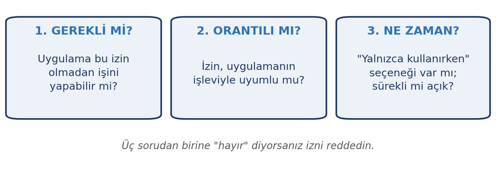
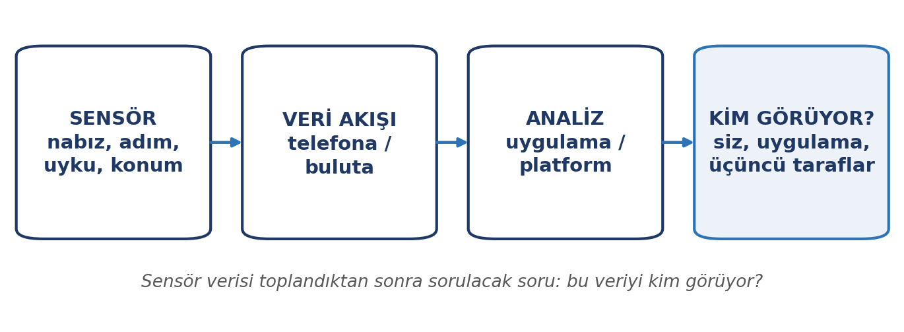

# Bu Haftanın Çerçevesi

## Öğrenme Çıktıları

- Mobil ekosistemi açıklar.
- Uygulama izinlerini değerlendirir.
- Senkronizasyonun fayda ve risklerini bilir.
- Mobil cihaz güvenliği önlemlerini uygular.
- Giyilebilir cihazların topladığı verileri tanır.
- Sağlık verisinin gizlilik boyutunu değerlendirir.
- Nesnelerin interneti risklerini bilir.
- Teknolojinin toplumsal etkilerini tartışır.

# Mobil Ekosistem

## 3. Haftadan Farkı

3. haftada mobil **işletim sistemlerini** tanıdık.

Bu hafta mobil cihazları **cihaz ve veri olarak** ele alıyoruz.

## Ekosistem

| Kavram | Anlamı |
|:---|:---|
| Uygulama mağazası | Resmî indirme kanalı |
| Mağaza dışı kurulum | **Güvenlik riski** |
| Ekosistem | Cihazların birlikte çalışması |
| Senkronizasyon | Verinin eşitlenmesi |

## Uygulamaları Resmî Mağazadan Yükleyin

Mağaza dışı uygulamalar (kırılmış, "ücretsiz premium") en yaygın **zararlı yazılım** kaynaklarıdır.

::: {.callout-warning}
**Mağaza dışı kurulum en yaygın zararlı yazılım kaynağıdır.** "Ücretsiz premium" vaat eden kırılmış uygulamalar cihazınızı ve hesaplarınızı riske atar.
:::

# Uygulama İzinleri

## Her İzin Bir Sorudur

{width=76%}

## Üç Soru

1. **Gerekli mi?** Bu izin olmadan çalışır mı?
2. **Orantılı mı?** İşleviyle uyumlu mu?
3. **Ne zaman?** "Yalnızca kullanırken" var mı?

## Tipik Orantısız İzinler

| Uygulama | İzin | Değerlendirme |
|:---|:---|:---|
| Fener | Konum | **Orantısız** |
| Not alma | Kişiler | **Orantısız** |
| Harita | Konum | Gerekli |
| Oyun | Mikrofon | Genellikle gereksiz |

**İzin istendiğinde "neden?" diye sorun.**

# Senkronizasyon

## Aynı Veri, Her Cihazda

**Faydaları:** Veri taşınır, kayıp riski azalır, her cihazdan erişim.

**Riskleri:**

- Hesap ele geçirilirse **bütün cihazlara** erişilir
- Yanlışlıkla silinen dosya **her yerden** silinir
- Yanlış hesapla eşitlenirse veri karışır

## Senkronizasyon Yedek Değildir

**Senkronizasyon:** aynı veriyi her yerde gösterme

**Yedekleme:** verinin **ayrı** bir kopyasını saklama

Bir dosyayı yanlışlıkla silip bütün cihazlardan silinmesi, aradaki farkı gösterir.

**4. haftanın 3-2-1 kuralını hatırlayın.**

# Mobil Güvenlik

## Ek Önlemler

- **Ekran kilidi:** parola, desen veya biyometrik
- **Otomatik güncelleme:** açık olsun
- **Kayıp cihaz önlemi:** uzaktan bul, kilitle, sil
- **Genel şarj noktaları:** tanımadığınız USB'den şarj etmeyin
- **Genel WiFi'da hassas işlem yapmayın** (5. hafta)
- **Bluetooth'u kapatın** (5. hafta)
- **Kayıtlı ağları temizleyin**

## Telefonunuz Kurtarma Yolunuzdur

Telefon numaranız çoğu hesabınızın **kurtarma yolu**dur.

Telefon ele geçirilirse birçok hesaba erişilebilir.

Bu yüzden **ekran kilidi** ve **SIM PIN'i** açık olmalıdır.

# Giyilebilir Teknolojiler

## Vücutta Taşınan Sensörler

{width=78%}

## Hangi Veriler?

| Sensör | Veri |
|:---|:---|
| Hareket | Adım, aktivite, uyku |
| Kalp atışı | Nabız, stres göstergesi |
| Oksijen | SpO₂ |
| GPS | Rota, gidilen yerler |
| Mikrofon | Ses, ortam |

Tek başına önemsiz görünen bu veriler, bir araya geldiğinde **ayrıntılı bir profil** oluşturur.

## Sağlık Verisi ve Gizlilik

Sağlık verisi **özel nitelikli kişisel veridir** (11. hafta).

Sorulacak sorular:

- **Kim görecek?** Siz mi, geliştirici mi, üçüncü taraflar mı?
- **Nereye gidiyor?** Cihazda mı, bulutta mı?
- **Kimlerle paylaşılıyor?** Sigorta, işveren, reklam veren?
- **Ne kadar saklanıyor?**
- **Silinebiliyor mu?**

## Gizlilik Politikasını Okuyun

Okumadan kabul etmek, verinizin nereye gittiğini bilmemektir.

**Ücretsiz sağlık uygulamalarında ödenen bedel genellikle veridir.**

# Nesnelerin İnterneti

## Günlük Cihazlar İnternette

Akıllı televizyon, priz, kamera, sesli asistan, termostat.

**Faydaları:** uzaktan kontrol, otomasyon, enerji tasarrufu, konfor.

## Riskler

| Risk | Ne demek |
|:---|:---|
| Zayıf güvenlik | Varsayılan parola, güncellenmeyen yazılım |
| Sürekli veri | Her cihaz veri toplar |
| Ses kaydı | Asistanlar sürekli dinleme modunda |
| Kamera riski | Yanlış yapılandırma → dışarıdan izlenebilir |
| Ağa giriş kapısı | Güvensiz cihaz ev ağına kapı olabilir |

## Akıllı Cihazlar İçin Üç Kural

1. **Varsayılan parolayı değiştirin**
2. **Yazılımını güncelleyin**
3. **Kullanmıyorsanız kapatın veya kaldırın**

# Dijital İyi Olma Hali

## Teknolojiyle Dengeli İlişki

- **Ekran süresi:** ne kadar zaman geçirdiğinizi bilin
- **Bildirim yönetimi:** gereksizleri kapatın
- **Kontrol araları:** telefonu elinize almadığınız zamanlar koyun
- **Uyku:** gece ekran kullanımı uykuyu etkiler
- **Karşılaştırma tuzağı:** herkes en iyi hâlini paylaşır
- **Çevrimdışı zaman** da planlanmalı

## Teknoloji Ne İyi Ne Kötü

Kendi başına iyi ya da kötü değildir; **nasıl kullanıldığına** bağlıdır.

Aynı araç bir kişi için öğrenme, bir başkası için zaman kaybı olabilir.

# Toplumsal Etkiler

## Dijital Uçurum

1. haftada söz ettiğimiz kavram: erişim, cihaz ve beceri bakımından eşitsizlik.

Eğitime ve işe erişimi doğrudan etkiler.

## Etki Alanları

| Alan | Etki |
|:---|:---|
| Çalışma hayatı | Uzaktan çalışma, dönüşen işler |
| Eğitim | Çevrimiçi kaynaklar, dijital beceri gereği |
| Mahremiyet | Gözetim ve veri toplama |
| İletişim | Hız ama yüzeysellik, yankı odaları |
| Toplumsal katılım | Erişimi olan katılıyor |
| Otomasyon | Rutin işler makineye, yeni beceriler |

## Hepsi İki Yönlü

Bu etkilerin hepsi hem olumlu hem olumsuz yön içerir.

Bu dersin amacı kesin cevap vermek değil; **bu soruları sorabilecek** bir bakış kazandırmaktı.

# Kapanış

## Uygulama: Dijital Dengenizi Değerlendirin

1. **Ekran sürenizi inceleyin** — günlük ortalama kaç saat?
2. **Bildirimleri düzenleyin** — gereksizleri kapatın
3. **Bir uygulamanın izinlerini** gözden geçirin, orantısız olanı kapatın
4. Bir paragraf yazın: *Bu dönemde öğrendiklerinizden hangisi kullanımınızı en çok değiştirdi?*

Notla değerlendirilmez.

## Dönemin Özeti

- **1–6:** Temel kavramlar, donanım, yazılım, dosya, ağ, internet pratikleri
- **7–9:** Üretim araçları — kelime işlemci, tablo, sunum
- **10–14:** Sorumluluk — güvenlik, kişisel veriler, yapay zekâ, mobil ve toplumsal etki

## Son Söz

Bu dersin amacı yalnızca araçları öğretmek değildi.

**Teknolojiyi sorgulayan, bilinçli ve sorumlu bir kullanıcı** olmanızı sağlamaktı.

Bu bakışı koruyun.
