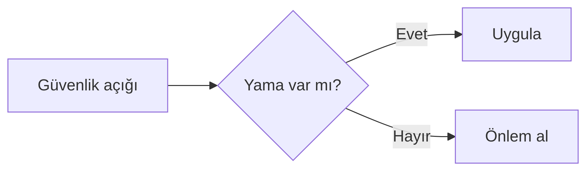
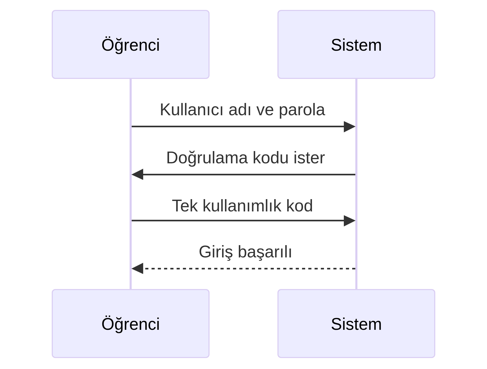
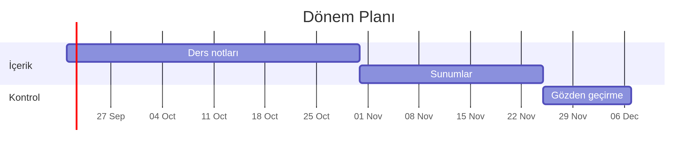
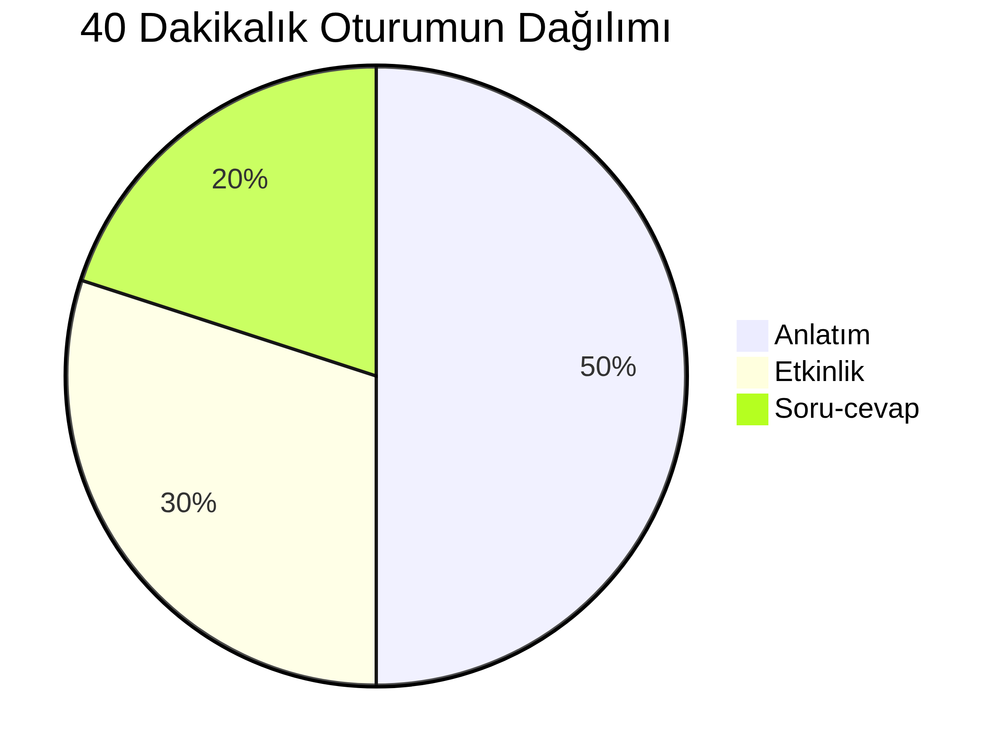
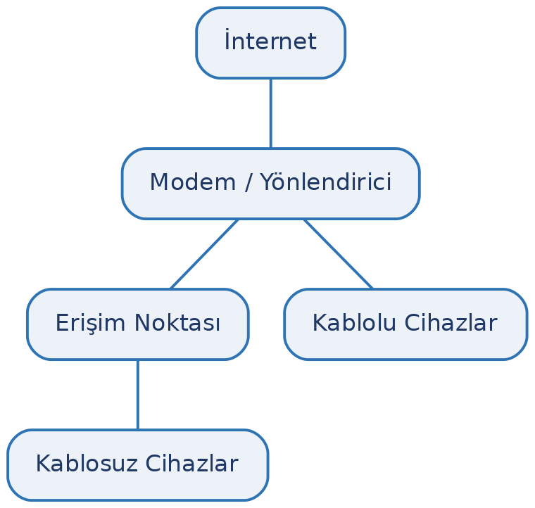

# Giriş

## Bu Sunum Nedir?

Ders malzemesi üretirken kullanabileceğimiz Quarto özelliklerinin örnekleri.

Her özellik, **slayt üzerinde çalışır hâlde** gösterilir.

::: callout-note
## Ayrıntılı sürüm
Kaynak kodları ve uzun anlatım için: `ornekler/quarto-ozellikleri.pdf`
:::

## Hangi Özellikler Var?

- Metin ve listeler
- Kutular
- Tablolar
- Kod ve matematik
- Yapı öğeleri (sütun, dipnot, atıf)
- **Diyagramlar** (Mermaid, Graphviz, TikZ)
- Görseller
- Çıktı biçimleri

# Metin ve Listeler

## Metin Biçimlendirme

**Kalın**, *italik*, ***kalın italik***, `satır içi kod`, ~~üstü çizili~~

Alt simge H~2~O · Üst simge x^2^

Hepsi aynı satırda karışık kullanılabilir.

## Madde İşaretli Liste

- Birinci madde
- İkinci madde
  - Alt madde
  - Başka bir alt madde
- Üçüncü madde

Girinti için satır başına iki boşluk yeterlidir.

## Numaralı Liste

1. Birinci adım
2. İkinci adım
3. Üçüncü adım

Numaraları elle yazmanıza gerek yok; sıra değişince Quarto kendisi düzeltir.

## Görev Listesi

- [x] Tamamlanmış iş
- [ ] Devam eden iş
- [ ] Henüz başlanmamış iş

Ders planı ve kontrol listeleri için kullanışlıdır.

## Tanım Listesi

**Veri**

: İşlenmemiş ham gerçekler.

**Enformasyon**

: Bağlam içine yerleştirilmiş veri.

**Bilgi**

: Yorumlanmış enformasyon.

# Kutular

## Çağrı Kutusu Tipleri

| Tip | Ne için |
|:--|:--|
| `note` | Genel bilgi |
| `tip` | Pratik öneri |
| `important` | Mutlaka bilinmesi gereken |
| `warning` | Dikkat edilmezse sorun çıkarır |
| `caution` | Riskli işlem |

## Örnek Kutu

::: callout-warning
## Uyarı
Dikkat edilmezse sorun çıkaracak durumlar için kullanılır.
:::

Kutunun başlığını `##` satırına istediğinizi yazarak değiştirebilirsiniz.

# Tablolar

## Basit Tablo

| Kavram | Tanım | Örnek |
|:--|:--|:--|
| Veri | Ham gerçekler | 23,5 |
| Enformasyon | Bağlam kazanmış veri | Hava 23,5 °C |
| Bilgi | Yorumlanmış enformasyon | Öğle vakti koşulmaz |

## Hizalama

| Sola | Ortaya | Sağa |
|:--|:-:|--:|
| metin | metin | 1250 |
| metin | metin | 48 |

Hizalamayı ayırıcı satırdaki iki nokta belirler: `:--` sola, `:-:` ortaya, `--:` sağa.

# Kod ve Matematik

## Kod Blokları

```python
sayilar = [48, 49, 50, 52, 51, 53, 54, 56]
ortalama = sum(sayilar) / len(sayilar)
print(f"Ortalama: {ortalama:.1f}")
```

Sözdizimi renklendirmesi otomatiktir.

## Matematik

Satır içi: $E = mc^2$ ve $\pi \approx 3{,}14$

Blok hâlinde:

$$\bar{x} = \frac{1}{n}\sum_{i=1}^{n} x_i$$

# Yapı Öğeleri

## Sütun Düzeni

::::: columns
::: {.column width="50%"}
### Sol taraf

- Birinci madde
- İkinci madde
- Üçüncü madde
:::

::: {.column width="50%"}
### Sağ taraf

| Öğe | Değer |
|:--|--:|
| A | 12 |
| B | 28 |
:::
:::::

## Dipnotlar

Metin içinde açıklama vermek için dipnot kullanılabilir[^1].

[^1]: Dipnotun içeriği buraya yazılır ve sayfa altında numaralı olarak çıkar.

## Çapraz Başvurular

Belge içindeki tablo, şekil ve bölümlere otomatik numarayla atıf yapılabilir.

- `{#tbl-ad}` etiketini verin
- Metinden `@tbl-ad` ile çağırın

Etiketlenen öğeler "Tablo 1", "Şekil 1" biçiminde numaralanır.

# Diyagramlar

## Sunuda Diyagramlar

Quarto'nun Mermaid PDF çıktısında **ölçek ayarı çalışmıyor**: şemalar slayt sınırını aşıyor.
Bu yüzden sunudaki diyagramlar önceden görsele çevrilip sabit genişlikle yerleştirildi.

Dört şema da **metin tabanlı** kaynaktan üretilir; kaynak dosyalar `gorseller/*.mmd`.
Canlı (Quarto'nun doğrudan ürettiği) sürümler için: `ornekler/quarto-ozellikleri.pdf`

## Mermaid — Akış Şeması

Süreç adımları ve kararlar için en uygun araç.

{width=85%}

## Mermaid — Sıra Şeması

İki taraf arasındaki adım adım etkileşimi gösterir.

{width=54%}

## Mermaid — Zaman Çizelgesi

Dönem planı ve proje takvimi için.

{width=85%}

## Mermaid — Oran Şeması

{width=54%}

## Graphviz — Ağ Şeması

Düğüm-kenar ilişkisi yoğun olduğunda Mermaid'den güçlüdür.

{width=50%}

Kaynak, metin tabanlı bir `.dot` dosyasıdır; `dot` komutuyla görsele çevrilir.

::: callout-note
## Beamer'da Graphviz
Beamer şablonu, Quarto'nun ürettiği Graphviz görselini slayt sınırına sığdırmıyor.
Bu yüzden şema `dot` komutuyla önceden üretilip görsel olarak eklendi. Makale biçiminde
(PDF ders notu) Graphviz doğrudan çalışır.
:::

## TikZ — Kurumsal Görünüm

Belgenin kendi renklerini ve yazı tipini kullanır.

```{=latex}
\begin{center}
\begin{tikzpicture}[
  kutu/.style={draw=enfnavy, rounded corners=3pt, fill=lightbg,
               minimum width=2.7cm, minimum height=0.9cm, align=center,
               font=\small\bfseries, text=enfnavy},
  ok/.style={-{Latex}, thick, color=enfaccent}
]
\node[kutu] (a) at (0,0)    {GİRDİ};
\node[kutu] (b) at (3.5,0)  {İŞLEM};
\node[kutu] (c) at (7.0,0)  {ÇIKTI};
\node[kutu] (d) at (3.5,-1.7) {DEPOLAMA};
\draw[ok] (a) -- (b);
\draw[ok] (b) -- (c);
\draw[ok] (b) -- (d);
\end{tikzpicture}
\end{center}
```

::: callout-note
## Renk adları
`enfnavy`, `enfaccent`, `lightbg` — ortak tema dosyasında tanımlıdır.
:::

# Görseller

## Görsel Ekleme

{width=62%}

Köşeli parantez içindeki metin altyazı olur ve otomatik numaralanır.

# Çıktı Biçimleri

## Aynı Kaynak, İki Çıktı

Tek bir `.qmd` dosyasından hem PDF hem web sayfası üretilebilir:

```yaml
format:
  pdf: default
  html: default
```

İçeriği ikinci kez yazmak gerekmez.

::: callout-tip
## Yalnızca HTML'de çalışan özellikler
Sekmeli içerik, kod katlama ve sıralanabilir tablo gibi özellikler yalnızca web çıktısında anlamlıdır.
:::

# Özet

## Hangi Araç Ne İçin?

| İhtiyaç | Araç |
|:--|:--|
| Akış ve süreç şeması | Mermaid |
| Zaman planı | Mermaid (gantt) |
| Oran gösterimi | Mermaid (pie) |
| Ağ ve ilişki şeması | Graphviz |
| Kurumsal görünümlü şema | TikZ |
| Fotoğraf, ekran görüntüsü | Görsel dosyası |
| Grafik (sayısal veri) | Çizim betiği (matplotlib) |

## Teşekkürler

Ayrıntılı anlatım ve kaynak kodları:

`ornekler/quarto-ozellikleri.pdf`
